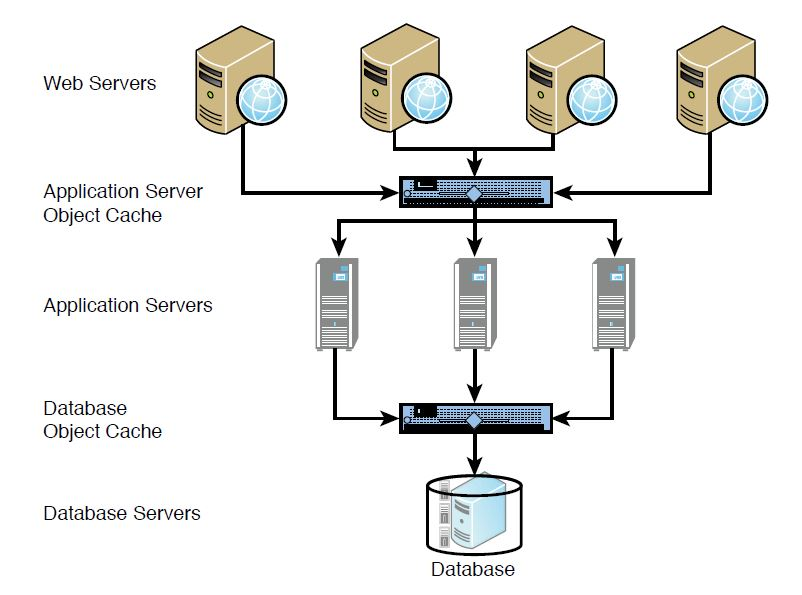
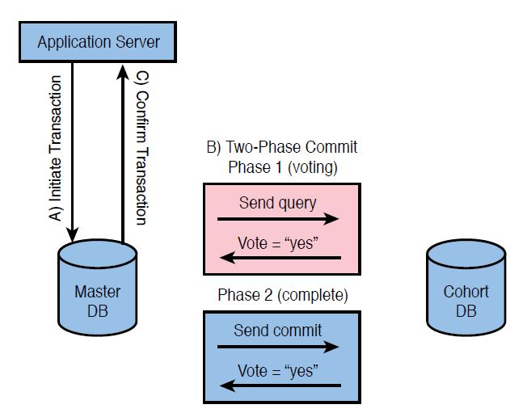

Martin L. Abbott and Michael T. Fisher, Scalability Rules：Principles for Scaling Web Sites Second Edition, 2017
---------------------------------------------------

可扩展性涉及如下几个方面
* 项目管理
* 架构设计
* 技术选型
* 编程技巧
* 部署规范

从部署和功能的角度，有可以划分为如下层级
* 数据层
* 业务层
* Web层

上述两个方面形成一个二维的可扩展规则示意图

不同于一般的数据操作，账户操作具有可逆性，从而可以大大简化分布式数据库环境的账户操作。

## Chapter 1 Reduce the Equation 大道至简

match the effort and approach to the complexity of the problem. Not every solution has the same complexity—take the simplest approach to achieve the desired outcome。 努力和方法要与问题的复杂性相匹配。不是每个方案都有相同的复杂性，选取最简单的方法，实现所期望的结果

keeping things as simple as possible. Our view is that a complex problem is really just a collection of smaller, simpler problems waiting to be solved. 保持事情要尽可能的简单。从我们的视角来看，一个复杂问题其实仅仅是一些更小的、更简单的待解决问题的集合

### Rule 1—Don’t Overengineer the Solution 
### 规则1—不要过度设计解决方案

**What:** Guard against complex solutions during design. 在设计过程中严防复杂的解决方案。

**When to use:** Can be used for any project and should be used for all large or complex systems or projects. 可以应用于任何项目，而且也必须应用于所有大型或者复杂的系统或者项目

**How to use:** Resist the urge to overengineer solutions by testing ease of understanding with fellow engineers. 通过与工程师同事测试易懂性，来抵制对于过度工程化的解决方案的冲动。

**Why:** Complex solutions are excessively costly to implement and are expensive to maintain long term. 复杂方案的实现会严重超支，而长期维护费用也高昂，

**Key takeaways:** Systems that are overly complex limit your ability to scale. Simple systems are more easily and cost-effectively maintained and scaled. 过于复杂的系统将会限制你的可扩展能力。简单的系统更简单，并且能够更高效地维护和扩展。

过度工程化可以划归两大类
* The first category covers products designed and implemented to exceed their useful requirements. 第一类涵盖那些设计和实现超过其有用需求的产品。
* The second category of overengineering covers products that are made to be overly complex.第二类过度工程化涵盖那些制造过于复杂的产品。

To explain the first category of overengineering, exceeding useful requirements。第一类是超过了有用需求，即设计和实现了现在比并不需要的功能。

The second category of overengineering deals with making something overly complex and making something in a complex way. 第二类过度工程化涉及使得某些事情过于复杂并且以某种复杂的方式做事情。

不要向不需要的需求或功能买单

[Faster Time to Market – How to Avoid Overengineering (Rule 1)](https://akfpartners.com/growth-blog/faster-time-to-market-how-to-avoid-overengineering-yagni)

Overengineering is solving problems you don’t have.

We will look at two sides of overengineering: Exceeding useful requirements, and spending too much effort to get a job done.
我们将会研究过度工程化的两个方面：超出有用的需求，以及花费更多的精力完成一个工作。

### Rule 2—Design Scale into the Solution　(D-I-D Process) 
### 方案2—将可扩展性设计到方案中（设计-实现-部署过程）

**What:** An approach to provide JIT (just-in-time) scalability. 一种提供及时可扩展性的方法

**When to use:** On all projects; this approach is the most cost-effective (resources and time) to ensure scalability. 在所有的项目中应用；此方法在确保可扩展性上是最为高效（资源和时间）。

**How to use:**
* Design for 20x capacity.针对20倍的容量，设计
* Implement for 3x capacity.针对3倍的容量，实现
* Deploy for roughly 1.5x capacity.针对大约1.5倍容量，部署

**Why:** D-I-D provides a cost-effective, JIT method of scaling your product. 设计-实现-部署提供了一种高性价比的、及时的方式，来扩展你的产品。

**Key takeaways:** Teams can save a lot of money and time by thinking of how to scale solutions early, implementing (coding) them a month or so before they are needed, and deploying them days before the customer rush or demand. 如果在开始的时候考虑如何扩展解决方案，那么需要在扩展前的一个月左右时间实现（编码）或者需要在客户高峰到来前的几天部署，团队就能够节省大量的金钱和时间。

D-I-D provides a cost-effective, JIT method of scaling your product.

Dell, configure-to-order： 按订单配置，just-in-time manufacturing：及时制造

AKF Partners’ Design-Implement-Deploy or D-I-D approach to thinking about scalability.

[The DID Process - Scale Design Principles (Rule 2)](https://akfpartners.com/growth-blog/scale-design-principles-the-did-process)

Ideally, what you want is JIT (just-in-time) scalability. The idea originates from JIT manufacturing, and relates to reducing delivery time. JIT scalability is the ability to scale up or down when needed, as needed. 理想情况下，你所需要的是及时的可扩展性。这个想法来自于及时制造，并涉及缩短交付时间。及时可扩展性是指当需要时，可以根据需要实现向上或者向下的伸缩。

infrastructure-as-a-service (IaaS) 

有预见性的设计，分阶段性的实现，及时性的部署

### Rule 3—Simplify the Solution Three Times Over 
### 方案3—三重简化方案

**What:** Used when designing complex systems, this rule simplifies the scope, design, and implementation. 当设计复杂系统时使用这个规则，简化范围、设计和实现。

**When to use:** When designing complex systems or products where resources (engineering or computational) are limited. 当设计复杂的并且资源（工程或者计算）受到限制的系统或者产品时，

**How to use:**
* Simplify scope using the Pareto Principle. 通过帕累托法则来简化范围
* Simplify design by thinking about cost effectiveness and scalability. 通过考量经济效益和可扩展性来简化设计
* Simplify implementation by leveraging the experience of others.通过充分利用他人的经验来简化实现

**Why:** Focusing just on “not being complex” doesn’t address the issues created in requirements or story and epoch development or the actual implementation. 仅仅聚焦于不复杂并不能解决在需求中和在开发或实际实施时期产生的问题

**Key takeaways:** Simplification needs to happen during every aspect of product development. 在产品开发的各个方面都需要简单化。

Pareto principle 即帕累托法则，又称80/20法则、马特莱法则、二八定律、帕累托定律、最省力法则、不平衡原则、犹太法则。意大利经济学家帕累托提出的。法则认为原因和结果、投入和产出、努力和报酬之间本来存在着无法解释的不平衡

[Scalability Rules - How to Simplify Scope, Design, and Implementation (Rule 3)](https://akfpartners.com/growth-blog/scalability-rules-how-to-simplify-scope-design-and-implementation)

简化体现在更容易被理解，完成的时间更短，所付出的代价更小

Complexity elimination is about cutting off unnecessary trips in a job, and simplification is about finding a shorter path

“How can we leverage the experiences of others and existing solutions to simplify our implementation?”

### Rule 4—Reduce DNS Lookups 减少DNS查找
### 规则4—避免重复性工作

**What:** Reduce the number of DNS lookups from a user perspective.

**When to use:** On all Web pages where performance matters.

**How to use:** Minimize the number of DNS lookups required to download pages, but balance
this with the browser’s limitation for simultaneous connections.

**Why:** DNS lookups take a great deal of time, and large numbers of them can amount to a large portion of your user experience.

**Key takeaways:** Reduction of objects, tasks, computation, and so on is a great way of
speeding up page load time, but division of labor must be considered as well.

[什么是高并发下的请求合并？](https://mp.weixin.qq.com/s?__biz=MzIxNTQ4MzE1NA==&mid=2247501569&idx=1&sn=1bdce3ec6b00e2a1ec4e71c293fbf8ef&chksm=9795117ca0e2986a85c91e3fd1157d302e25db247ac694f3f80ddb9a44245a45255874cfd68a&mpshare=1&scene=1&srcid=112361PzzD8ACPONUPHVU9HI&sharer_sharetime=1606100477426&sharer_shareid=fc937fe50a97e6c10553c542abe0a39b&exportkey=AUU9f1Fl1KaBL6RENR8Oraw%3D&pass_ticket=fk%2BE1fOYHmI5CyP5XtiiPrUMmfrHPspkwtzMhbIMcZ8RCXV3pYelubWJqWxZuV5q&wx_header=0#rd)

方法
* Batch: 打包批量处理
* cache 缓存和复用结果

在分割后的功能中包含一些重复的处理，将这个处理分离出来，作为一个公共的前置功能。

### Rule 5—Reduce Objects Where Possible尽可能减少对象
### Rule 5—控制分割的粒度

**What:** Reduce the number of objects on a page where possible.

**When to use:** On all Web pages where performance matters.

**How to use:**
* Reduce or combine objects but balance this with maximizing simultaneous connections.
* Look for opportunities to reduce weight of objects as well.
* Test changes to ensure performance improvements.

**Why:** The number of objects impacts page download times.

**Key takeaways:** The balance between objects and methods that serve them is a science that requires constant measurement and adjustment; it’s a balance among customer usability, usefulness, and performance.

如果分割的太小，引入的代价将会超过分割带来的好处。因此，在一些情况下可以需要合并

[Reduce DNS lookups to improve website performance (Rule 4)](https://akfpartners.com/growth-blog/reduce-dns-lookups-to-improve-website-performance)

无论是对应功能进行分割，还是对应数据进行分割，都会引入高昂的代价。如果分割的粒度过小，那么所付出的代价将远远超过所引入的好处，因而得不偿失。

### Rule 6—Use Homogeneous Networks使用同构网络

**What:** Ensure that switches and routers come from a single provider. 确保交换机和路由器都来自单一的提供商。

**When to use:** When designing or expanding your network. 当设计或者扩展你的网络时

**How to use:**
* Do not mix networking gear from different OEMs for switches and routers.不要将来自不同OEM的交换机和路由器混合联网。
* Buy or open-source for other networking gear (firewalls, load balancers, and so on). 购买或使用开源的联网设备（防火墙、负载均衡器等等）

**Why:** Intermittent interoperability and availability issues simply aren’t worth the potential cost savings. 异构网络所带来的间歇互操作和可用性问题并不值得潜在的、所节约的费用

**Key takeaways:** Heterogeneous networking gear tends to cause availability and scalability problems. Choose a single provider. 异构互联设备更容易造成可用性和可扩展性问题。选择单一的提供商。

对于操作系统以及数据库、JDK和Nginx等系统软件采用相同的版本。

## Chapter 2 Distribute Your Work 分布你的工作

### Rule 7-Design To Clone or Replicate Things (X Axis)
### 规则7-设计支持克隆或者复制相同的东西（X轴）

**What:** Typically called horizontal scale, this is the duplication of services or databases to spread transaction load. 复制服务或者数据库，来分担事务负载，因此通常被称为水平可伸缩，

**When to use:**
* Databases with a very high read-to-write ratio (5:1 or greater—the higher the better).数据具有非常号的读/写比（5:1或者更高，越高越好）
* Any system where transaction growth exceeds data growth.任何系统如果其事务的增长超过了数据的增长

**How to use:**
* Simply clone services and implement a load balancer.简单的克隆服务并实现一个负载均衡器
* For databases, ensure that the accessing code understands the difference between a read and a write.对于数据库，确保访问的代码理解读和写的不同

**Why:** Allows for fast scale of transactions at the cost of duplicated data and functionality. 允许以复制数据和功能为代价，快速地实现事务处理的可伸缩性

**Key takeaways:** X axis splits are fast to implement, are low cost from a developer effort perspective, and can scale transaction volumes nicely. However, they tend to be high cost from the perspective of operational cost of data. X轴的分解能够快速地实现，并且从开发者工作的视角具有较低的成本，能够非常好地扩展事务的数量。但是从数据运维代价的角度，X轴分解倾向于更高的成本。

Often, the hardest part of a solution to scale is the database or persistent storage tier. 通常，在实现可伸缩性的解决方案中最为困难的部分是数据库或者持久化存储层。
* 分布式事务：ACID
* 数据一致性：如果写数据，1）如何实现数据多个副本数据的一致性；2）如何避免读到不一致的数据

One technique for scaling databases is to take advantage of the fact that most applications and databases perform significantly more reads than writes. 一种用于扩展数据库的技术是（读写分离）利用了这样一个事实，即大多数应用和数据库的读要远远多于写。

There are a couple of ways that you can distribute the read copy of your data depending on the time sensitivity of the data. Time (or temporal) sensitivity is how fresh or completely correct the read copy has to be relative to the write copy. 依赖于数据的时间敏感性，你可以使用多种方式分布数据的读副本。时间敏感性是指相对于写副本，读副本的一致性的程度或者完全正确的程度。

两个问题：
1. 在写入数据后，最多需要多长时间全部副本才能实现一致性
2. 应用能够忍受多长时间的读副本与写副本之间的不一致性。

the ways to distribute the data.分布数据的方式
* One way is to use a caching tier in front of the database.一种方法是在数据库之前使用缓存层。（对象缓存）
* The next step beyond an object cache between the application tier and the database tier is replicating the database。除了在应用层和数据库层之间对象缓存，下一步是复制数据库。（数据库复制）

X axis—Horizontal Duplication

应用和web服务的克隆相对较为容易实现，允许我们扩展所处理事务的数目。

两个复制/克隆方向
* 数据（名词）
* 功能（动词）

### Rule 8—Design to Split Different Things (Y Axis)

### 规则8—设计支持分拆不同的东西（Y轴）

**What**: Sometimes referred to as scale through services or resources, this rule focuses on scaling by splitting data sets, transactions, and engineering teams along verb (services) or noun (resources) boundaries. 有时指的是通过服务或者资源实现可扩展，这个规则聚焦于沿着动词(服务)或者名词(资源)的边界，通过分割数据集、事务和工程团队，来实现可扩展。
 
**When to use**:
* Very large data sets where relations between data are not necessary.非常大的数据集合，并且集合内数据之间的关系不是必须的。数据之间没有必然的关联，无需考虑JOIN操作。
* Large, complex systems where scaling engineering resources requires specialization. 庞大的、复杂的系统，并且在系统中扩展工程资源需要非常的专业化

**How to use**:
* Split up actions by using verbs, or resources by using nouns, or use a mix.使用动词分拆分动作，使用名词拆分资源，或者两者混合使用。
* Split both the services and the data along the lines defined by the verb/noun approach.沿着通过动词/名词方法定义的路线拆分服务和数据

**Why:** Allows for efficient scaling of not only transactions but also very large data sets associated with those transactions. Also allows for the efficient scaling of teams. 不仅许可高效地扩展事务，而且许可高效地扩展与这些事务相关联的、非常大的数据集合。此外，还许可高效地扩展团队。

**Key takeaways:** Y axis or data/service-oriented splits allow for efficient scaling of transactions, large data sets, and can help with fault isolation. Y axis splits help reduce the communication overhead of teams. Y轴分解或者面向数据/服务的分解能够实现高效地扩展事务和大数据集合，并且有助于故障隔离。Y轴分解帮助减小团体交流开销。

Let’s split up our site using the verb approach first。让我们首先使用动词方法分解我们的网站。

We might identify certain resources upon which we will ultimately take actions (rather than the verbs that represent the actions we take). 我们可以鉴别我们将最终操作的特定资源（而不是代表我们操作行为的动词）

Because services or resources are now split, the actions we perform and the code necessary to perform them are split up as well. 因为服务或资源已被分拆，所有我们的执行以及操作服务或者资源的代码代码也会被分拆。

One tenet of Brooks’ Law is that developer productivity is reduced as a result of increasing team sizes. The communication effort within any team to coordinate team efforts is a square of the number of participants in the team. Therefore, with increasing team size comes decreasing developer productivity as more developer time is spent on coordination.
Brooks法则的一个原则是团队规模逐渐扩大一个必然结果是开发人员的生产率的降低。在任何团队内部协同团队工作所需要的沟通工作是团队成员数目的平方。因此，增加团队的规模会降低开发人员的生产率，因为开发人员花费更多的时间用于协同。

### Rule 9—Design to Split Similar Things (Z Axis)
### 规则9-设计支持分拆相似的东西(Z轴)

**What:** This is very often a split by some unique aspect of the customer such as customer ID, name, geography, and so on. 非常常见的分离方式是通过客户一些独特的属性，例如客户id、名字和地理位置等。

**When to use:** Very large, similar data sets such as large and rapidly growing customer bases or when response time for a geographically distributed customer base is important. 非常庞大的或者相似的数据集，例如大量并快速增长的客户群或者对于地理分布的客户群而言，响应时间非常重要。

**How to use:** Identify something you know about the customer, such as customer ID, last name, geography, or device, and split or partition both data and services based on that attribute. 识别那些你所知的、有关于客户的信息，例如客户id、姓氏、地理位置或终端，并据此分割或者划分数据和服务。

**Why:** Rapid customer growth exceeds other forms of data growth, or you have the need to perform fault isolation between certain customer groups as you scale. 快速的客户增长超过了其他格式的数据增长，或者在你扩展客户规模的过程，你需要在特定的客户之间实现故障隔离。

**Key takeaways:** Z axis splits are effective at helping you to scale customer bases but can also be applied to other very large data sets that can’t be pulled apart using the Y axis methodology. Z轴分解不仅是一种有效的方式，协助你扩展客户群，而且还可以应用到其他一些巨大数据集合上，这些数据集合使用Y轴方法无法有效得分解，

数据的Sharding或者Partition

Often referred to as sharding and podding, Rule 9 is about taking one data set or service and partitioning it into several pieces. These pieces are often equal in size but may be of different sizes if there is value in having several unequally sized chunks or shards. 规则9经常称为分片或者分割，其获取一个数据集或者服务，然后将其划分为多个部分。这些部分通常大小相等，但如果大小不一的块或者分片有意义，那么也可以大小并不相同。

Summary
* Scale by cloning—Cloning or duplicating data and services allows you to scale transactions easily.
* Scale by splitting different things—Use nouns or verbs to identify data and services to separate. If done properly, both transactions and data sets can be scaled efficiently.
* Scale by splitting similar things—Typically these are customer data sets. Set customers up into unique and separated shards or swim lanes (see Chapter 9 for
the definition of swim lane) to enable transaction and data scaling.

## Chapter 3 Design to Scale Out Horizontally
## 第三章 设计支持水平地向外扩展

In our minds, it is clear: we believe that within hyper-growth environments it is critical that companies plan to scale in a horizontal fashion—what we describe as scaling out. Most often this is done through the segmentation or duplication of workloads across multiple systems. 在我们心中非常显然地认为，在高速增长的环境中公司计划以一种水平方式扩展（也被我们描述为向外扩展）是非常关键的。绝大多数情况下此种方式是通过跨越多个系统，使用分割或者复制来实现。

Here again we see this troubling notion of “complexity.” When used one way, more devices equals more complexity—or as we prefer to indicate, more devices to manage and oversee. But when seen from another perspective, more devices equals lower complexity—lower rates of failure overall and fewer incidents to manage.
这里我们再次看到复杂性这个令人陷入麻烦的概念。从一个方向上使用，更多的设备等于更高的复杂性，或者按照我们喜欢的方式指出，更多的设备需要管理和监控。但是，从另一个角度看，更多的设备等于更低的复杂性，因为更低的整体故障率和更少需要管理的事故。

### Rule 10—Design Your Solution to Scale Out, Not Just Up
### 规则10-设计你的系统支持向外扩展，而不仅仅是向上扩展

**What:** Scaling out is the duplication or segmentation of services or databases to spread transaction load and is the alternative to buying larger hardware, known as scaling up.
向外扩展是针对服务或者数据库的复制或者分割，以扩大事务负载，其是购买更大型的硬件、被称为向上扩展的替换方案。

**When to use:** Any system, service, or database expected to grow rapidly or that you would like to grow cost-effectively.
期望快速增长的或者你期望高性价比增长的任何系统、服务或者数据库

**How to use:**  Use the AKF Scale Cube to determine the correct split for your environment. Usually the horizontal split (cloning) is the easiest. 针对你的环境，使用AKF可扩展立方确定正确地分拆。通常水平分拆（克隆）是最简单的。

**Why:** Allows for fast scale of transactions at the cost of duplicated data and functionality. 允许以复制数据和功能为代价，快速扩展事务。

**Key takeaways:** Plan for success and design your systems to scale out. Don’t get caught in the trap of expecting to scale up only to find out that you’ve run out of faster and larger systems to purchase. 为成功做计划，并设计你的系统实现向外扩展。不要陷入如下如下的陷阱：仅仅期望向上扩展，但是发现你已经没有更快的和更大的系统可供购买了。

Having the ability to run your product on multiple servers through all tiers is scaling out.Continuing to run your systems on larger hardware at any tier is scaling up.
有能力将你的产品在所有的层级都运行在多个服务器是向外扩展。继续将你系统上的任何一个层级运行在更强大的硬件上是向上扩展。

### Rule 11—Use Commodity Systems (Goldfish Not Thoroughbreds)
### 规则11-采用商品化系统

**What:** Use small, inexpensive systems where possible.尽可能使用小规模的和不昂贵的系统

**When to use:** Use this approach in your production environment when going through hypergrowth and adopt it as an architectural principle for more mature products. 当业务飞速增长时在你们的生产环境中使用这个方法，并且针对更多的成熟产品将其作为架构原则。

**How to use:** Stay away from very large systems in your production environment.在你的生产环境中避免使用非常大型的系统。

**Why:** Allows for fast, cost-effective growth. Allows you to purchase the capacity you need rather than spending for unused capacity far ahead of need. 许可快速和高效的增长。允许你购买你需要的容量，而不是在实际需要之前就购买当期并不使用的容量。

**Key takeaways:** Build your systems to be capable of relying on commodity hardware, and don’t get caught in the trap of using high-margin, high-end servers.
能够依赖于商品化硬件构建你的系统，避免陷入使用高利润、高端服务器的陷阱。

使用成熟的和商业化的系统，而不要采用定制化的、高端系统。
* 价格相对便宜，更容易大规模的部署，以支持横向扩展
* 更好的性价比

### Rule 12—Scale Out Your Hosting Solution
### 规则 12-横向扩展你的托管方案

**What:** Design your systems to have three or more live data centers to reduce overall cost, increase availability, and implement disaster recovery. A data center can be an owned facility, a colocation, or a cloud (IaaS or PaaS) instance.
设计你的系统具有三个或者更多的活跃数据中心，以降低综合成本、提高可用性和实现灾后恢复。数据中心可以是自有设施、托管服务器或者一个云实例（IaaS或者PaaS）。

**When to use:** Any rapidly growing business that is considering adding a disaster recovery (cold site) data center or mature business looking to optimize costs with a three-site solution。 任何快速增长并正在考虑添加一个灾难恢复（冷站点）数据中心的业务或者期望通过三个站点解决方案来优化成本的成熟业务。

**How to use:** Scale your data per the AKF Scale Cube. Host your systems in a “multiple live” configuration. Use IaaS/PaaS (cloud) for burst capacity, new ventures, or as part of a three-site solution. 按照AFK可扩展立方来实现你数据的可扩展性。以一种“多个活跃”的配置，托管你的系统。使用IaaS/Paas（云）来支持突发容量、新企业或者部分的三站点解决方案。

**Why:** The cost of data center failure can be disastrous to your business. Design to have three or more as the cost is often less than having two data centers. Consider using the cloud as one of your sites, and scale for peaks in the cloud. Own the base; rent the peak. 数据中心故障的代价对你的业务可能是灾难性。因此，设计具有三个或者更多的数据中心，其综合成本经常低于具有两个数据中心的场景。考虑使用云作为你的站点之一，并且在云中扩展支持突发流量。自有实施处理日常基础流量，租用云来处理突发流量。

**Key takeaways:** When implementing disaster recovery, lower your cost by designing your systems to leverage three or more live data centers. IaaS and PaaS (cloud) can scale systems quickly and should be used for spiky demand periods. Design your systems to be fully functional if only two of the three sites are available, or N-1 sites available if you scale to more than three sites.
当实施灾难恢复时，通过设计你的系统以充分使用三个或者更多的活跃数据中心，从而降低你的成本。IaaS和PaaS（云）能够快速地扩展系统，因为应该在尖峰需求期间使用此种方式。设计你的系统在三个站点中仅有两个可用时或者在扩展具有多于三个站点情况下有N-1个站点可用时，也能提供全部的功能

It is this segmentation, replication, and cloning of data and services as well as statelessness that form the building blocks for us to spread our data centers across multiple sites and geographies. Standardize system configuration, code deployment, and monitoring to enable seamless growth between colocation sites and cloud sites.
正是数据和服务的分割、复制和克隆以及无状态为我们提供了构造基石，可以跨域多个站点和地区分布我们的数据中心。在托管站点和云站点之间实现系统配置、代码部署和监控的标准化，从而能够无缝地增长。

Multiple live site benefits include多个站点的好处包括
* Higher availability as compared to a hot and cold site configuration.与一个冷站和一个热站的配置相比，具有更好的可用性。
* Lower costs compared to a hot and cold site configuration.与一个冷站和一个热站的配置相比，具有更低的成本。
* Faster customer response times if customers are routed to the closest data center for dynamic calls.对于动态调用，如果将用户请求路由到距离最近的数据中心，能够实现更快的客户响应时间。
* Greater flexibility in rolling out products in an SaaS environment.在一个SaaS环境中推出产品，具有更大的灵活性。
* Greater confidence in operations versus a hot and cold site configuration.与一个冷站和一个热站比较，对于运维具有更大的信心。
* Fast and easy “on-demand” growth for spikes using spare capacity in each data center, particularly if PaaS/IaaS/cloud is part of the overall solution. 在每个数据中心中使用富余容量，针对于峰值实现快速简单的按需增长，特别是当PaaS/IaaS/云作为整个方案的一部分时

Drawbacks or concerns of a multiple live site configuration include多个活跃站点配置的缺点或者问题包括
* Greater operational complexity. 更大的运维复杂性
* Likely a small increase in headcount.可能要小幅增加人手
* Increase in travel and network costs. 增加出差和网络成本。

Architectural considerations in moving to a multiple live site environment include 对于多个活跃站点环境，架构上的考虑包括：
* Eliminating the need for state and affinity wherever possible。尽可能地消除对于状态和亲和性的需求
* Routing customers to the closest data center if possible to reduce dynamic call times。 尽可能地将客户路由到最近的数据中心，以减小动态呼叫时间
* Investigating replication technologies for databases and state if necessary。如果必须，研究数据库和状态的复制技术

### Rule 13—Design to Leverage the Cloud
### 规则13-设计充分利用云/为充分利用云而设计

**What:** This is the purposeful utilization of cloud technologies to scale on demand.这是有目的性地使用云技术，以按需可扩展。

**When to use:** When demand is temporary, spiky, and inconsistent and when response time is not a core issue in the product. Consider when you are “renting your risk”—when future demand for new products is uncertain and you need the option of rapid change or walking away from your investment. Companies moving from two active sites to three should consider the cloud for the third site. 当需求是临时的、突发性的和不一致的，并且响应时间不是这些产品中的核心问题的时候。考虑何时真正承担你的风险——当未来对于你产品的需求还不确定并且你需要选择快速改变或者放弃你的投资时。那些将两个活跃站点迁移到三个的公司应该考虑为第三个站点使用云。

**How to use:**
* Make use of third-party cloud environments for temporary demand, such as seasonal business trends, large batch jobs, or quality assurance (QA) environments during testing cycles. 使用第三方云环境满足临时性需求，例如季节性业务趋势、大量批处理作业或者在测试周期中的质量保证环境。
* Design your application to service some requests from a third-party cloud when demand exceeds a certain peak level. Scale in the cloud for the peak, then reduce active nodes to a basic level.设计你的应用，以当需求超过一个特定峰值水平时服务于一些来自第三方云的请求。针对峰值在云中扩展，然后减少活跃的节点到一个基本水平。

**Why:** Provisioning of hardware in a cloud environment takes a few minutes as compared to days or weeks for physical servers in your own colocation facility. When used temporarily, this is also very cost-effective. 在一个云环境中提供硬件仅仅需要花费几分钟的时间，与此相比在你的托管设施中提供物理服务器可能需要数天或者数周时间。当临时使用时，云环境也非常合算。

**Key takeaways:** Design to leverage virtualization in all sites and grow in the cloud to meet unexpected spiky demand. 为了在所有的站点中充分利用虚拟化而设计，在云中增长以满足意外的尖峰需求。

Vendor-provided clouds have four primary characteristics: pay by usage, scale on demand, multiple tenants, and virtualization.
有供应商提供的云具有四个主要特征：按使用付费、按需扩展、多租户和虚拟化。

#### Chapter 4 Use the Right Tools
#### 使用正确的工具（工欲善其事，必先利其器）

“Law of the Instrument,” otherwise known as Maslow’s Hammer.  “When all you have is a hammer, everything looks like a nail.” There are at least two important implications of this “law.” 当你的所有只是一个锤子时，那么一切看起来都像钉子。

The first is that we all tend to use instruments or tools with which we are familiar to solve the problems before us. 第一个含义是我们都倾向于使用自己熟悉的器械或者工具，来解决我们面前的问题。

The second implication of this law really builds on the first. If within our organizations we consistently bring in people with similar skill sets to solve problems or implement new
products, we will very likely get consistent answers built with similar tools and thirdparty products. The problem with such an approach is that while it has the benefit of
predictability and consistency, it may very well drive us to use tools or solutions that are inappropriate or suboptimal for our task.
这个法则的第二个含义是构建在第一含义的基础上。如果在我们的组织内我们持续地引进那些拥有类似技术能力的人员，来解决问题或者实现新产品，那么我们会非常可能地得到使用类似工具和第三方产品所构建的、一致的答案。使用这种方法的一个问题是虽然其具有可预测性和一致性的好处，但是其非常可能驱动我们针对我们的问题，使用不适当的或者次优的工具或者解决方案。

This one system was carrying all the weight of everything the organization wanted to do. While it worked, and the execution risk for projects was lower, this is a classic example of overusing a tool
一个系统承载了组织想做的所有事情。虽然其有效并且降低了项目的执行风险，但是这是一种经典的、滥用一个工具的例子。

Using the right tool for the right job at the right time in an organization’s lifecycle is critical. This is a balancing act that requires judgment, especially in a large organization. Some teams suffer from always chasing the ‘next cool tool.’ Their infrastructure ends up being littered with a myriad of different tools, none of them hardened, robust, or able to be supported at scale. On the flip side, some organizations get good at just one thing, and they take that one thing way too far.”
在一个组织的生命周期中在正确的时间使用正确的工具完成正确的工作是至关重要的。这需要基于判断做出平衡，尤其是在大型组织中。有些团队容忍经常追逐于“下一个很酷的工具”。他们的基础设施凌乱不堪，遍布大量不同的工具，而这些工具都不是坚固的、健壮的或者能够得到大规模支持的。另一个方面，一些组织仅仅擅长一个事情，将事情做到极致。

These tools present modern approaches to solving problems more effectively than older tools often can. Unfortunately for many organizations, a lack of experimentation and adoption of these newer technologies has led to tool lock-in and overuse.
这些工具提供了比旧有工具更有效的方法解决问题。不幸的是，对于很多组织而言，对这些更新的技术缺乏实验和应用，造成工具的锁定和滥用。

It’s critical that every organization avoid getting trapped in this innovator’s dilemma. While a portion of the R&D portfolio needs to go to critical projects, and making existing tools better, a set portion always needs to be isolated for proactive analysis, piloting, and adoption of new tool capabilities. It’s important that the teams owning core tools are also the teams that are innovating with new advances and new technologies. This will set an organization up to be leading, innovating, and cost-effectively solving problems, with the right tools being used to solve the right problems, and will make the company more successful in the long term
至关重要的是每个组织要避免陷入创新者困境。虽然一部分研发投资需要投向一些关键项目，并优化已有工具，但始终要从研发费用中划拨一部分，用于主动地分析、实现和采用新工具能力。非常重要的是拥有核心工具的团队往往也是正在使用新进展和新技术进行创新的团队。这将使得组织能够使用正确的工具解决正确的问题，从而将组织提升为一个领军的、创新的和高效解决问题的个组织，并使得公司在长期的发展上更加成功。

"The Innovator's Dilemma"  Clayton M. Christensen

The advantages that those technologies can give businesses are massive, but not understanding the trade-offs can kill a business. The company that I spoke of was trying to take advantage of the agility of a nonrelational database; that’s great, but they failed to understand that they had given up some of the analytical capability, such as multitable complex joins, that they used in a relational database. Understanding these differences is just good engineering; it can make the difference between companies that prosper and those that fail.
这些技术的优势是能够为业务提供巨大的容量，但是不能理解这些技术的折中将会扼杀一个业务。我所说的这个公司试图利用非关系型数据库的敏捷性，这非常棒，但是他们没能理解他们不得不放弃一些在关系数据中所使用的分析能力，例如多表复杂的join。正确理解这些差异才是一个好的工程，其将会造成繁荣的公司与失败公司之间的差异。

There is no perfect database. There’s no perfect data store. They all have trade-offs, and that’s kind of the thing that everybody needs to wrap their head around. People have their biases for whatever reason, but the honest answer is that when you’re writing or reading data from or to some kind of storage mechanism, there are a couple of core choices that you have to make that ultimately determine the characteristics of the database. One solution may take twice as much storage space, generally be a bit slower, but give you significantly greater flexibility. Conversely, another choice may give you less storage to worry about, be faster for many things, but constrain you in what you can do with it. Knowing these differences or having an expert to help you understand these trade-offs is critical for designing a modern application and really is a business advantage. 
没有完美的数据库，也没有完美的数据存储，它们都需要折中。这一点需要在每个人的头脑中牢牢记住。人们出于各种原因总是带有偏见，但是最为诚实的回答是当你向一些存储机制写入数据或者从中读取数据时，你必须确定一些核心选项，这些选项最终决定了数据库的特性。一种方案可能使用两倍的存储空间，并且通常会有点慢，但是却给你提供了显著的灵活性。相反地，另一个选择为你带来更少的可用存储空间，并且对很多事情会更快，但是会限制你所做的事情。对于设计现代应用而言，知道这些区别或者让一个专家帮助你理解这些折中是非常重要的，这实际是一个业务优势。

Don’t get locked into only what you are familiar with;spend the time to learn new things and be open to them.
不要仅仅局限于你所熟悉的事物；花些时间学习新东西并对它们保持开放态度。

### Rule 14—Use Databases Appropriately
### 规则14-恰当地使用数据库

**What:** Use relational databases when you need ACID properties to maintain relationships between your data and consistency. For other data storage needs consider more appropriate
tools such as NoSQL DBMSs. 当你需要ACID属性以保证数据之间的关系和一致性时，请使用关系数据库。对于其他数据存储需求，请考虑更加适当的工具，例如NoSQL DBMSs。

**When to use:** When you are introducing new data or data structures into the architecture of a system. 

**How to use:** Consider the data volume, amount of storage, response time requirements, relationships, and other factors to choose the most appropriate storage tool. Consider how
your data is structured and your products need to manage and manipulate data. 考虑数据规模、存储容量、响应时间需求、关系和其他因素，以选择最恰当的存储工具。考虑你的数据如何构造以及你的产品需要如何管理和操作数据。

**Why:** An RDBMS provides great transactional integrity but is more difficult to scale, costs more, and has lower availability than many other storage options.关系型数据库管理系统提供了强大的事务完整性，但是与很多其他存储选择相比，其较难实现可扩展、成本更高、具有较低的可用性。

**Key takeaways:** Use the right storage tool for your data. Don’t get lured into sticking everything in a relational database just because you are comfortable accessing data in a
database.

Relational database management systems (RDBMSs), such as Oracle and MySQL, are based on the relational model introduced by Edgar F. Codd in his 1970 paper “A Relational Model of Data for Large Shared Data Banks.”Most RDBMSs provide two huge benefits for storing data. The first is the guarantee of transactional integrity through ACID properties. The second is the relational structure within and between tables. To minimize data redundancy and improve transaction processing, the tables of most OLTP databases are normalized to third normal form, where all records of a table have the same fields, nonkey fields cannot be described by only one of the keys in a composite key, and all nonkey fields must be described by the key. Within the table each piece of data is highly related to other pieces of data. Between tables there are often relationships known as foreign keys. While these are two of the major benefits of using an RDBMS, these are also the reasons for their limitations in terms of scalability.
大多数的关系数据库系统为数据存储提供了两大便利。第一个是通过ACID属性确保事务完整性。第二个是在表内部和表之间的关系型结构。为了最小化数据冗余和提高事务处理，大多数OLTP数据库的表都被正规化为第三范式，其中一个表的所有记录都有相同的字段，非键字段不能仅仅被组合键中的一个键描述，所有的非键字段必须被键所描述。在一个表内部数据的每一个部分紧密地关联到数据的其他部分。在表之间的关联关系通常被称为外键。虽然这些是使用关系型数据库带来的主要便利，但是这也是在可伸缩方面受到限制的原因。

文件系统
* 大型数据，比如文件、图片等
* 一次写入，多次读取

The next set of alternative storage strategies is termed NoSQL. Technologies that fall into this category are often subdivided into key-value stores, extensible record stores, and document stores. There is no universally agreed-upon classification of technologies, and many of them could accurately be placed in multiple categories.

Key-value stores include technologies such as Memcached, Redis, and Amazon DynamoDB and Simple DB. These products have a single key-value index for data and that is stored in memory.
键值存储

Extensible record stores (ERSs), sometimes called wide column stores or table-style DBMSs, include technologies such as Google’s proprietary Bigtable and Facebook’s, now open-source, Cassandra and the open-source HBase.
列存储

Document stores include technologies such as MongoDB, CouchDB, Amazon’s DynamoDB, and Couchbase. The data model used in this category is called a “document” but is more accurately described as a multi-indexed object model. The multi-indexed object (or “document”) can be aggregated into collections of multi-indexed objects (typically called “domains”).
文件存储

You can tune consistency and latency in many of the NoSQL solutions with trade-offs, but immediate consistency is not possible as with an RDBMS.
在很多NoSQL解决方案中你可以利用折中来调整一致性和时延，但是获得像一个关系型数据库那样的实时一致性是不可能的。

There is a trade-off between scalability and flexibility within these systems. The degree of relationship between data entities ultimately drives this trade-off; as relationships increase, flexibility also increases. This flexibility comes at an increase in cost and a decrease in the ability to easily scale the system
在在这些系统中存在着可扩展和灵活性之间的折中。数据实体之间的关系程度最终驱动了这种折中，当关系增加时，灵活性也会得到提高。然而，这种灵活性是增加成本和减小系统的易扩展能力为代价。

Read and write ratios are important as they help drive an understanding of what kind of system we need. Data that is written once and read many times can easily be put on a file system coupled with some sort of application, file, or object cache.Images are great examples of systems that typically can be put on file systems. Data that is written and then updated, or with high write-to-read ratios, is better off within NoSQL or RDBMS solutions.
读和写之间的比非常重要，因为其有助于推动我们更深入地理解我们需要哪种系统。一次写入和多次读取的数据非常容易放入那些与应用、文件或对象缓存相结合的文件系统。

* degree of relationships
* Rate of Growth
* read and write conf licts,
[Database Solution Decision Cube](https://github.com/QuChunhe/study/blob/master/pics/DatabaseSelection.JPG)

A much better approach might be using tiers of data storage; as the data ages in terms of access date, continue to push it off to cheaper and slower-access storage media.We call this the Cost-Value Data Dilemma, which is where the value of data decreases over time and the cost of keeping it increases over time.
一个更好的方法是使用分层的数据存储。随着在数据访问方面数据年龄的增加，持续地将数据转移到更加便宜、访问更慢的存储介质。我们称之为数据的成本-价值困境，即随着时间流失，数据的价值在降低，而保存数据的成本却随着时间在增加。

### Rule 15—Firewalls, Firewalls Everywhere!
### 规则15-防火墙，处处皆是防火墙

**What:** Use firewalls only when they significantly reduce risk, and recognize that they cause issues with scalability and availability. 仅仅当能够显著降低风险时才使用防火墙，并且要认识到防火墙会导致可扩展性和可用性问题。

**When to use:** Always.

**How to use:** Employ firewalls for critical PII, PCI (Payment Card Industry) compliance, and so on. Don’t use them for low-value static content.

**Why:** Firewalls can lower availability and cause unnecessary scalability chokepoints.

**Key takeaways:** While firewalls are useful, they are often overused and represent both availability and scalability concerns if not designed and implemented properly.

The decision to employ security measures should ultimately be viewed through the lens of profit maximization.
最终从利润最大化的角度来考量部署安全措施的决定。

Unfortunately, far too many companies view firewalls as an all-or-nothing approach to security. They overuse firewalls and underuse other security approaches that would otherwise make them even more secure. We can’t overstate the impact of firewalls on availability. In our experience, failed firewalls are the number-two driver of site downtime next to failed databases.。
不幸的是，太多的公司将防火墙视为或全有或全无的安全方法。他们过度使用防火墙而没有充分使用其他能够使得他们更加安全的安全方法。我们不能高估防火墙对于可用性的影响。根据我们的经验，防火墙故障是使得网站宕机的第二大因素，仅次于数据库故障。

防火墙是一个边际的安全设备。

However, it is important to keep in mind that any extra hop reduces availability and increases latency regardless of implementation.
但是需要牢记，无论如何实现，任何额外的跳都会降低可用性和增加时延。

### Rule 16—Actively Use Log Files
### 规则16-积极地使用日志文件

**What:** Use your application’s log files to diagnose and prevent problems.使用应用日志文件来诊断和防范问题。

**When to use:** Put a process in place that monitors log files and forces people to take action on issues identified.
设置一个过程来监控日志文件，并强迫人们对已经甄别出的问题采取行动

**How to use:** Use any number of monitoring tools from custom scripts to Splunk or the ELK framework to watch your application logs for errors. Export these and assign resources to identify and solve the issue.
可以使用任意数量的监控工具，从自定义脚本到Splunk或者ELK框架，来监视应用日志中的错误。导出这些出错日志并分配资源甄别和解决问题。

**Why:** The log files are excellent sources of information about how your application is performing for your users; don’t throw this resource away without using it.
日志文件是极好的信息来源，其包含了你的应用如何为你的用户提供服务。不要丢掉而不使用这个来源。

**Key takeaways:** Make good use of your log files, and you will have fewer production issues with your system. When issues do occur, you will be able to address them more quickly.

The first step in using log files is to aggregate them.使用日志文件的第一步是聚合它们。

If the amount of data is too large to pull together, there are strategies such as sampling, pulling data from every nth server, that can be implemented. Another strategy is to aggregate the logs from a few servers onto a log server that can then transmit the semiaggregated logs into the final aggregation location. 
如果数据规模过于庞大，无法汇总在一起，那么可以使用一些策略，例如抽样，从第n个服务器提前数据。另一种策略是从一些服务器上汇总日志到一个日志服务器，然后这个日志服务器再发送半聚合的日志到最终的聚合服务器。

This aggregation is generally done through an out-of-band network that is not the same network used for production traffic. What we want to avoid is impacting production traffic from logging, monitoring, or aggregating data.
这种聚合通常是通过带外网络完成的，不同于产品流量所使用的网络。我们所想要的是避免记录、监视和聚合数据影响生产流量。

The next step is to monitor these logs.第二步是监视这些数据。

ELK (Elasticsearch, Logstash, Kibana)

A tool that combines the aggregation and monitoring of log files is Splunk.

Extract, Transform, and Load (ETL)

## Chapter 5 Get Out of Your Own Way
## 第五章 不要固守成规

### Rule 17—Don’t Check Your Work
### 规则17-不要检查你的工作

**What:** Avoid checking and rechecking the work you just performed or immediately reading objects you just wrote within your products. 避免检查或者重复检查你刚刚完成的工作或者理解阅读你刚刚在你的产品中写的对象

**When to use:** Always (see rule conflict in the following explanation). 

**How to use:** Never read what you just wrote for the purpose of validation. Store data in a local or distributed cache if it is required for operations in the near future. 不要为了验证目的而读取刚刚写入的数据。如果在不久的将来需要再次操作数据，那么就将此数据存储在本地或者分布式缓存中。

**Why:** The cost of validating your work is high relative to the unlikely cost of failure. Such activities run counter to cost-effective scaling.
验证你工作的成本要相对高于不太可能发生故障的成本。此类活动与高性价比的可扩展背道而驰。  

**Key takeaways:** Never justify reading something you just wrote for the purpose of validating the data. Trust your persistence tier to notify you of failures, and read and act upon errors associated with the write activity. Avoid other types of reads of recently written data by storing that data locally.

Sure, corruption happens from time to time, but in most cases that corruption is identified during the actual write operation. Writing and then reading a result doubles the transactions on your systems and as a result halves the number of total transactions you may perform to create value. This in turn decreases margins and profitability. A better solution is to simply read the return value of the operation you are performing and trust that it is correct, thereby increasing the number of value-added transactions you can perform. As a side note here, the most appropriate protection against corruption is to properly implement high availability and have multiple copies of data around such as a standby database or replicated storage (see Chapter 9, “Design for Fault Tolerance and Graceful Failure”). Ideally you will ultimately implement multiple live sites (see Chapter 3, “Design to Scale Out Horizontally,” Rule 12).
当然，损坏时常会出现，但是在大多数情况下，损坏能够在写操作过程被发现。写然后查会将你系统中的事务数量翻一番，其后果是你能够执行的、创造价值的事务数量减半。这会降低利润率和盈利能力。一个更高的解决方案是简单地读取你操作所返回的结果并相信其是正确的，从而提高你所执行增值事务的数量。作为此处的旁注，针对于损坏最为合适的保护措施是适当地实现高可用性以及使用数据的多个副本，例如备用数据库或者复制存储。理想情况下，你将最终使用多个活跃站点。

If you just wrote something and you know you are likely to need it again, just keep it around locally.
如果你刚刚写入了一些数据，并且你知道你可能还会读取这些数据，那么将这些数据保存在本地。

Regardless of the case, if the information you are writing is going to be needed in the near future, it makes sense to keep it around, to cache it. See Chapter 6, “Use Caching Aggressively,” for more information on how and what to cache. One nifty trick here in providing users with data they may immediately need is to simply write said data to the screen of the client (again an application or browser) directly rather than requesting the data again. Or pass said data through the URI and use it in subsequent pages.
无论何种情况，如果你正在写入的信息在不远的将来还会需要到，那么通过缓存将这些信息保存在附近是有意义的。参见第6章“勇敢地使用缓存”，以获得更多关于如何和怎样使用缓存的信息。如果在写入数据后，用户立刻需要这些数据，那么一个实用技巧是将数据直接写到客户端（应用或者浏览器）屏幕上，而不是再次查询这些数据。或者通过URI传递这些数据并在后续页面中使用它们。

Storing information locally on a system might be indicative of state and certainly requires affinity to the server to be effective. As such, we’ve violated Rule 40 (see Chapter 10, “Avoid or Distribute State”). At a high level, we agree, and if forced to make a choice we would always develop a stateless application over ensuring that we don’t have to read what we just wrote. That said, our rules are meant to be nomothetic or “generally true” rather than idiographic or “specifically true.” You should absolutely try not to duplicate your work and absolutely try to maintain a largely stateless application. Are these two statements sometimes in conflict? Yes. Is that conf lict resolvable? Absolutely
在一个服务器的本地存储信息可能意味着状态，并且肯定需要对服务器具有亲和性才能有效。如果如此，那么我们就违反了规则40（参考10章避免或者分发状态）。从较高的层次上，我同意，如果被迫作出选择，我将会开发一个无状态的应用，以确保我们不会读取我们刚刚写入的数据。也就是说，我们的规则是普遍适用的或者“通常情况是真实的”，而不是个例或者“特殊情况是真实的”。你绝对不要尝试重复你的工作，并且绝对要尽力维护一个大型的无状态应用。上述两个陈述有时候冲突吗？是的。冲突可以解决吗？当然。

As with any rule, there are likely exceptions.
任何规则都有例外的情况。

### Rule 18—Stop Redirecting Traffic
### 规则18——停止重定向流量

**What:** Avoid redirects when possible; use the right method when they are necessary.尽量避免重定向；当需要重定向时，使用正确的方法

**When to use:** Always.总是

**How to use:** If you must use redirects, consider server configurations instead of HTML or other code-based solutions. 如果你必须使用重定向，考虑服务器配置，以取代HTML或者其他基于代码的方案。

**Why:** Redirects in general delay the user, consume computation resources, are prone to errors, and can negatively affect search engine rankings. 重定向通常会增加用户时延，消耗计算资源，容易出错，并且可能对于搜索引擎排名产生负面影响。

**Key takeaways:** Use redirects correctly and only when necessary.正确使用重定向并且只有当需要时才使用。

HTTP 3xx Status Codes
* 300 Multiple Choices—The requested resource corresponds to any one of many representations and is being provided so that the user can select a preferred representation.
* 301 Moved Permanently—The requested resource has been assigned a new permanent URI, and any future references to this resource should use the URI returned.
* 302 Found—The requested resource resides temporarily under a different URI, but the client should continue to use the Request-URI for future requests.
* 303 See Other—The response to the request can be found under a different URI and should be retrieved using a GET method. This method exists primarily for the PRG design pattern to allow the output of a POST to redirect the user agent.
* 304 Not Modified—If the client has performed a conditional GET request and access is allowed, but the document has not been modified, the server should respond with this status code.
* 305 Use Proxy—The requested resource must be accessed through the proxy given by the Location field.
* 306 (Unused)—This status code is no longer used in the specification.
* 307 Temporary Redirect—The requested resource resides temporarily under a different URI.

### Rule 19—Relax Temporal Constraints
### 规则19-放松时间约束

**What:** Alleviate temporal constraints in your system whenever possible. 在你的系统中尽可能地减轻时间约束。

**When to use:** Anytime you are considering adding a constraint that an item or object must maintain a certain state between a user’s actions.当你考虑添加一个约束，使得一个商品或者对象必须在用户行为之间维护一个特定状态时。

**How to use:** Relax constraints in the business rules.在商业规则上放松约束。

**Why:** The difficulty in scaling systems with temporal constraints is significant because of the ACID properties of most RDBMSs.由于大多数RDBMs的ACID属性，具有严格时间约束的可扩展性系统是非常难于实现的。

**Key takeaways:** Carefully consider the need for constraints such as items being available from the time a user views them until the user purchases them. Some possible edge cases where users are disappointed are much easier to compensate for than not being able to scale.请仔细考虑对于约束的需求，例如商品从用户流量到这个用户购买为止一直可用。相对于不能扩展，对一些可能的、令用户失望的极端例子是非常容易弥补的。

constraint satisfaction problems (CSPs) 约束满足问题

temporal constraint satisfaction problem (TCSP),

Most RDBMSs aren’t good at keeping all the data completely consistent between nodes. Even though read replicas or slave databases can be kept within seconds of each other in terms of consistent data, certainly there will be edge cases when two users want to view the last available inventory of a particular item.
大多数的RDBM系统都不擅长于在节点之间保持数据的完全一致性。即使读副本或者从属数据库能够在节点之间实现秒级的数据一致性，当两个用户想要查看一个特定商品的可用库存时，还是可能出现数据不一致的特殊情况。

The CAP Theorem, also known as the Brewer Theorem, so named after computer scientist Eric Brewer, states that three core requirements exist when designing applications in a distributed environment, but it is impossible to simultaneously satisfy
all three requirements. These requirements are expressed in the acronym CAP: 在分布式环境设计应用时，存在三个核心需求，不可能同时满足这三个需求。这个三个需求被缩写为CAP
* Consistency—The client perceives that a set of operations has occurred all at once.一致性
* Availability—Every operation must terminate in an intended response.可用性
* Partition tolerance—Operations will complete, even if individual components are unavailable.抗分区

BASE：“basically available, soft state, and eventually consistent”

A BASE architecture allows for the databases to become consistent, eventually. This might be minutes or even just seconds, but as we saw in the previous example, even milliseconds of inconsistency can cause problems if our application expects to be able to “lock” the data。
BASE架构许可数据库最终变得一致。这个过程可能需要数分钟，或者仅仅数秒钟，但是我们从之前的例子中看到，即使存在毫秒级的不一致。如果我们的应用期望能够锁住数据，那么也能导致问题

The way we would redesign our system to accommodate this eventual consistency would be to relax the temporal constraint. The user just viewing an item would not guarantee that it is available. The application would “lock” the data when the item is placed into a shopping cart, and this would be done on the primary write copy or master database. Because we have ACID properties, we can guarantee that if our transaction completes and we mark the record of the item as “locked,” then that user can continue through the purchase confident that the item is reserved. Other users viewing the item may or may not have it available for them to purchase.
重新设计我们的系统以适应上述最终一致性的方式是放松时间约束。在用户正在浏览一个商品时，并不能保证该商品可以被购买。当商品被放置到购物篮，应用将会“锁定”数据，并且这个操作是在主写拷贝或者主数据库上完成的。由于ACID数据，我们能够保证一旦我们事务完成，我们将商品的记录标记为“已经锁定”，然后在确信商品被预留，用户能够继续购物。其他浏览这个商品的用户，可能会或者可能不会获知这个商品已经不能被订购。

Another area in which temporal constraints are commonly found in applications is the transfer of items (money) or communications between users. The PayPal example with which we opened this chapter is a great example of such a constraint. Guaranteeing that user A gets the money, message, or item in his or her account as soon as user B sends it is easy on a single database. Spreading out the data among several copies of the data makes this consistency much more difficult. The way to solve this is to not expect or require the temporal constraint of instant transfer. More than likely it is totally acceptable that user A waits a few seconds before seeing the money that user B sent. The reason is simply that most dyads don’t synchronously transfer items in a system. Obviously synchronous communication such as chat is different.
另一个经常在应用中发现时间约束的领域是在用户之间的商品（钱）转账或者通信。一旦用户B发送完毕，用户A就能够在他或者她的账号中获得钱、消息或者商品，在单个数据库中非常容易确保上述过程。在多个副本之间扩散数据使得一致性非常难以实现。解决这一问题的方法是不要期望或者不要要求实时转账的时间约束。用户完全可以接受在用户B发送之后需，用户A需要等待几秒钟才能看到钱。原因非常简单，双方不会在一个系统中同步转移商品。显然，例如聊天这样的同步通信是不同的。

两个问题：
* 数据一致性问题：各个副本如何保持与写入数据是一样的
* 分布式事务问题

## Chapter 5 Use Caching Aggressively
## 第5章 大胆地使用缓存

Caching prevents you from needing to look up, create, or serve the same data over and over again. 缓存能够防止你一次又一次地查询、创建或者服务于相同的数据

Scaling static content, such as text and images that don’t change very often, is elementary. A number of rules in this book cover how to make static content highly available and scalable at low cost through the use of caches. Dynamic content, or content that changes over time, is not so elementary to serve quickly and scale out.
例如文本和图片这类静态内容不经常变化，因此实现静态内容的可扩展性比较容易实现。本书中的一些规则涉及如何利用缓存，使得静态内容以较低成本实现高可用和可扩展。动态内容或者随着时间变化的内容不容易实现快速服务和可扩展性。

1）：
To solve latency and scale issues, the first thing Lon’s team did was to add a content distribution network; they chose Akamai. Lon stated, “It was really simple to just take all of our static assets and push them there [Akamai] and let them handle caching closest to the user. And then we could expire [the objects] using their typical cache expiration tools when we published. Expiring objects was part of our deploy process.”
为了解决时延和可扩展性问题，Lon团队所做的一个事情就是添加内容分发网络，他们选择了Akamai。Lon说“真的非常简单，仅仅提取所有静态资产并将它们推送到Akamai，让Akamai将数据缓存到离用户最近的位置。然后当我们要发布时，我们可用使用通常的缓存过期工具将这些缓存的对象设置为过期。将对象设置为过期是我们部署过程的一部分

2）
Next Lon’s team started profiling the application to understand what was causing slow load times.
下一步Lon团队开始对于分析应用性能，排查导致加载时间慢的原因。

3）
Another challenge Lon and his team faced was that product detail pages changed on a regular basis.
Each deployment would then invalidate any number of caches, causing high load on servers and slower response times to end customers. Lon’s team closely monitored the cache hit/miss ratios. Determining that most of the changes were really small, Lon decided to build a small content management system that allowed the merchandisers to use a proprietary markup language to change information displayed, such as the price of the product, the SKU, and the content descriptions, without affecting the overall layout, the Cascading Style Sheets (CSS), or other assets, leaving the cache intact. This approach not only reduced the load on his development team but allowed assets to continue to be cached, thereby eliminating the increases in server load and customer response time.
Lon和其团队面临的另一个条件是产品详细页面会定期的更新。每次部署都会使得大量缓存失效，造成服务器的高负载和对终端用户更低的响应时间。Lon团队密切监测系统的命中/没命中之比，确认大多数的更新都是非常小的，因此Lon决定构建一个小型的内容管理系统，许可商户需用一个专门的标记语言修改所展示的信息，例如商品的价格、SKU和内容表述，而不影响整个的布局、CSS或其他资产，以保持缓存的完整性。这种方法不仅减小了部署团队的工作，而且许可资产持续被缓存，从而减小了服务器的负载和用户的响应时间。

But the cost of caching full static pages was fairly high. Instead, Lon decided to pre-render sections of the page and then assemble them at the time of request. Lon recalled, “At the top of the page you have a view of the different images related to a product. This stuff didn’t change that much, except for perhaps the price. So we would change the layout of the page in such a way where we could grab a huge chunk of that HTML, pre-render it, and cache a CLOB [character large object] in memory using Memcached. Memcached would distribute it across our cluster of application servers, making it super-easy. We proactively expired that cache based on business changes to data. We wouldn’t proactively pre-render it, so the first request still took some time. Every call but the first call went really, really fast. One of the reasons that netted out to be faster is because we were able to get rid of those Ajax calls that I mentioned when we were doing the full reverse proxy caching.
但是缓存全部静态页面的成本还是比较高。相反地，Lon决定预先提交页面的各个部分，并且在请求的时刻将这些部分组装成页面。Lon回忆道”在每个页面的上部存在一个与产品相关的、由不同图片所组成的视图。除了价格之外，这些内容不会变化太多。因此，我们采用如下方式更改页面的布局，提取HTML的大块并预先提交它们，然后使用Memcached在内存中缓存BLOB（大对象）。Memcached将会跨越应用服务器集群分发这些BLOB，使得缓存非常容易。基于这些数据在业务上的变化，我们会主动地过期缓存数据。我们不会预先提交，因此第一个访问仍然花费一些时间。除了第一个请求，每次请求都会非常非常块的实现。对外连接会更快的一个原因是我们使用了全部的反向代理缓存，从而消除了我们提到的Ajax请求。

As Lon described it, “Those business objects were like compositions. And those are where we had a caching rule. So what would happen, just to give you a sense of this, is a user would request a particular product. A product was a business object that might contain data from 20 different tables or views. So we’d bring these together, form a business object, and then cache that business object. We’d have a nice fully composed concept that was really meaningful to the business. The cost of assembling them is a little high, but the cost of caching them is relatively low because they really are only a bunch of text. A fully composed product model, there’s not that much in there, maybe a few hundred bytes. So we ended up having this business engine that sat in our business access layer that would be able to proactively expire these business objects. And they were really great. We had a lot of debates about what things belonged in there. For example, does it ever make sense to cache a customer object? This was a very hotly debated topic for our organization because if you’re a customer, while you’re on the site we reuse your customer object in your session quite a bit, but it’s just within your session.”
正如Lon描述的“这些业务对象倾向于组合。这也是我们缓存规则所在。所发生的事情给你一种感觉，一个用户将会请求一个特定的产品。这个产品是一个业务对象，其包含来自20多个不同表或者视图的数据。因此我们将这些数据集成在一起，形成一个业务对象，然后缓存这些业务对象。我们已经就有了完整的合成概念，其具有真正的业务意义。组装这些数据的代价有点高，但是缓存这些数据的代价却相对低，因为它们仅仅是一组文本而已。一个完整的合成产品模型，没有那么多数据，可能仅仅是几百字节。因此，我们最终使用了业务引擎，其位于我们业务访问层，并能够主动过期这些业务对象。它们真的很棒。关于能够将什么放入这个业务引擎中，我们有很多争论。例如，缓存业务对象是否有意义？对于我们的组织，这是一个非常火热的争论话题，因为如果你是一个客户，当你登录我们的网站时，我们会在你的会话中复用你的客户对象，但是这种复用仅仅在你的会话中。”

### Rule 20—Leverage Content Delivery Networks
### 规则20-充分利用内容分发网络

**What:** Use CDNs (content delivery networks) to offload traffic from your site. 使用CDN分担你网站的流量

**When to use:** When speed improvements and scale warrant the additional cost. 当需要提高速度并能够承担更多成本时

**How to use:** Most CDNs leverage DNS to serve content on your site’s behalf. Thus you may need to make minor DNS changes or additions and move content to be served from new subdomains.
大多数CDN使用DNS来代表你的网站提供内容。因此，你可能需要对DNS做一些小改动或者添加，并且需要转移内容，以在新的子域名下提供服务。

**Why:** CDNs help offload traffic spikes and are often economical ways to scale parts of a site’s traffic. They also often substantially improve page download times. 
CDN有助于减轻流量峰值，是扩展部分网站流量的一种经济方式。CDN通常还可以提高页面下载速度。

**Key takeaways:** CDNs are a fast and simple way to offset spikiness of traffic as well as traffic growth in general. Make sure you perform a cost-benefit analysis and monitor the CDN usage.
CNDs是一种快速和简单的方式，既能用于分流突发的流量，也能应对一般性的流量增长。确保进行成本效益分析，并监控CDN的使用情况。

### Rule 21—Use Expires Headers
### 规则21-使用过期头部标志

What: Use Expires headers to reduce requests and improve the scalability and performance of your system. 使用过期头部标志，以降低请求次数和提高系统的可扩展性和性能。

When to use: All object types need to be considered. 所有的对象类型都需要考虑

How to use: Headers can be set on Web servers or through application code. 头部标志能够在web服务器上或者通过应用代码来设置。

Why: The reduction of object requests increases the page performance for the user and decreases the number of requests your system must handle per user.
减小对象请求次数不仅可以提高用户的页面访问性能，并且可以减小系统针对每个用户必须处理的请求数量。

Key takeaways: For each object type (image, HTML, CSS, PHP, and so on), consider how long the object can be cached and implement the appropriate header for that time frame.
针对于每个对象类型（图片、HTML、CSS和PHP等），考虑对象可能的缓存时长，并且通过适当的头部标志来实现特定时间的缓存，

通过如下的头部标志实现缓存
* Pragma
* Expires
* Cache-Control
* Last-Modified:
* ETag

Keep-alives, or HTTP persistent connections

### Rule 22—Cache Ajax Calls
### 规则22-缓存Ajax调用

What: Use appropriate HTTP response headers to ensure cacheability of Ajax calls. 使用适当的HTTP应答头部标志，以确保Ajax调用的可缓存性。

When to use: Every Ajax call except for those absolutely requiring real-time data that are likely to have been recently updated. 每个Ajax调用，除了那些绝对需要实时性数据（最近更新的数据）的情况

How to use: Modify Last-Modified, Cache-Control, and Expires headers appropriately. 恰当地更改Last-Modified, Cache-Control, and Expires头部标志。

Why: Decrease user-perceived response time, increase user satisfaction, and increase the scalability of your platform or solution. 降低用户所能感觉到的响应时间，提高用户的满意度，并提高系统或者解决方案的可扩展性。

Key takeaways: Leverage Ajax and cache Ajax calls as much as possible to increase user satisfaction and increase scalability. 尽可能地使用Ajax和缓存Ajax调用，以提高用户满意度和可扩展性。

Ajax is an acronym for Asynchronous JavaScript and XML.Ajax是异步Javascrip和XML的缩写。

### Rule 23—Leverage Page Caches
### 规则23-充分利用页面缓存

What: Deploy page caches in front of your Web services. 在Web服务的前端部署页面缓存

When to use: Always.总是

How to use: Choose a caching solution and deploy. 选择并部署一种缓存方案

Why: Decrease load on Web servers by caching and delivering previously generated dynamic requests and quickly answering calls for static objects. 通过缓存和传递之前生成的动态请求以及快速响应静态对象的调用，以减小web服务器的负载。

Key takeaways: Page caches are a great way to offload dynamic requests, decrease customer response time, and scale cost-effectively. 页面缓存是一种强大的方法，用于减少动态请求，降低服务响应时间和实现高成本效益的可扩展性。

A page cache is a caching server you install in front of your Web servers to offload requests for both static and dynamic objects from those servers. Other common names for such a system or server are reverse proxy cache, reverse proxy server, and reverse proxy. 页面缓存是一个安装在Web服务器之前的缓存服务器，用于减小针对这个服务器的动态和静态对象请求。针对这类系统或者服务器的另一些常用名字是反向代理缓存(Reverse Proxy Cache)、反向代理服务器和反向代理。

Page caches handle some or all of the requests until the pages or data that is stored in them is out of date or until the server receives a request for which it does not have the data. A failed request is known as a cache miss and might be a result of either a full cache with no room for the most recent request or an incompletely filled cache having either a low rate of requests or a recent restart. The cache miss is passed along to the Web server, which answers and populates the cache with the request, either replacing the least-recently-used record or taking up an unoccupied space
页面缓存处理部分或者全部的请求，直到所存储的页面或者数据过期为止或者服务器收到没有缓存对应数据的请求。一个失败的请求被称为缓存未命中，造成缓存未命中的原因或者是缓存已满，没有多余的空间用来缓存最近的请求，或者虽然缓存尚未填满，但是请求的速率过低或者最近重启过缓存。缓存未命中的请求将会传递到Web服务器，其将会应答请求并使用请求填充缓存，或者替换最近使用最少的记录或者使用尚未占用的空间。

There are three key points we emphasize in this rule. The first is that you should implement a page (or reverse proxy) cache in front of your Web servers and in doing so you will get a significant scalability benefit. 针对于此规则我们需要强调三点。第一点，你需要在你的Web服务器的前面实现页面缓存，一旦如此，你将会得到显著的可扩展性收益。

The second point is that you need to use the appropriate HTTP headers to ensure the greatest (but also business-appropriate) cache potential of your content and results.第二点，你需要使用适当的HTTP头部标签，以确保将内容和结果的缓存潜力最大化。

Our third point is that where possible you should include another HTTP header from RFC 2616 to help maximize the cacheability of your content. This new header is known as the ETag. The ETag, or entity tag, was developed to facilitate the method of If-None-Match conditional GET requests by clients of a server. ETags are unique identifiers issued by the server for an object at the time of first request by a browser. If the resource on the server side is changed, a new ETag is assigned to it. Assuming appropriate support by the browser (client), the object and its ETag are cached by the browser, and subsequent If-None-Match requests by the browser to the Web server will include the tag. If the tag matches, the server may respond with an HTTP 304 Not Modified response. If the tag is inconsistent with that on the server, the server will issue the updated object and its associated ETag。
第三点，你需要尽可能地包含RFC 2616中的另一个HTTP头部标签，以帮助你将内容的可缓存性最大化。这个新的头部标签被称为ETag。开发ETag，或者实体标签（entity tag），便于服务器处理来自客户端的、IF-None-Match条件的GET请求。ETags是由服务器发布的唯一标识符，用于来自浏览器的第一次请求那些对象。如果在服务端的资源发生改变，那么一个新的ETag会被分配给这个资源。假设浏览器（客户端）能够提供适当的支持，缓存对象和其ETag，那么由浏览器向服务器发起的If-None-Match请求时就会包含这个标签。如果来自浏览器的标签与服务器的标签相互匹配，那么服务器可能返回一个HTTP 304 Not Modified应答。如果tag与服务器上的不一致，那么服务器将会返回被更新的对象和相关联的ETag。

### Rule 24—Utilize Application Caches
### 规则24-使用应用缓存

What: Make use of application caching to scale cost-effectively. 利用应用缓存实现经济高效的可扩展性。

When to use: Whenever there is a need to improve scalability and reduce costs. 当需要提高可扩展性和降低成本时

How to use: Maximize the impact of application caching by analyzing how to split the architecture first. 首先通过分析如何分解系统，将应用缓存的作用最大化，

Why: Application caching provides the ability to scale cost-effectively but should be complementary to the architecture of the system. 应用缓存提供了经济高效的可扩展能力，但是应用缓存需要依赖于系统的架构。

Key takeaways: Consider how to split the application by Y axis (Rule 8) or Z axis (Rule 9) before applying application caching in order to maximize the effectiveness from both cost and scalability perspectives. 在使用应用缓存之前为了将成本和可扩展性前景的有效性最大化，考虑如何沿着X轴（规则8）和Z轴（规则9）分解应用。

This isn’t a section on how to develop an application cache.Rather we are going to make two basic but important points:
本节并不介绍如何开发一个应用缓存，而是给出两个基本但是重要的结论
* The first is that you absolutely must employ application-level caching if you want to scale in a cost-effective manner. 第一个是如果你想要一种经济高效的方式实现可扩展性，那么你绝对地需要部署应用级别的缓存
* The second is that such caching must be developed from a systems architecture perspective to be effective long term. 第二个这种缓存必须从系统架构的视角开发，才能长期有效。

With any luck, you’ve identified a pattern in this rule. The first step is to hypothesize as to likely usage and determine ways to split to maximize cacheability. After implementing these splits in both the application and supporting persistent data stores, evaluate their effectiveness in production. Further refine your approach based on production data, and iteratively apply the Pareto Principle and the AKF Scale Cube (Rules 7, 8, and 9) to refine and increase cache hit rates. Lather, rinse, repeat.
运气好的话，你已经识别出这个规则中的模式。第一步是假设可能的使用并确定拆分方式以将可缓存性最大化。在应用和支撑持久化的数据存储中实现上述分解后，评估这些分解在生产上的有效性。基于生产数据，进一步改进你的方法，迭代地应用帕瓦罗原则和AKF可扩展立方（规则7、8和9），持续地改进和提高缓存命中率。

### Rule 25—Make Use of Object Caches
### 规则25-使用对象缓存

What: Implement object caches to help scale your persistence tier. 实现对象缓存，帮助持久化层的可扩展。

When to use: Anytime you have repetitive queries or computations. 任何你有重复请求或者技术的时候。

How to use: Select any one of the many open-source or vendor-supported solutions and implement the calls in your application code. 从众多的开源和厂家支持的解决方案中选择任何一个，并在你的应用代码中实现相应的调用

Why: A fairly straightforward object cache implementation can save a lot of computational resources on application servers or database servers. 即使实现一个相对简单的对象缓存，也能够节省大量应用服务器或者数据库服务器的的计算资源。

Key takeaways: Consider implementing an object cache anywhere computations are performed repeatedly, but primarily this is done between the database and application tiers. 虽然任何存在重复计算的地方都需要考虑实现一个对象缓存，但是首先在数据和应用层之间考虑。

Object caches are most often implemented between the database and the application to cache result sets from SQL queries. However, some people use object caches for results of complex application computations such as user recommendations, product prioritization, or reordering advertisements based on recent past performance. The object cache in front of a database tier is the most popular implementation because often the database is the most difficult and most expensive to scale. If you have the ability to postpone the split of a database or the purchase of a larger server, which is not a recommended approach to scaling, by implementing an object cache this is an easy decision. Let’s talk about how to decide when to pull the trigger and implement an object cache.
对象缓存通常位于数据和应用之间，缓存来自SQL查询的结果。然而，一些人使用对象缓存缓存复杂应用计算的结果，例如基于最近的操作的用户推荐、产品排列或者广告重排。在数据库层之前部署对象缓存是最为常见的实现，因为数据库是最难以可扩展，扩展成本也最为高昂。实现对象缓存是一种简单的方式，能够推迟拆分数据库或者购买更大型的服务器（并不推荐使用此种方式实现可扩展）。让我们来讨论如何决定在何时出发并实现对象缓存。

Besides the normal suspects of CPU and memory utilization by the database, one of the most telling pieces of data that indicates when your system is in need of an object cache is the Top SQL report. This is a generic name for any report generated (or tool used) to show the most frequent and most resource-intensive queries run on the database.
除了常规地推测数据库CPU和内存的使用率，另一个具有说服力的数据是TOP SQL报告，可以提示你系统需要对象缓存了。这是针对于一类生成（或者使用工具）报告的通用性名称，这类报告显示在数据库中使用最为频繁和资源最为密集的查询。

Once you’ve decided you need an implementation of an object cache, you need to choose one that best fits your needs. A word of caution for those engineering teams that at this point might be considering building a home-grown solution. There are more than enough production-grade object cache solutions to choose from.
一旦已经决定需要实现对象缓存，你需要选择一个最适合你需求的方案。在此时对于考虑构建自有方案的工程团队需要谨慎，因为具有大量的产品级的对象缓存解决可供选择。
While there are possible reasons that might drive you to make a decision to build an object cache instead of buying/using an open-source product, this decision should be highly scrutinized.
虽然有适当的原因驱动我们作出构建对象缓存而不是购买/使用开源的产品的决定，但是需要仔细的审视这种决定。

The next step is to actually implement the object cache, which is generally straightforward.
下一步是实际地实现对象缓存，这通常非常简单。

The final step in implementing the object cache is to monitor it for the cache hit rate. This ratio is the number of times the system requests an object that is in the cache compared to the total number of requests. Ideally this ratio is 85% or better, meaning that requests for objects not in cache or expired in cache occur only 15% or less of the time. If the cache hit ratio drops, you need to consider adding more object cache servers.
实现对象缓存的最后一个步骤是监控其缓存命中率。这个命中率是对象正好在缓存中的系统请求数量与总的请求数量的比值。理想条件下，命中率为85%，甚至更高，这意味着请求一个对象并且这个对象不在缓存中或者虽然在但是已经过期的情况仅仅占15%，或者更少。如果缓存命中率下降，则需要考虑添加更多的缓存服务器。

### Rule 26—Put Object Caches on Their Own “Tier”
### 规则26——将对象缓存放置到它们自己的层级中

What: Use a separate tier in your architecture for object caches. 在架构中针对于对象缓存使用一个分离的层级。

When to use: Anytime you have implemented object caches. 任何已经实现对象缓存的时候

How to use: Move object caches onto their own servers. 将对象缓存转移到自己的服务器

Why: The benefits of a separate tier are better utilization of memory and CPU resources and having the ability to scale the object cache independently of other tiers. 分离层级的好处是更好地利用CPU和内存资源，能够独立其他层级扩展对象缓存。

Key takeaways: When implementing an object cache, it is simplest to put the service on an existing tier such as the application servers. Consider implementing or moving the object cache to its own tier for better performance and scalability. 当实现对象缓存时，最简单的方式是将服务放置到一个已经存在的层级上，例如应用服务器。为了获得更好的性能和可扩展项，可以考虑在自己的层级上实现对象缓存或者将对象缓存转移到自己的层级上。

A better alternative is to put the object cache on its own tier of servers. This would be between the application servers and the database, if using the object cache to cache query result sets. If caching objects created in the application tier, this object cache tier would reside between the Web and application servers.
一个更好的选择是将对象缓存放置到自己层级中的服务器上。如果使用对象缓存来缓存查询结果集，则这个位置为应用服务器和数据库之间。如果如果在应用层级创建所缓存的对象，则对象缓存层级将位于web和应用服务器之间。

## Chapter 7 Learn from Your Mistakes
## 第七章 从自己的错误学习

failover architecture or active/active architecture 故障转移架构或者活跃/活跃架构

Organizations must learn both deeply and broadly. Depth of learning comes from asking “why” multiple times until the answers stop coming and causes are clearly identified. Breadth of learning comes not only from looking at the technical and architectural fixes necessary to make a better product, but also from identifying what we need to do with training, people, organizations, and the processes we employ. Incidents like data center failures are costly, and we must learn deeply and broadly from them in order to prevent similar failures.
组织必须深入而广泛地学习。学习的深度来在于多问问"为什么“，直到原因已经被清楚的确定并且答案不再出现。学习的广度不仅来自于研究那些制造更好产品所必须的技术和架构方法，而且来自于识别在培训、人员、组织和我们所部署的流程上我们需要做什么。像数据中心故障这样的事故，代价是非常高昂的，因此我们必须深入而广泛地从中学习，以防止类似的事故。

### Rule 27—Learn Aggressively
### 规则27——积极地学习

**What:** Take every opportunity, especially failures, to learn and teach important lessons. 抓住每个机会，尤其是故障，来学习和吸取重要的经验教训。

**When to use:** Be constantly learning from your mistakes as well as your successes. 持之以恒的从你的错误和成功中学习

**How to use:** Watch your customers or use A/B testing to determine what works. Employ a postmortem process and hypothesize failures in low-failure environments. 观察你的客户或者使用A/B测试，来确定什么是有效的。在低故障环境中使用事后分析过程和假设失效。

**Why:** Doing something without measuring the results or having an incident without learning from it are wasted opportunities that your competitors are taking advantage of. We learn best from our mistakes—not our successes. 做了些事情但是无法测量或者遇到事故但是没有从中学到教训，这都是浪费机遇，但是你的竞争者却会充分利用这些机遇。我们是从失误中而不是成功中学到最好的东西（不是成功，而是失败才是我们最好的老师）。

**Key takeaways:** Be constantly and aggressively learning. The companies that learn best, fastest, and most often are the ones that grow the fastest and are the most scalable. Never let a good failure go to waste. Learn from every one and identify the architecture, people, and process issues that need to be corrected. 要不断地和积极地学习。那些学习最好和最快的公司，往往也是增长最快和扩展性最强的公司。千万不要浪费一个好的故障。从每个故障中学习，并梳理架构、人员和流程方面需要改进的问题。

There are two areas in which learning is critical. The first, as we have been discussing, is from the customers. The second is from the operations of the business/technology. We discuss each briefly in turn. Both rely on excellent listening skills. We believe that we were given two ears and one mouth to remind us to listen more than we talk.
有两个方面的学习非常关键。第一个是我们已经讨论过的，要从的客户身上学习。第二个是从技术运维/业务运营中学习。我们将会按照顺序简要讨论这两个方面的学习。两个方面都依赖于出色的倾听技巧。我们相信我们之所以有两个耳朵和一个嘴巴，是因为要提醒我们多听少说。

Charles Perrow, Normal Accidents (Princeton, NJ: Princeton University Press, 1999).

Todd R. LaPorte and Paula M. Consolini, “Working in Practice but Not in Theory: Theoretical Challenges of ‘High-Reliability Organizations,’” Journal of Public Administration Research and Theory, Oxford Journals,
https://polisci.berkeley.edu/sites/default/files/people/u3825/LaPorte-WorkinginPracticebutNotinTheory.pdf

Charles Perrow’s Normal Accident Theory hypothesizes that the complexity inherent in modern coupled systems makes accidents inevitable. The coupling inherent in these systems allows interactions to escalate rapidly with little opportunity for humans or control systems to interact successfully.
Charles Perrow的正态事故理论假设现代耦合系统所固有的复杂性使得故障不可避免。这些系统所固有的相互耦合会使得相互之间的交互迅速恶化，而没有给人类或者控制系统留下成功交互的机会。

Todd LaPorte, who developed the theory of high reliability organizations, believes that even in the case of an absence of accidents from which an organization can learn, there are organizational strategies to achieve higher reliability。Todd LaPorte，其发展了高可靠组织理论，认为即使在没有故障的情况下，组织也能从中学习到经验，使用组织性策略实现更高的可靠性。

For any major issue that we experience, we believe an organization should attack that issue with a postmortem process that addresses the problem in three distinct but easily described phases 我们相信一个组织应该通过事后处理流程来攻克我们所经历的任何主要问题，解决这问题的流程可用划分为三个迥异但易于描述的阶段。
* Phase 1: Timeline—Focus on generating a timeline of the events leading up to the issue or crisis. Nothing is discussed other than the timeline during this first phase. The phase is complete once everyone in the room agrees that there are no more items to be added to the timeline. We typically find that even after we’ve completed the timeline phase, people continue to remember or identify timeline-worthy events in the next phase of the postmortem. 阶段1 ：时间线——聚焦于生成一个由导致问题或者事故的事件所构成的时间线。在第一个阶段，不要讨论任何事情，仅仅是时间线。当屋子里的所有人都同意没有更多的事项需要添加到时间线上，则完成这个阶段。即使我们已经完成了时间线阶段，我们通常还会发现事件，在下一个阶段的事后分析中人们会不断回想起或者识别出对于时间线有价值的事件。
* Phase 2: Issue identification—The process facilitator walks through the timeline and works with the team to identify issues. Was it OK that the first monitor identified customer failures at 8:00 a.m. but that no one responded until noon? Why didn’t the auto-failover of the database occur as expected? Why did we believe that dropping the table would allow the application to start running again? Each and every issue is identified from the timeline, but no corrections or actions are allowed to be made until the team is done identifying issues. Invariably, team members will start to suggest actions, but it is the responsibility of the process facilitator to focus the team on issue identification during Phase 2.  阶段2： 问题识别——过程协调员与团队一同工作，沿着时间线从头到尾地识别问题。早上8点第一个监控器就已经识别出客户故障，但是到中午还没有反应，这种情况是否正常？为什么数据库的自动故障切换没有按照所预期的发生？为什么我们认为删除这个表就能够使得应用再次开始运行？在时间线上的每一个问题都需要被识别，但是在团队识别完所有的问题之前，不许可修复或者采取措施。在第二个阶段，团体成员总是会开始提出措施，但是过程协调员的职责是将团队聚焦于识别问题。
* Phase 3: State actions—Each item should have at least one action associated with it. For each issue on the list, the process facilitator works with the team to identify an action, an owner, an expected result, and a time by which it should be completed. Using the SMART principles, each action should be specific, measurable, attainable, realistic, and timely. A single owner should be identified, even though the action may take a group or team to accomplish.阐述措施——每个事项都应该至少有一个与之相关联的措施。过程协调员与团队一起工作，对于列表中的每一个问题找到对应的措施、实施者、所期望的结果以及必须完成的时间。使用SMART原则，每个措施应该是具体的、可以量的、可以达到的、具有相关性（Relevant）、有实效性的。每个措施都要指派一个实施者，即使这个措施可能需要一组或者整个团队来完成。

No postmortem should be considered complete until it has addressed the people, process, and architecture issues responsible for the failure. Too often we find that clients stop at “a server died” as a root cause for an incident. Hardware fails, as do people and processes, and as a result no single failure should ever be considered the “true root cause” of any incident. The real question for any failure of scalability or availability is to ask, “Why didn’t the holistic system act more appropriately?” If a database fails due to load, “Why didn’t the organization identify the need earlier?” What process or monitoring should have been in place to help the organization find the issue? Why did it take so long to recover from the failure? Why isn’t the database split up such that any failure has less of an impact on our customer base or services? Why wasn’t there a read replica that could be quickly promoted as the write database? In our experience, you are never finished unless you can answer the question “why” at least five times to cover five different potential problems. Asking “why” five times is common but somewhat arbitrary, and you should continue to ask it until nothing new is revealed. It is a process for identifying multiple causes or contributing factors. Rarely do we see a failure caused by a single root cause.Keep incident logs and review them periodically to identify repeating issues and themes.
直到解决了导致故障的人员、流程和架构问题，才认为事后处理过程已经完成。我们频繁地发现客户将”一个服务器死掉"作为一个事故的根源，并停止了事后处理过程。像人员和流程一样，硬件会发生故障，但是作为结果，单一故障不应被认为是任何一个事故的真实根源。对于可扩展性和可用性方面的任何故障，一个应该询问的问题是：“为什么整个系统不能更加适当地应对？”。如果一个数据库由于负载的原因而发生故障，“为什么组织不能在更早地识别出需要？”。需要设置何种流程或者监控，能够帮助组织发现问题。为什么花费这么长的时间才从故障中恢复？为什么不拆分数据库，使得任何故障可以更少地影响我们的客户群或者服务？为什么一个读副本没有能够快速地提成为写数据库。根据我们的经验，不要结束故障处理过程，除非针对涵盖五个不同的潜在问题，能够至少五次地回答为什么的问题。提问为什么五次是常见的，但也是武断的，你应该继续发问，直到没有新东西揭示出来。这是一个识别多个原因或者影响因素的过程。我们发现一个故障是由单一根源导致的情况非常罕见。保存故障的日志并定期地回顾这些日志，以识别周期性的问题和主题。

Our philosophy is that while mistakes are unavoidable, making the same mistake twice is unacceptable. If a poor-performing query doesn’t get caught until it goes into production and results in a site outage, we must get to the real root cause and fix it. In this case the root cause goes beyond the poorly performing query and includes the process and people that allowed it to get to production. 我们的哲学是犯错是不可避免的，但是两次犯相同的错误是不可接受的。如果一个存在性能问题的查询直到部署到生产系统并且导致网站宕机才被发现，那么我们必须找到真正的根源并加以修复。在这个例子中，根源远不止于有性能问题的查询，还包括许可这个有问题的查询进入生产系统的流程和人员。

### Rule 28—Don’t Rely on QA to Find Mistakes
### 规则 28——不要依赖于质量保证来发现错误

QA：Quality Assurance 质量保证

**What:** Use QA to lower the cost of delivered products, increase engineering throughput, identify quality trends, and decrease defects—not to increase quality. 使用AQ虽然可以降低产品交付成本、提高工程产出、识别质量趋势和减少缺陷，但是并不能提高质量。

**When to use:** Whenever you can, get greater throughput by hiring someone focused on testing rather than writing code. Use QA to learn from past mistakes—always. 在任何可能的时候，通过雇佣一些人专注于测试而不是编写代码的员工能够得到更高的产出。使用QA能够从过去的错误中学习，并且总是如此。

**How to use:** Hire a QA person anytime you get greater than one engineer’s worth of output with the hiring of a single QA person. 一旦与雇佣一个工程师相比，你能够获得更多的产出，就雇佣一个QA员工。

**Why:** Reduce cost, increase delivery volume/velocity, decrease the number of repeated defects. 降低成本、提高交货量和交货速度，降低重复缺陷的数量。

**Key takeaways:** QA doesn’t increase the quality of your system, as you can’t test quality into a system. If used properly, it can increase your productivity while decreasing cost, and most importantly it can keep you from increasing defect rates faster than your rate of organizational growth during periods of rapid hiring. QA不能提高你系统的质量，因为你不能在系统中测试质量。如果使用得当，QA能够在降低成本的同时提高你的生产率，并且更重要的是，其能够在快速招聘期间防止缺陷增加的速率高于你组织增长的速率。

Techniques such as code reviews and test-driven development (TDD) help engineers create quality code, identifying defects before they reach QA. Conducting code reviews one on one with peers helps engineers find and fix mistakes overlooked in the initial development process. Test-driven development is a technique that has the engineer develop the automated test case that defines the new feature or function, then produce the minimum amount of code to pass the test. TDD improves code quality while increasing productivity. These techniques help build quality into the software early in the process and reduce rework.
诸如代码评审和测试驱动开发这样的技术能够帮中工程师创建靠质量代码，使得缺陷在到达QA之前就识别出来。与同事一对一的处理代码评审有助于工程师发现和修复在初始开发过程中被忽视的错误。测试驱动开发是一种技术，首先由工程师开发的自动化测试实例定义新的特性或者功能，然后以最小的代码量通过测试。测试驱动开发在增加生产效率的同时也提高了代码质量。这些技术有助于在初期就将构建质量融入到软件中，从而减小返工。

### Rule 29—Failing to Design for Rollback Is Designing for Failure
### 规则29——不为回滚而设计就是为失败而设计

**What:** Always have the ability to roll back code. 总是能够回滚代码。

**When to use:** Ensure that all releases have the ability to roll back, practice it in a staging or QA environment, and use it in production when necessary to resolve customer incidents. 确保所有的发布都能够回滚，在测试环境或者QA环境中演练，然后当能够解决客户的问题时，在生产环境使用。

**How to use:** Clean up your code and follow a few simple procedures to ensure that you can roll back your code. 清除你的代码并执行若干简单过程，以确保你能够回滚代码。

**Why:** If you haven’t experienced the pain of not being able to roll back, you likely will at some point if you keep playing with the “fix-forward” fire. 如果你没有经历过不能回滚的痛苦，那么你非常可能

**Key takeaways:** Don’t accept that the application is too complex or that you release code too often as excuses that you can’t roll back. No sane pilot would take off in an airplane without the ability to land, and no sane engineer would roll code that he or she could not pull back off in an emergency. 不能接受以应用过于复杂或者以发布代码过于频繁为借口来拒绝回滚。理智的飞行员不会登上无能降落的飞机，同样地，一个理智的工程师不会上线在紧急情况下不能退回的代码。

The following bulleted points provided us and many other teams since then the ability to roll back. As you’d expect, the majority of the problem with rolling back is in the database. By going through the application to clean up any outstanding issues and then adhering to some simple rules, every team should be able to roll back.
如下的要点为我和其他很多团队提供了回滚的能力。正如你所估计的，回滚的主要问题是在数据库。通过检查应用来清除突出的问题，然后遵循一些简单的规则，每个团队都能够实现回滚。
* Database changes must only be additive—Columns or tables should only be added, not deleted, until the next version of code is released that deprecates the dependency on those columns. Once these standards are implemented, every release should have a portion dedicated to cleaning up the last release’s data that is no longer needed. 数据库的更新必须是增量的————列或者表只能增加，而不能删除，直到在代码的下一版本发布的时候放弃对于这些列的依赖，才能删除。一旦实现这些标准，每个版本都需要包括部分专门的代码，用于清除上一个版本发布的并且不再需要的数据。
* Database changes scripted and tested—The database changes that are to take place for the release must be scripted ahead of time instead of applied by hand. This should include the rollback script. The two reasons for this are that (1) the team needs to test the rollback process in QA or staging to validate that they have not missed something that would prevent rolling back, and (2) the script needs to be tested under some amount of load condition to ensure that it can be executed while the application is using the database.数据库更新要编写脚本和测试————针对于将要发布的数据库更新必须提前编写好脚本，而不是手工操作数据库。之所以如此的原因是：1）团队需要在QA或者测试阶段测试回滚过程，以验证没有遗漏一些阻止回滚的内容；2）脚本需要在一定负载条件下测试，以确保在应用正在使用数据库的情况下脚本也能执行。
* Restricted SQL queries in the application—The development team needs to disambiguate all SQL by removing all SELECT * queries and adding column names to all UPDATE statements. 在应用中约束SQL查询————开发团队需要通过删除所有SELECT *查询和在所有UPDATE声明中添加列名来消除SQL中的歧义。
* Semantic changes of data—The development team must not change the definition of data within a release. An example would be a column in a ticket table that is currently being used as a status semaphore indicating three values such as assigned, fixed, or closed. The new version of the application cannot add a fourth status until code is first released to handle the new status. 数据语义的更新————开发团队不能在发布中更改数据的定义。例如，在一个ticket表的一列当前用于信号量的状态，可以指示三个值，分别为 assigned, fixed,或者closed。在新一版的应用中不能添加第四个状态，直到代码第一次发布支持新的状态为止。
* Wire on/wire off—The application should have a framework added that allows code paths and features to be accessed by some users and not by others, based on an external configuration. This setting can be in a configuration file or a database table and should allow for both role-based access as well as access based on random percentage. This framework allows for beta testing of features with a limited set of users and allows for quick removal of a code path in the event of a major bug in the feature, without rolling back the entire code base.上线/下线————应用具有框架，能够基于外部的配置添加许可，允许一些用户访问代码路径和特性，而不允许其他用户访问。这些设置可能位于一个配置文件或者一个数据库表中，许可基于角色的访问和基于随机百分比的访问。这个框架既许可对于限定的用户集合进行特性的beta测试，也许可在特性中出现重大bud时在无需回滚全部代码的情况下快速地删除该特性所在的代码路径。

# Chapter 8 Database Rules 数据库规则

* Atomicity: All of the operations in the transaction will complete, or none will. 原子性：事务中的所有操作要么全部完成，要么什么也不操作。
* Consistency: The database will be in a consistent state when the transaction begins and ends. 一致性：当事务开始和结束时，数据库将处于一致状态。
* Isolation: The transaction will behave as if it is the only operation being performed upon the database. 隔离性： 事务运行就像在数据库中仅有其一个事务在执行。
* Durability:  Upon completion of the transaction, the operation will not be reversed.持久性：一旦事务完成，操作就不会被撤销。

ACID properties are really powerful when we need to split up data into different entities, each of which has some number of relationships with other entities within the database. They are even more powerful when we want to process a large number of transactions through these entities and relationships: transactions consisting of reads of the data, updates to the data, the addition of new data (inserts or creates), and removal of certain data (deletes). While we should always strive to find more lightweight and faster ways to perform transactions, sometimes there simply isn’t an easy way around using a relational database, and sometimes the relational database is the best option for our implementation given the flexibility it affords.
当我们需要将数据分解到不同的实体并且每个实体与数据库中其他实体之间都有一些关系时，ACID性质就非常强大。当我们想要处理大量的、涉及实体和关系的事务时，ACID性质就更加强大了：这些事务由读取数据、更新数据、添加新数据（插入或者创建）以及删除特定数据（delete）组成。我们一直在努力寻找更轻量的和更快速的方法执行事务，虽然有的时候使用一个关系型数据库并不是一种简单的方式，但是有的时候关系数据库为我们的实现提供了灵活性，因而是最佳的选择。

## Rule 30—Remove Business Intelligence from Transaction Processing
## 规则 30——从事务处理中移除商业智能

三类不同的表
* 事务型
* 日志型
* 汇总型

两种处理
* 统计分析
* 事务处理
 
**What:** Separate business systems from product systems and product intelligence from database systems. 将业务系统和产品系统分开，将产品智能与数据库系统分开。

**When to use:** Anytime you are considering internal company needs and data transfer within, to, or from your product. 任何时候，当你考虑公司内部的需求，并且数据需要在你的产品内部传输、从外部传输到你的产品或者从你的产品传输到外部。

**How to use:** Remove stored procedures from the database and put them in your application logic. Do not make synchronous calls between corporate and product systems. 在你的数据库中删除存储过程，并将处理过程放到你的应用逻辑中。不要在公司系统和产品系统之间采用同步调用。

**Why:** Putting application logic in databases is costly and represents scale challenges. Tying corporate systems and product systems together is also costly and represents similar scale challenges as well as availability concerns. 将应用逻辑放到数据库中的代价高昂，而且成为扩展的挑战。将公司系统和产品系统绑定到一起的代价同样高昂，而且呈现类似的扩展型挑战性以及可用性问题。

**Key takeaways:** Databases and internal corporate systems can be costly to scale due to license and unique system characteristics. As such, we want them dedicated to their specific tasks. In the case of databases, we want them focused on transactions rather than product intelligence. In the case of back-office systems (business intelligence), we do not want our product tied to their capabilities to scale. Use asynchronous transfer of data for business systems.  由于许可证和独特的系统属性，数据库和内部公司系统需要高昂的成本实现扩展。因此，我们期望它们专注于它们特定的任务。对于数据库而言，我们期望其聚焦于事务而不是产品智能。对于后台系统（商业智能），我们不期望我们的产品绑定它们的能力进行扩展。针对于商业系统，使用数据的异步传输。

存储过程的问题
* 可测试性问题
* 可移植性问题
* 可扩展性问题

Given the emphasis on databases, why didn’t we put this rule in the chapter on databases? The answer is that the reason for our concerns about stored procedures is really the need to separate business intelligence and product intelligence from transaction processing. In general, this concept can be further abstracted to “Keep like transactions together (or alternatively separate unlike transactions) for the highest possible availability and scalability and best possible cost.”  将重点放在数据库上，我们为什么不将这个规则放到数据库章节中？答案是我们关注存储过程的原因是真的需要将商业智能和产品智能从事务处理中分离出来。通常情况下，这个概念能够进一步地被抽线为“为了获得最高的可用性和扩展性以及最好的成本，将像事务的放到一起（或者可以替换为将不像事务的分离出来）”。

Ideally we want these systems to scale independently relative to their individual needs. When these systems are tied together, each of them needs to scale at the same rate as the system making requests of them. In some cases, as was the case with our database performing business logic, the systems may be more costly to scale. This is often the case with ERP systems that have licenses associated with CPUs to run them. Why would we possibly want to increase our cost of scale by making a synchronous call to the ERP system for each transaction? Moreover, why would we want to reduce the availability of our product platform by adding yet another system in series as we discuss in Rule 38 (Chapter 9, “Design for Fault Tolerance and Graceful Failure”)?
理想情况下，我们希望这些根据自己的需求独立地扩展。当这些系统被捆绑到一起时，其中一个系统需要扩展时，系统会要求每一个系统以同样的速率扩展。在一些情况下，像我们数据库运行业务逻辑的情况，系统扩展成本可能更加高昂。ERP系统通常是这种情况，其使用许可是与运行它们的CPU相关联的。为什么我们要通过使用同步调用ERP系统来增加我们的扩展成本？进一步地，为什么我们要像我们在规则38（第9章，“为容错和优雅故障而设计”）中讨论的那样，通过添加另一个系统来降低我们产品平台的可用性，

单一职责原则以及松耦合高内聚不仅仅适合于模块，同样适用于系统。

Just as product intelligence should not be placed on databases, business intelligence should not be tied to product transactions. There are many cases where we need that data resident within our product, and in those cases we should do just that—make it resident within the product. We can select data sets from these other systems and represent them appropriately within our product offering. Often this data will be best served with a new or different representation, sometimes of a different normal form. Very often we need to move data from our product back to our business systems such as in the case of customer support systems, marketing systems, data warehouses, and ERP systems. In these cases, we will also likely want to summarize and/or represent the data differently. Furthermore, to increase our availability we will want these pieces of data moved asynchronously back and forth between the systems.
正如产品智能不能放在数据库上，商业智能也不能与产品事务绑定在一起。在很多情况中，我们需要存储在我们产品中的数据，对于这种情况我们应该这样做————使数据存储在产品中。我们能够从其他系统中选择数据集合，并在我们产品中适当的表示它们。通常这些数据最

For instance, you can select data elements over small time intervals and move those between your systems. Additionally, you can always publish the data on some sort of message bus for use on these other systems. The lowest-cost solution is batch extraction, but if temporal constraints don’t allow such cost-efficient movement, then message buses are absolutely an appropriate solution. Just remember to revisit our rules on message buses and asynchronous transactions in Chapter 11, “Asynchronous Communication and Message Buses.“
例如，你可以在小的时间间隔内选择数据元素，然后在你的系统之间转移它们。此外，你可以将数据发布到某类消息总线，然后在其他系统使用这些数据。 成本最低廉的解决方案是批量提取，但是如果时间限制不允许这类经济有效的转移，那么消息总线绝对是一个合适的解决方案。只是要记住要重温在11章”异步通信和消息总线“中我们关于消息总线和异步事务的规则。

## Rule 31—Be Aware of Costly Relationships
## 规则31————注意昂贵的关系

**What:** Be aware of relationships in the data model. 注意数据模型中的关系。

**When to use:** When designing the data model, adding tables/columns, or writing queries, consider how the relationships between entities will affect performance and scalability in the long run. 当设计数据模型、添加表/列或者编写查询时，考虑实体之间的关系如何在长期会影响性能和扩展性

**How to use:** Think about database splits and possible future data needs as you design the data model. 在你设计数据模型时，思考数据拆分以及未来可能的数据需求。

**Why:** The cost of fixing a broken data model after it has been implemented is likely 100x as much as fixing it during the design phase. 对于有问题的数据模型，在被实现之后修复的成本可能是在设计阶段修复成本的100倍。

**Key takeaways:** Think ahead and plan the data model carefully. Consider normalized forms, how you will likely split the database in the future, and possible data needs of the application.
提前考量并仔细规划数据模型。考量范式，你在未来将会如何拆分数据，以及应用对于数据可能的需求。

Database relationships are determined by the data model, which captures the cardinality and referential integrity rules of the data. 数据库关系是由数据模型确定的，而数据模型数据满足基数和引用完整性规则。

While there are all types of variations on this process, for a relational model the first step generally is to define the entities. 构建数据模型的过程可能千变万化，但是对于关系模型的第一步通常是定义实体。

An entity is anything that can exist independently such as a physical object, event, or concept. Entities can have relationships with each other, and both the entity and the relationship can have attributes describing them. Using the common grammar analogy, entities are nouns, relationships are verbs, and attributes are adjectives or adverbs, depending on what they modify.
一个实体可以是任何可以独立存储的东西，例如物理对象、事件或者概念。实体之间可能有关系，实体和关系都能含有属性用于描述自己。使用常见的语法类比，实体是名词，关系是动词，而依赖于所修饰的内容，属性可以是形容词或者副词。

In our database the entity is the equivalent of the row, and the entity set is the table. The unique attribute that describes the entity is the primary key of the table. Primary keys enforce entity integrity by uniquely identifying entity instances. The unique attributes that describe the relationship between entities are the foreign keys. Foreign keys enforce referential integrity by completing an association between two entities of different entity sets. Most commonly used to diagram entities, relationships, and attributes are entity relationship diagrams (ERDs). ERDs show the cardinality between entity sets, one-to-one, one-to-many, or many-to-many relationships.
在我们的数据库中实体相当于行，而实体集合相当于表。描述实体唯一性的属性是表的主键。通过唯一地识别实体实例，主键强制实体的完整性。描述实体之间关系的唯一属性是外键。通过在不同实体集合的两个实现之间建立关联，外键强制引用完整性。对于绘制实体、关系和属性，最常使用的工具是实体关系图。实体关系图通过实体集之间的基数来显示一对一、一对多或多对多的关系。

The primary purpose of normalizing a data model is to ensure that the data is stored in a manner that allows for insert, update, select, and delete (aka CRUD: create, read, update, delete) with data integrity. Non-normalized data models have a high degree of data redundancy, which means that the risk of data integrity problems is greater. Normal forms build upon each other, meaning that for a database to satisfy the requirements for second normal form it first must satisfy those for first normal form.
规范化数据模型的首要目的是确保数据以一种在保持数据完整性的情况许可插入、更新、选取和删除（又称为CRUD：创建、读取、更新和删除）的方式存储。非规范化的数据模型具有高度的数据冗余，这意味着具有更大风险面临数据完整性问题。范式是相互依赖的，意味着一个满足第二范式的数据库，其必须满足第一范式。

Each higher normal form implies that it must satisfy lower forms. Generally a database is said to be in normal form if it adheres to third normal form. 每一个更高的范式需要满足更低级的范式。一般来说，如果一个数据库遵顼第三范式，这个数据库就被称为满足范式。
* First normal form—Originally, as defined by Codd,1 the table should represent a relation and have no repeating groups. While “relation” is fairly well defined by Codd, the meaning of “repeating groups” is a source of debate. Controversy exists over whether tables are allowed to exist within tables and whether null fields are allowed. The most important concept is the ability to create a key.
* Second normal form—Nonkey fields cannot be described by only one of the keys in a composite key.
* Third normal form—All nonkey fields must be described by the key.
* Boyce-Codd normal form—Every determinant is a candidate key.
* Fourth normal form—A record type should not contain two or more multivalued facts.
* Fifth normal form—Every nontrivial join dependency in the table is implied by the
candidate keys.
* Sixth normal form—No nontrivial join dependencies exist.

An easy mnemonic for the first three normal forms is “1—The Key, 2—The Whole Key, and 3—Nothing but the Key.” 对于前三个范式，一个容易记忆的表述是：1——键，2——整个键，3——除了键什么也没有。

As you have probably figured out by now, the relationships between entities dramatically affect how efficiently the data is stored, retrieved, and updated. They also play a large role in scalability as these relationships define how we are able to split or shard our database. If we are attempting to perform a Y axis split of our database by pulling out the order confirmation service, this might prove problematic if the order entity is extensively related to other entities. Trying to untangle this web of relationships is difficult after the fact. It is well worth the time spent up front in the design phase to save you 10x or 100x the effort when you need to split your databases.
正如你现在可能已经了解到的，实体之间的关系极大地影响了数据存储、检索和更新的效率。这些关系定义了我们能够如何拆分或者分解我们的数据库，因此关系在可扩展性上也扮演了非常重要的角色。当我们期望通过拉出订单确认服务，以实施Y轴分解我们的数据库时，如果订单实体与其他实体广泛关联，那么这就可能会有问题。在遇到这种情况后，尝试解开这张关系网是非常困难的。因此，在设计阶段值得花费时间，从而与你需要分拆数据库时相比，可以节约十倍或者百倍的工作。

You have probably noticed that there is a relationship between a desire for increased data integrity through normalization and the degree to which relationships must be used in a database. The higher the normal form, the greater the number of potential relationships as we create tables specific to such things as repeating values. What was once taught as a law years ago in database design (moving up in normal form is good) is now seen as more of a trade-off in high-transaction system design. This trade-off is similar to the trade-offs between risk and cost, cost and quality, time and cost, and so on; specifically, a decrease in one side typically implies an increase in the other. Often to increase scale, we look to reduce normal forms. Remember as we discussed in Chapter 4, when scale is desired and ACID properties aren’t necessary for your product, a NoSQL solution may be appropriate.
你已经注意到了，在通过正规化以提高数据完整性的期望与在数据库中必须使用关系的程度之间存在关联。当我们针对于具有重复值的事物创建表时，范式的级别越高，潜在的关系数量越多。若干年之前在数据库设计中要求我们做为一种原则的那些东西（使用更高级别的范式是好的），现在更多地被看成是在高级事务系统设计中的一种权衡。这种权衡类似于风险与成本之间、成本与质量之间、时间与成本之间等等的权衡，特别是，在一个方面的减小通常意味着在另一方的增加。经常地未来提高可扩展项，我们期望减少正规化。记住我们在第四章所讨论的，当期望获得可扩展性，而ACID并不是我们产品所必须的，那么NoSQL解决方案可能会更加适合。

When SQL queries perform poorly because of the requirements to join tables, there are several alternatives. The first is to tune the query. If this doesn’t help, another alternative is to create a view, materialized view, summary table, and so on that can preprocess the joins. Another alternative is to not join in the query but rather pull the data sets into the application and join in memory in the application. While this is more complex, it removes the processing of the join from the database, which is often the most difficult to scale, and puts it in the application server tier, which is easier to scale out with more commodity hardware. A final alternative is to push back on the business requirements. Often our business partners will come up with different solutions when it is explained that the way they have requested the report requires a 10% increase in hardware but the removal of a single column may make the report trivial in complexity and nearly equivalent in business value.
当由于需要join表的原因使得执行SQL查询的性能不佳，有几种可选方案。第一种是优化查询。如果此种方案没有帮助，另一个可选方案是创建试图、物化试图或者汇总表等能够预先处理join的方式。另外一种方式是在查询中不使用join，而是将数据集合拽入到应用中并在应用的内存中join。后一种方案更加复杂，其从数据库删除了通常实现可扩展性最为困难的join处理，并将其放置到应用服务器级，而应用服务器级能够更容易地使用更多商品化硬件实现可扩展。最后一种方案是驳回业务需求。向我们的业务伙伴解释，实现他们所提出的报表需要增加10%的硬件，但是删除一列可能会使得报表的复杂性微不足道并且在业务价值上几乎相同，通常情况下他们会提出不同的解决方案。

## Rule 32—Use the Right Type of Database Lock
## 规则32——使用正确的数据库锁类型

What: Be cognizant of the use of explicit locks and monitor implicit locks.要认识到显式锁的使用和监控隐式锁

When to use: Anytime you employ relational databases for your solution. 任何时候，当你为你的解决方案部署关系型数据库时

How to use: Monitor explicit locks in code reviews. Monitor databases for implicit locks and adjust explicitly as necessary to moderate throughput. Choose a database and storage engine that allow flexibility in types and granularity of locking. 在代码审查中检查显式锁。监控数据库的隐式锁，如果需要，则显式地调整以控制吞吐量。

Why: Maximize concurrency and throughput in databases within your environment. 在你的环境中实现数据库的最大并发度和吞吐量。

Key takeaways: Understand the types of locks and manage their usage to maximize database throughput and concurrency. Change lock types to get better utilization of databases, and look to split schemas or distribute databases as you grow. When choosing databases, ensure that you choose one that allows multiple lock types and granularity to maximize concurrency.
理解锁的类型并管理它们的使用情况，以实现数据库的最大吞吐量和并发度。改变锁的类型以获得更好的数据库使用率，并且当使用率增长时，考虑拆分schemas或者分布数据库。在选择数据库时，确保你所选择数据库，许可多种锁类型和粒度以最大并发度。

Locks are a fact of life within a database; they are the way in which databases allow concurrent users while helping to ensure the consistency and isolation components of the ACID properties of a database. But there are many different types of database locks, and even different approaches to implementing them.
锁才是数据库中生活的真实一面；它们是数据库所使用的方式，许可在并发用户使用的情况帮助确保在数据库中ACID属性的一致性和隔离性部分。有很多不同类型的数据库锁，甚至不同的方式实现它们。

根据是否在SQL中以显式方式使用锁，还是隐含在SQL中有数据库提高锁功能，可以划分
* Implicit. Implicit locks are those generated by the database on behalf of a user to perform certain transactions. These are typically generated when necessary for certain DML (data manipulation language) tasks. 隐式。隐式锁是指那些由数据库代表用户在执行事务过程中生成的锁。通常在某些数据操作语言中也需要生成锁
* Explicit. These are locks defined by the user of a database during the course of his or her interaction with entities within the database.显式。在与数据库的实体交互过程中，由数据库的用户定义的锁。

锁的粒度
* Row. Row-level locking locks a row in a table of a database that is being updated, read, or created. 行。行级锁定在数据库正在更新、读取或者创建时锁住其中一个表的一行
* Page. Page-level locking locks the entire page that contains a row or group of rows being updated. 页。页级锁定会锁住包含正要更新的一行或者一组行的页
* Extent. Typically, these are locks on groups of pages. They are common when database space is being added.范围。通常，是指在一组页上的锁。这种情况在添加数据库空间是比较常见
* Table. This locks an entire table (an entity within a database). 表。其锁住整个表（在数据库中的一个实体）
* Database. This locks the entirety of entities and relationships within a database.

While locking is absolutely critical to the operations of a database to facilitate both isolation and consistency, it is obviously costly. Typically databases allow reads to occur simultaneously on data, while blocking all reads during the course of a write (an update or insertion) on an element undergoing an operation. Reads then can occur very fast, and many of them can happen at one time, whereas typically a write happens in isolation. The finer the granularity of the write operation, such as in the case of a single row, the more of these can happen within the database or even within a table at a time. Increasing the granularity of the object being written or updated, such as updating multiple rows at a time, may require an escalation of the type of lock necessary.
虽然锁定对于数据中实现操作的隔离性和一致性是非常关键的，但是其代价也是非常高昂的。通常，数据库许可同时读取数据，但是在写入（一个更新或者插入）一个元素的过程中会阻止所有的操作此元素的读取。读取因此可以很快地完成，而且众多的读取可以在一个时间执行，然而一个写入则在隔离情况执行。写入操作的粒度越写，例如仅仅一行数据的情况，数据库（甚至同一个表）能够同时执行操作越多。增加写入或者更新对象的粒度，例如同时更新多行，可能需要升级所需的锁类型。

The size or granularity of lock to employ ultimately impacts the throughput of transactions. When updating many rows at a single time within a database, the cost of acquiring multiple row locks and the competition for these rows might result in fewer transactions per second than just acquiring a larger lock of a page, extent, or table. But if too large a lock is grabbed, such as a page when updating only a small number of rows, then transaction throughput will decrease while the lock is held.
所采用锁的粒度大小最终会影响事务的吞吐量。当在同一个时间更新数据库中的很多行时，与获取一个更大的页锁、范围锁或者表锁相比，获取众多的行锁以及这些锁之间的竞争会导致每秒处理更少的事务。但是，如果获取过于大的锁，例如当更新仅仅少量的行时就使用页锁，那么在持有锁期间，事务吞吐也会降低。

database optimizer数据库优化器

Most databases allow performance statistics to be collected that allow us to understand the most common locking conditions and the most common events causing transactions to wait before being processed. By analyzing this information historically, and by monitoring these events aggressively in the production environment, we can identify when the optimizer is incorrectly identifying the type of lock it should use and force the database to use an appropriate type of locking.
大多数数据库许可收集性能统计信息，使得我们能够理解最常使用的锁定条件以及最常用的、造成在被处理之前事务所等待的事件。通过分析这些历史数据，并且在生产环境通过主动地监控这些事件，我们能够识别出什么时候优化器没有正确地识别和使用锁的类型，从而我们能够强制使用适当的锁定类型。

Perhaps as important as the analysis of what is causing bottlenecks and what type of locking we should employ is the notion of determining if we can change the entity relationships to reduce contention and increase concurrency. This of course brings us back to the concepts we discussed in Chapter 2. We can, for instance, split our reads across multiple copies of the database and force writes to a single copy as in the X axis of scale (Rule 7). Or we can split up our tables across multiple databases based partially on contention such as in the Y axis of scale (Rule 8). Or we may just reduce table size by pulling out certain customer-specific data into multiple tables to allow the contention to be split across these entities such as in the Z axis of scale (Rule 9).
与分析什么造成瓶颈和我们应该采用哪种锁定类型同等重要的是确定我们是否能够改变关系实体从而减小竞争和提高并发。显然，这会将我们带回到我们在第二章所讨论的概念。例如在X轴扩展（规则7）中，我们能够跨越数据库的多个副本拆分读取，并且强制写入单一副本，或者像在Y轴扩展（规则8）那样，基于部分地依赖于竞争，我们能够跨越多个数据库分拆我们的表。或者像在Z轴扩展（规则9）那样，我们可以仅仅将特定用户的数据抽取到多个表中，从而减小表的大小，使得可以跨越这些实体拆分竞争。

Finally, where we employ databases to do our work we should try to ensure that we are choosing the best solution. As we’ve said many times, we believe that you can scale nearly any product or service using nearly any set of technologies. That said, most decisions we make would have an impact on either our cost of operating our product or our time to market. There are, for example, some database storage engine solutions that limit the types of locks we can employ within the database and as a result limit our ability to tune our databases to maximize concurrent transactions. MySQL is an example where the selection of a storage engine such as MyISAM can limit you to table-level locks and, as a result, potentially limit your transaction throughput. When using something such as MySQL and the MyISAM storage engine, scaling really needs to be considered using the X, Y, and Z axes of scale.
最后，当我们需要部署数据库来完成我们的工作时，我们需要尽力确保我们选择了最佳的解决方案。正如我们多次重复的那样，我们相信你几乎可以使用任何技术集合来扩展任何产品或者服务。换言之，我们所作出的大多数决定或者影响运维我们产品的成本，或者影响产品的上市时间。例如，一些数据库的存储引擎方案限制我们在数据库中所能采用的锁类型，从而限制我们的能力来优化我们的数据库以达到最大并发事务。MySQL就是这样的例子，选择列如MyISAM这样的存储引擎将会限制你仅能使用表级锁，因此潜在地限制了你事务吞吐量。当你使用MySQL以及MyISAM这样的存储影响，实现扩展就需要考虑使X、Y和Z轴扩展。

## Rule 33—Pass on Using Multiphase Commits
## 规则33————避免使用多阶段提交

What: Do not use a multiphase commit protocol to store or process transactions. 不要使用多阶段提交协议来存储或者处理事务

When to use: Always pass or alternatively never use multiphase commits.总是避免或者不要使用多阶段提交

How to use: Don’t use them; split your data storage and processing systems with Y or Z axis splits.不要使用它们；利用Y轴或者X轴分拆，拆分你的数据存储和处理系统。

Why: A multiphase commit is a blocking protocol that does not permit other transactions to occur until it is complete. 多阶段提交是一个阻塞式的协议，直到其执行完毕为止不允许其他事务执行。

Key takeaways: Do not use multiphase commit protocols as a simple way to extend the life of your monolithic database. They will likely cause it to scale even less and result in an even earlier demise of your system. 不要将多阶段提交协议作为一种简单的方式，用于延长你庞大数据库的生命周期。它们将会大概率地造成系统具有更小的可扩展性，以及导致你系统更早的失败。

Multiphase commit protocols, which include the popular two-phase commit (2PC) and three-phase commit (3PC), are specialized consensus protocols. The purpose of these protocols is to coordinate processes that participate in a distributed atomic transaction to determine whether to commit or abort (roll back) the transaction. Because of these algorithms’ capability to handle system-wide failures of the network or processes, they are often looked to as solutions for distributed data storage or processing.
多阶段提交协议包括流行的两阶段提交2PC和三阶段提交3PC，其是专门的一致性协议。这些协议的目的是协同参与一个分布式原子事务的进程，以确定是提交、还是终止（回滚）事务。由于这些算法有能力处理由网络或者进程所造成的系统层面故障，因此被视为针对于分布式数据存储或处理的解决方案。

The basic algorithm of 2PC consists of two phases. The first phase, the voting phase, is where the master storage or coordinator makes a “commit request” to all the cohorts or other storage devices. All the cohorts process the transaction up to the point of committing and then acknowledge that they can commit or vote “yes.” Thus begins the second phase or completion phase, where the master sends a commit signal to all cohorts that begin the commit of the data. If any cohorts should fail during the commit, then a rollbackis sent to all cohorts and the transaction is abandoned.
2PC的基本算法有两个阶段组成。第一阶段，投票阶段，主储存或者协调者向全部参与者或者其他存储设备发送一个”提交请求"。所有的参与者处理直到提交时刻为止的事务，然后确认它们能够提交或者投票“Yes”。然后，开始第二阶段或者完成阶段。在此阶段，协调者发送一个提交信号给所有的参与者，让参与者开始提交数据。如果任何参与者在提交阶段失败了，则会发送回滚消息给所有的参与者，然后终止这个事务。

So far this protocol probably sounds pretty good since it provides atomicity of transactions within a distributed database environment. Hold off on your judgment just a short while longer. In the example in Figure 8.1, notice that the app server initiated the transaction, step A. Then all the 2PC steps started happening and had to complete, step B, before the master database could acknowledge back to the app server that indeed that transaction was completed, step C. During that entire time the app server thread was held up waiting for the SQL query to complete and the database to acknowledge the transaction. This example is typical of almost any consumer purchase, registration, or bidding transaction on the Web where you might try to implement 2PC. Unfortunately, locking up the app server for that long can have dire consequences. While you might think either that you have plenty of capacity on your app servers or that you can scale them out pretty cost-effectively since they are commodity hardware, the locking also occurs on the database. Because you’re committing all rows of data—assuming you have row-level locking capabilities because it’s even worse for block level—you are locking up all those rows until everything commits and gives the “all clear.” Furthermore, if the coordinator fails permanently, some of the cohorts will never resolve their transactions, leaving locks in place. You can see how such scenarios would create a costly failure of your systems.
因为其在分布式数据库环境中提供了事务原子性，所以到这里为止，这个协议听起来很不错。稍等一会，再作出判断。在如8.1中的例子，注意到在步骤A）app服务器发起事务。然后，在步骤B）所有2PC步骤开始发生，并且在步骤C）主数据库能够向app服务器确认事务已经完成之前必须完成。这段时间内，app服务器的线程被挂起，等待SQL查询完成和数据库确认事务。这个例子在网络上几乎任何你可能实现2PC的购物、注册或者拍卖事务中非常典型。不幸的是，长时间地锁定应用服务器可能造成极其严重的问题。虽然你可能认为自己的app服务器上具有很大的容量，或者由于app服务器是商品化硬件，你能够非常经济高效地向外扩展这些服务器，但是锁定也可能出现在数据库上。你正在提交所有的数据行，因为对于块级锁来说情况会更加糟糕，因此假设你具有行级锁定功能，你要一直锁定所有这些行，直到每行都都已提交并发出“全部清除”的命令。此外，如果协调者永久失败，则某些参与者将永远无法处理这个事务，而锁却一直留在那里。您能够看到这样的场景将如何造成代价高昂的系统故障。

As we discussed in the introduction of this chapter, we’ve implemented (or rather failed to implement) 2PC on a large scale, and the results were disastrous and entirely due to the lock and wait nature of the approach. Our database could initially handle thousands of reads and writes a second prior to the 2PC implementation. After introducing 2PC for just a fraction of the calls (less than 2%), the site completely locked up before processing a quarter of the total number of transactions it could previously handle. While we could have added more application servers, the database was not able to process more queries because of locks on the data.
正如我们在本章引言中所讨论的，我们已经大规模地实现了（或者说失败地实现了）2PC，但结果是灾难性的，这完全是因为这种方法所固有的锁和等待特性。在2PC实现之前，我们的数据库每秒钟可以处理成千次读写操作。在只有一小部分调用（不到2%）引入2PC后，在所处理的事务还不及之前操作事务总数的四分之一时，网站就已经完全锁定了。虽然我们可以添加更多的应用程序服务器，但由于数据锁定，数据库无法处理更多的查询。

While 2PC might seem like a good alternative to actually splitting your database by a Y or Z axis split (Rules 8 and 9), think again. Pull apart (or separate) database tables the smart way instead of trying to extend the life of your monolithic database with a multiphase commit protocol.
虽然2PC可能看起来像是一个好的替代方案，不用通过Y或者Z轴（规则8或9）拆分你的数据库，但是请三思。与其通过使用多阶段提交来延长你庞大数据库的生命，分离（或者分割）数据库表才是聪明的方式。

## Rule 34—Try Not to Use Select for Update
## 规则34————尽量不要使用SELECT FOR UPDATE

What: Minimize the use of the FOR UPDATE clause in a SELECT statement when declaring cursors.在声明游标时，在SELECT语句中尽可能地少用FOR UPDATE子句。

When to use: Always. 总是

How to use: Review cursor development and question every SELECT FOR UPDATE usage. 评审游标的开发并询问每个SELECT FOR UPDATE的使用。

Why: Use of FOR UPDATE causes locks on rows and may slow down transactions. 使用FOR UPDATE导致在行上加锁，并且可能拖慢事务。

Key takeaways: Cursors are powerful constructs that when properly used can actually make programming faster and easier while speeding up transactions. But FOR UPDATE cursors may cause long-held locks and slow transactions. Refer to your database documentation to determine whether you need to use the FOR READ ONLY clause to minimize locks.
游标是一种强大的结构，如果使用得当，可以使得编程更快捷、更容易，同时加快事务处理速度。但是对于FOR UPDATE游标可能会导致长时间地持有锁并且拖慢事务。请参阅数据库文档以确定是否需要使用FOR READ ONLY子句来最小化锁。
 
Can you identify at least two potential problems with the “select for update” cursor? The first problem is that the cursor holds locks on rows within the database while you perform your actions. Granted, in many cases this might be useful, and in some smaller number of cases it either might be unavoidable or may be the best approach for the solution. But these locks are going to potentially cause other transactions to block or wait while you perform some number of actions. If these actions are complex or take some time, you may stack up a great number of pending transactions. If these other transactions also happen to be cursors expecting to perform a “select for update,” we may create a wait queue that simply will not be processed within our users’ acceptable time frame. In a Web environment, impatient users waiting on slowly responding requests may issue additional requests with the notion that perhaps the subsequent requests will complete more quickly. The result is a disaster of cascading failures; our systems come to a halt as pending requests stack up on the database and ultimately cause our Web servers to fill up their TCP ports and stop responding to users.
你能发现至少两个使用SELECT FOR UPDATE游标的问题吗？第一个问题是在你执行操作时，在数据库中游标会一直持有行上的锁。诚然，在很多情况下这也许是有用的，并且在更加少数的情况下这也许是不可避免或者可能是解决问题的最佳方案。然而，在你执行一定数量的操作时，这些锁将会潜在地导致其他事务阻塞或者等待。如果你所执行的操作很复杂或者需要花费一些时间，那么你可能堆积大量的挂起事务。如果这些被挂起的事务碰巧也期望执行SELECT FOR UPDATE的游标，那么我们可能创建了一个等待队列，并且在用户可接受的时间范围内这个队列根本不会被处理。在一个Web环境中等待响应缓慢的请求时，没有耐心的用户可能发出额外的请求，并且认为后续的请求可能会更快地完成。结果是一场级联失败的灾难；由于挂起的请求堆积在数据库上，我们的系统逐渐停止，并最终导致我们的Web服务器填满它们的TCP端口并停止响应用户。

The second problem is the mirror image of our first problem and was hinted at previously. Future cursors desiring a lock on one or more rows that are currently locked will wait until other locks clear. Note that these locks don’t necessarily need to be placed by other cursors; they can be explicit locks from users or implicit locks from the RDBMS. The more locking that we have going on within the database, even while some of it is likely necessary, the more likely it is that we will have transactions backing up. Very longheld locks will engender slower response times for frequently requested data. Some databases, such as Oracle, include the optional keyword NOWAIT that releases control back to the process to perform other work or to wait before trying to reacquire the lock. But if the cursor must be processed for some synchronous user request, the end result to the user is the same—a long wait for a client request.
第二个问题是我们前面所提到的第一个问题的镜像。当前由于一行或多行被锁定，那些未来期望在这些行上加锁的游标将会等待，直到其他锁定已经清除。要注意，这些锁不一定需要由其他游标放置；它们可以是来自用户的显式锁，也可以是来自RDBMS的隐式锁。我们在数据库中所使用的锁定越多，即使有些可能是必要的，我们越可能阻塞事务。长时间的持有的锁将会使得频繁请求数据的响应时间变得更慢。有些数据库，例如Oracle，包含可选关键字NOWAIT，用于将控制交回给进程以执行其他工作或在尝试重新获取锁之前等待。然而，如果必须为某个同步用户请求处理游标，则用户的最终结果是相同的，即对客户端请求的长时间等待。 

## Rule 35—Don’t Select Everything
## 规则35————不要SELECT所有列