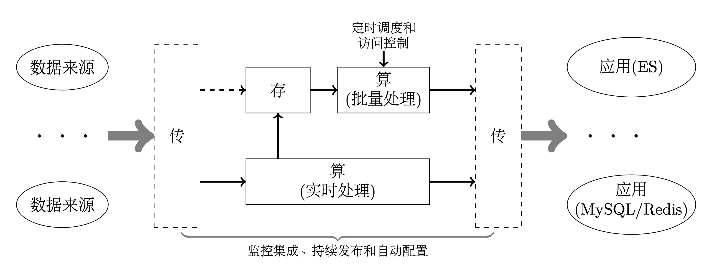

数据类型
* 业务数据：随机增删改查
* 日志数据：只增不改不删
* 汇总数据：顺序增少量改

 业务应用
 * 支撑决策
 * 辅助操作
 * 驱动应用

数据应用的目的
* 用数据说话
* 数据支撑决策
* 数据驱动业务


* 数据来源：业务数据和日志数据
* 大数据系统：方便地接受来自不同数据源的数据，经过处理后，按需地将数据发送目标系统
  * 传: 
     * 构造插入命令和预处理数据：通用、可配置，少定制化开发
	   * 缓存或者存储：a）传输时延，尤其是跨数据中心的数据传输；b）目标系统的吞吐问题；c）网络或者目标系统不可用，例如网络传输丢包；d）降低系统耦合性、提高系统安全性和提高数据复用性。
     * 消息和文件是传输的主要两种方式，Kafka和FTP是比较常用的存储/缓存数据工具
  * 存
     * 数据规模：
     * 数据类型：结构化数据和非结构化数据
	   * 访问模式：避免无效访问数据的规模
     * 包括：HDFS（包括schema预先定义和动态的）、MySQL、NoSQL
  * 算
     * 批量处理：大多数为定时任务，少部分为即席计算
	   * 实时处理：流式计算
     * 包括完全自己开发、SQL（包括MySQL、Hive SQL以及Flink SQL）和借助于Flink和Spark
* 应用系统：
  * 写入存储：大多数是业务数据和汇总数据，少数情况下会访问原始日志数据（经过裁剪的日志数据）
     * 比较常用的就是MySQL（集群）和Redis（集群）
     * 少数情况是HBase和ES这类NoSQL
  * 触发应用：触发报警或者调用接口等	
  * 即席计算：面向公司内部用户，例如数据分析员、开发工程师和机器学习应用等：a）访问频率并不高；建立专用系统，使用/投入比低；b）访问数据规模大，对于其他数据访问应用会有一定影响；c）访问模式差异大

支撑功能
* 定时调度
* 访问控制：身份认证和资源限制
* 监控集成：集成到现有的监控系统
* 持续发布：集成都git的pipeline
* 自动配置：例如调整处理参数，能够自动生效


高度重视实时处理
* 提高时效性，能够提高数据价值
* 批量处理可能造成目标系统的突发负载
* 实时处理+触发应用：有很多业务应用空间

不要忽视非结构化数据 


* 业务目标
   * 有哪些不同的角色
   * 不同角色的核心诉求和痛点
   * 公司和部门发展规划和目标
* 演进步骤
   * 业务效果和基础设施之间的平衡
   * 确保每个季度都要有业务成果
* 技术选型：概念多、系统多、发展快。没有最好的技术，只有最合适的业务。
  * 算：flink，spark
  * 存：MySQL集群、HBase，Hive、...,Data Lake,Data Lakehouse（湖仓一体）


分散在各个平台和数据库的系统 chaos

统一的数仓中，集中仓库  order

Data Warehouse 所有的主题 , Data Mart特定的主题


两类应用
* OLAP – Online Analytical Processing
* OLTP – Online Transactional Processing

There are two types of schemas:
* Predefined。Traditional Model – "Schema on Write"。Schema是预先定义好的，数据在写入表时校验数据是否符合schema定义，只有符合的情况下，才能写入表。
* Dynamic。Big data Model -  "Schema on read".  With the Big Data and NoSQL paradigm, “Schema-on-Read” means you do not need to know how you will use your data when you are storing it. 写入数据时不检查,而是在读取时根据需求采用一个schema来解析数据。


Relational model vs Aggregate model


There are two types of data models:
* Relational
* Nonrelational

In addition to making updates and reads very fast, normalization eliminates the risk of inconsistent data.


模型的层次
* Conceptual Model (概念模型): 实体和关系
* Logical Model (逻辑模型)：实体、关系和属性（列）
* Pyhsical Model (物理模型)：实体、关系和属性（列）、属性类型、主键和外键

[Dimensional Modeling Techniques](https://www.kimballgroup.com/data-warehouse-business-intelligence-resources/kimball-techniques/dimensional-modeling-techniques/)

[The Snowflake Elastic Data Warehouse](http://pages.cs.wisc.edu/~yxy/cs839-s20/papers/snowflake.pdf)

[NoSQL Data Modeling Techniques](https://www.cnblogs.com/balaamwe/archive/2012/05/02/2478699.html)

[NoSQL Data Modeling Techniques](https://www.idc-online.com/technical_references/pdfs/information_technology/NoSQL_Data_Modeling_Techniques.pdf)

NoSQL data modeling often starts from the application-specific queries as opposed to relational modeling:
* Relational modeling is typically driven by structure of available data, the main design theme is ”What answers do I have?”
* NoSQL data modeling is typically driven by application-specific access patterns, i.e. types of queries to be supported. The main design theme is ”What questions do I have?”


the basic principles of NoSQL data modeling
* Denormalization. Denormalization can be defined as copying of the same data into multiple documents or tables in order to simplify/optimize query processing or to fit user’s data into particular data model.
* Aggregates.Soft schema allows to form classes of entities with complex internal structure (nested entities) and vary structure of particular entities.
* Application Side Joins
* Atomic Aggregates
* Enumerable Keys
* Dimensionality Reduction
* Index Table
* Composite Key Index
* Inverted Search – Direct Aggregation
* Tree Aggregation
* Materialized Paths


Modern Data Warehouse
1. Ingest: Data orchestration and monitoring
2. Store; Big Data store
3. PREP: Transform & Clean
4. Model & Serve(& Store): Data warehouse

应用
* BI + reporting
* Advanced Analytics
* AI + ML
  
Use a data lake: 
* All data has potential value 所有数据都有潜在价值
* Data hoarding 数据存储
* No defined schema—stored in native format 并不定义数据模式，以天然格式存储 
* Schema is imposed and transformations are done at query time (schema-on-read). 在查询时施加模式并执行转换
* Apps and users interpret the data as they see fit 

two approaches for building data warehouses
* Kimball methodology(Dimensional Modeling): Bottom up aproach
   * Facts and dimensions, star schema
   * less tables, but have duplicate data
   * Easier for user to understand
   * Slowly changing dimensions, surrogate keys.
* Inmon Methodology (Relation Modeling)： Top-down approach
   * Entity-RelationShip model
   * Many tables using joins
   * History tables, natural keys
   * Goog for indirect end-user access of data

Ralph Kimball introduced the data warehouse/business intelligence industry to dimensional modeling in 1996 with his seminal book, The Data Warehouse Toolkit.

Dimensional models have two distinctly different expressions, logical and physical. 不同的存储引擎会以迥然不同的方式存储数据。维度模型实际上是数据仓库应用编程接口（API）。The power of this API lies in the consistent and uniform interface seen by all observers, both users and BI applications. We see that it doesn’t matter where the bits are stored or how they are delivered when an API request is launched.


[Kimball Dimensional Modeling Techniques](http://www.kimballgroup.com/wp-content/uploads/2013/08/2013.09-Kimball-Dimensional-Modeling-Techniques11.pdf)

Dimension Surrogate Keys: The DW/BI system needs to claim control of the primary keys of all dimensions; rather than using explicit natural keys or natural keys with appended dates, you should create anonymous integer primary keys for every dimension. These dimension surrogate keys are simple integers, assigned in sequence, starting with the value 1, every time a new key is needed. The date dimension is exempt from the surrogate key rule; this highly predictable and stable dimension can use a more meaningful primary key.


The four key decisions made during the design of a dimensional model include:
1. Select the business process.
2. Declare the grain.
3. Identify the dimensions.
4. Identify the facts


Natural, Durable, and Supernatural Keys.
Natural keys created by operational source systems are subject to business rules outside the control of the DW/BI system.

a new durable key must be created that is persistent and does not change in this situation. This key is sometimes referred to as a durable supernatural key.


Slowly Changing Dimension Techniques
* Type 0: Retain Original. With slowly changing dimension type 0, the dimension attribute value never changes, so facts are always grouped by this original value. 
* Type 1: Overwrite. With slowly changing dimension type 1, the old attribute value in the dimension row is overwritten with the new value; type 1 attributes always reflects the most recent assignment, and therefore this technique destroys history. 
* Type 2: Add New Row. Slowly changing dimension type 2 changes add a new row in the dimension with the updated attribute values.
* Type 3: Add New Attribute. Slowly changing dimension type 3 changes add a new attribute in the dimension to preserve the old attribute value; the new value overwrites the main attribute as in a type 1 change. This kind of type 3 change is sometimes called an alternate reality.
* Type 4: Add Mini-Dimension. Slowly changing dimension type 4 is used when a group of attributes in a dimension rapidly changes and is split off to a mini-dimension. This situation is sometimes called a rapidly changing monster dimension.
* Type 5: Add Mini-Dimension and Type 1 Outrigger.
Slowly changing dimension type 5 is used to accurately preserve historical attribute values, plus report historical facts according to current attribute values. Type 5 builds on the type 4 mini- dimension by also embedding a current type 1 reference to the mini-dimension in the base dimension.
* ...

Advanced Fact Table Techniques
* Fact Table Surrogate Keys. Surrogate keys are used to implement the primary keys of almost all dimension tables. In addition, single column surrogate fact keys can be useful, albeit not required. 
* Centipede Fact Tables. Some designers create separate normalized dimensions for each level of a many-to- one hierarchy. This results in a centipede fact table with dozens of hierarchically related dimensions. Centipede fact tables should be avoided.
* Numeric Values as Attributes or Facts. Designers sometimes encounter numeric values that don’t clearly fall into either the fact or dimension attribute categories. If the numeric value is used primarily for calculation purposes, it likely belongs in the fact table. If a stable numeric value is used predominantly for filtering and grouping, it should be treated as a dimension attribute; the discrete numeric values can be supplemented with value band attributes (such as $0-50).
* Lag/Duration Facts.


http://databaseanswers.org/downloads/Dimensional_Modelling_by_Example.pdf


A general fact table consists of two main attribute groups:
* Foreign keys to dimensional tables
* Measures

Measures (i.e. metrics or business facts) in a fact table can be:
* Additive: summable across any dimension
* Semi-additive: summable across some dimensions
* Non-additive: not summable (e.g. various ratios)

dim_, fact,

事实表的类型
* Transaction Fact Tables
* Periodic Snapshot Fact Tables
* Factless Fact Tables；student attendance

Accumulating Snapshot Fact Tables

https://vertabelo.com/blog/facts-about-facts-organizing-fact-tables-in-data-warehouse-systems/


Business Events can can be classified in to 3 types:
* Discrete. Discrete Events are represented as Transaction Fact tables in the Data Warehouse.
* Evolving. Accumulating Snapshot Fact
* Recurring. Periodic Snapshot Fact


Dimensions provide the “who, what, where, when, why, and how” context of a business process event. Dimension tables contain the descriptive attributes used by BI applications for filtering and grouping the facts.

Slowly Changing Dimensions

Dimensions are often referred to as ‘Slowly Changing Dimensions’. This describes the fact that dimensions members are relatively static but do change, albeit slowly, over time.

Hierarchies
* Natural Hierarchies.
* Parent-Child Hierarchies. Parent-Child Hierarchies are also know as Ragged Hierarchies.

Role Play Dimension.A Fact can be associated with a Dimension more than once in a different role. These secondary associations are known as Role Play Dimensions. 

Junk Dimensions. Transactions typically produce a set of miscellaneous, low-cardinality flags and indicators. E.g. Sale Type, Sale Status etc. Rather than making separate dimensions for each flag, you combine them in a single junk dimension. This dimension does not need to be (but can be) the Cartesian product of all the attributes’ possible values, but should contain the combination of values that actually occur in the source data.


Conformed Dimensions are Dimensions that are shared by the Fact tables.

自顶向下的方法
* 先有模型
* 确定需要解决的问题

自底向上的方法
* 后有模型
* 不确定需要解决的问题


organizing:S3

命名是个大问题
* 符合英语使用习惯
* 能够标识使用目的
* 便于实现分权管理
* 易于被检索和使用

environment/dataType/dataSource/dateTime/partitionDimention/fileName
* environment
  * test
  * staging
  * product
  * private: 依据国家法规或者公司规定，需要特殊权限才能访问的数据
* dataType
  * report
  * mysql
  * video
  * image
* dataSource
  * report: robot
  * mysql: 平台名称  
* dateTime 
  * 根据数据规模选择粒度，年/月/日/时，要避免数据规模较小而时间粒度又太小，而导致的大量小文件问题。
  * 采用整数表示，便于根据范围查询：例如日采用yyyyMMdd, 小时采用yyMMddhh
  * 仅仅对于日志数据和汇总数据采用dateTime，对于业务数据，不采用dateTime
* partitionDimention：根据应用和需求，可以没有
* fileName要有业务含义，以便于根据文件名区分和检索文件
  * 类似的数据具有相同的文件名前缀
  * 前缀能够支持partition，例如采用family code或者sn作为文件名前缀


所有的时间
* 时刻（Instant），通常作为事件数据或状态数据的维度，类型为Datetime和Timestamp类型。为了避免时区问题，可以采用unix时间戳，根据精度要求，可以选择秒或者毫秒。
* 时段（Duration），一般包括开始时刻和结束时刻，做完的unix时间戳，如果是固定时长，开始时刻或者

尽量避免使用null值，而是采用适当的默认值
* null值会带来复杂性
  * null会使运算出现异常，例如筛选条件和排序等，往往需要增加额外逻辑处理null值
  * null会使得join操作无效，例如出现总和大于各个部分之和的问题
  * 如果不参与运算并且null值代表特殊情况，比如耗材使用量中，采用nul代表没有此种耗材
* 尽量采用默认值，选择默认值时注意如下几种不同情况
  * 缺失：应该有，但是没有。
  * 无效：有值但是超过许可范围，例如
  * 无值：在这个维度不可应用，例如，对于40机型，不存在耗材使用量，可以采用默认值-1，代表不存在这种耗材
如果对于数据质量要求较高的场景，可以采用不同的取值以缺别上述不同的情况，从而将处理留给数据的使用者来处理。例如对于维度，可以分别定义专门的值，用来代表缺失、无效和无值的情况。

* 作为数据的统一出口，支撑不同的应用。
  * 报表
  * 机器学习
* 汇聚全公司各种类型的数据
  * 激光雷达数据、视频数据，甚至现场测量数据
  * “无用数据”可能并非没有价值

目录服务

包括
* 说明文档
* 数据组织
* 数据定义
* 通用接口：SQL

数据服务

* 及时入湖
* 实时如仓
* 按需处理

Virtualization versus a catalog-based logical data lake

[Design Tip #128 Selecting Default Values for Nulls](https://www.kimballgroup.com/2010/10/design-tip-128-selecting-default-values-for-nulls/)

* data source/subject /catalog 
* time

在NoSQL中实现关联关系的方法
* 增加新列，增加一列或者多列来存储所需要的关联数据
* 嵌套数据：很多数据库支持复合数据类型，例如数组和map等，从而可以在一列中存储多个不同的数据。这使得可以采用嵌套数据方式存储所关联的数据
* 外建引用：能够支持JOIN的数据库，并且相关联的两个或者多个表中，最多只有一个数据规模比较大，那么可以考虑采用采用外建方式关联数据。
* 采用分区：使用JOIN条件作为分区条件，有效的降低JOIN代价。


两类主键
* natural keys：自然主键，也被称为业务数据，其采用具有业务含义的一列或者多列作为主键。A natural key is a single column or set of columns that uniquely identifies a single record in a table, where the key columns are made up of real data.  A natural key is a column value that has a relationship with the rest of the column values in a given data record。
  * 主键为业务数据，可以直接进行检索，更加利于查询
  * 便于根据主键进行partition和sharding，例如MySQL分区字段必须包含在主键中
  * 便于聚会数据，从而减小无效数据读取和传输
* Surrogate Keys：人工主键，也被称为代理主键，其采用与业务无关的整数作为主键，数据类型为整数或者UUID。The surrogate key is just a value that is generated and then stored with the rest of the columns in a record.  The key value is typically generated at run time right before the record is inserted into a table.。建议采用整数作为人工主键，因为整数仅仅占用4或8个字节，占用更少存储和缓存空间，尤其是键存储空间，便于索引。存在如下两种具体的整数人工主键生成方式
  * 数据库生成，自增长主键或者利用Sequence（有些数据库支持Sequence）
  * 由应用生成，这个整数可以存在特定结构，例如SnowFlake ID
  


UUID 是指Universally Unique Identifier，翻译为中文是 通用唯一识别码

[UUIDs are Popular, but Bad for Performance — Let’s Discuss](https://www.percona.com/blog/2019/11/22/uuids-are-popular-but-bad-for-performance-lets-discuss/)

复合主键设计是需要考虑
* 避免访问热点。针对于OLTP应用，根据标识符获取对应的少量数据。
* 减小数据扫描。针对于OLAP应用，根据查询条件范围读取大量数据。基于clustered index， 合理设计主键，使得那些经常一块被访问的数据聚合在一起，从而减小不必要的数据操作。

The  "data lake" uses A bottoms-up approach.

* 宽表：列多，表少，在一个表的不同列之间存在依赖关系。因此，宽表是反范式的，但是不需要JOIN或者需要很少的JOIN操作
  * 不变的或者缓慢变化的维度
  * 表设计依赖于应用，不同的应用往往需要不同的表和字段
  * 检索模式固定，在一些情况下需要针对不同查询模式，
  * 采用NoSQL存储或者在MySQL中需要对于数量巨大的两个表做JOIN操作。
  * 为了避免JOIN：不支持JOIN或者JOIN的成本很高
  * 数据规模超大，多为日志数据。
  * 字段多样并且多为字符串类型，例如商品的特性(不同类型的商品具有迥异的特性)。
  * 复杂运算、海量检索
* 窄表：列少，表多，除了少数情况外，基本上遵循范式，换言之，采用事实表表加上维度表/业务表的方式 
  * 能够灵活地支持更多的应用 
  * 采用关系数据库或者有效支持JOIN操作的NoSQL数据库，
  * 能够JOIN操作，查询模式多样。汇总数据中小，多为汇总数据，字段固定并且多为数字类型。部分检索（条件为主键或者索引）、reduce(例如count、sum、max等)和map运算
  
denormalized data models


  汇总表
* 维度：最新粒度+基本维度。为了性能考虑，可能需要建立不同粒度和不同维度的汇总表
* 统计值
完成基本指标的
* 多个粒度：reduce运算+join
* 特定维度：group

Facts tables and Measures

Dimensions and Attributes

Exactly what is a data lake? A storage repository, usually Hadoop, that holds a vast amount of raw data in its native format until it is needed. 
* Inexpensively store unlimited data 
* Centralized place for multiple subjects (single version of the truth) 
* Collect all data “just in case” (data hoarding) 
* Easy integration of differently-structured data
* Store data with no modeling – “Schema on read” 
* Complements enterprise data warehouse (EDW) 
* Frees up expensive EDW resources for queries instead of using EDW resources for transformations (avoiding user contention) • 
* Hadoop cluster offers faster ETL processing over SMP solutions 
* Quick user access to data for power users/data scientists (allowing for faster ROI) 
* Data exploration to see if data valuable before writing ETL and schema for relational database, or use for one-time report 
* Allows use of Hadoop tools such as ETL and extreme analytics 
* Place to land IoT streaming data 
* On-line archive or backup for data warehouse data 
* With Hadoop/ADLS, high availability and disaster recovery built in 
* Keep raw data so don’t have to go back to source if need to re-run 
* Allows for data to be used many times for different analytic needs and use cases 
* Cost savings and faster transformations: storage tiers with lifecycle management; separation of storage and compute resources allowing multiple instances of different sizes working with the same data simultaneously vs scaling data warehouse; low-cost storage for raw data saving space on the EDW 
* Extreme performance for transformations by having multiple compute options each accessing different folders containing data 
* The ability for an end-user or product to easily access the data from any location

Data Analysis Paradigm Shift
* old way: Structure -> ingest -> Analyze
* new way: Ingest -> Analyze -> Structure

Data lake layers
* Raw Data layer 
* cleansed Data layer 
* application data layer 
* sandbox data layer


Organizing a  Data lake - Folder structure
* Plan the structure based on optimal data retrieval
* Avoid a chaotic, unorganized data swamp

Common ways to organize the data
* Time partitioning: 不要过大或者过小
* Subject Area
* Security Boundaries
  * Department
  * Business unit
* Downstream App/Purpose
* Data Retention Policy
   * Temporary Data
   * permanent data
   * Applicable period
* Business Impact /Criticality
  * High
  * Medium
  * Low
* Owner /Steward/SME
* Probability of Data Access
  * Recent /current data
  * historical data
* Confidential Classification
  * public information
  * internal user only
  * supplier/partner confidential
  * sensitive - financial


Multidimensional data model (MDDM)
* Data Cube Model
* Start Schema Model: Star join Schema 星形模式（一个事实表，多个维度表）每个维度仅仅存在一个表
* Snow Flake Schema Model：雪花模式（一个事实表，多个维度表）每个维度可能存在多个相关联的表
* Fact Constellations：事实星座模式（多个事实表）

 The two primary component of dimensional model 
 * Dimensions:- Texture Attributes to analyses data. 
 * Facts:- Numeric volume to analyze business. 

Fact Table ◦ Fact table consists of the measurements and facts of the business process. ◦ A fact table typically has two types of columns: those that contains facts(numerical values) and those that are foreign key to dimension tables.

Dimension Table ◦ The dimension table provides the detailed information about the attributes in the fact table. ◦ Fact tables connect to one or more dimension tables, but fact tables do not have direct relationships to one another.

The MDDM involve two types of tables
* Dimension Table:  
   * Consists of tupple of attributes of dimension. 
   * It is Simple Primary Key.  
* Fact Table
   * A Fact table has tuples, one per a recorded fact.  
   * It is Compound primary key. 


Fact Table
*  Measure
*  dimension :keys

Star Scheme 
* In the star schema design, a single object (the fact table) sits in the middle and is connected to other surrounding objects (dimension tables) like a star. 
* A star schema has one dimension table for each dimension.


Snowflake Scheme 
* Snowflake schemas contain several dimension tables for each dimension. *◦ 
* The main advantage of the snowflake schema is that it reduces the space required to hold the data and the number of places where it need to be updated if the data changes. 
* The main disadvantage of the snowflake schema is that it increase the number of tables that need to join in order to perform the given query.

Levels of data modeling:
* Conceptual Data Model • A conceptual data model identifies the highestlevel relationships between the different entities.
* Logical Data Model • A logical data model describes the data in as much detail as possible, without regard to how they will be physical implemented in the database. • Identify entity and relationships. • All attributes of each entity. • Identify primary and foreign key.
* Physical Data Model • Physical data model represents how the model will be built in the database.


* 关系模型
* 维度模型

Entity Relationship models关系-实体模型，表间的交互关系可以表示为实体-关系图
* entities： Attributes:
* relationships
  * 一对一
  * 一对多
  * 多对多
满足3NF

relationships among those entities and relationships among those atributes.

成本、性能和三者之间平衡

recursive relationship

Keys: Natural vs. Surrogate 
* Natural keys are based on business rules and logic that determine how an individual instance can be uniquely identified. 
* Surrogate keys are often used instead, which are system-generated unique identifiers. e.g. Customer ID, Product ID, etc. — While surrogate keys are more efficient, important business rules are lost when they are used. 
It’s a balancing act


OLTP
* 避免数据冗余
* 确保数据一致性


* ODS：Operation Data Store 最贴近数据源的一层，为接收到的最原始数据，用于数据溯源。
* DWD：data warehouse details 细节数据层，是业务层与数据仓库的隔离层。主要对ODS数据层做去噪、去重、异常值处理和规范化等操作。命名规范化、设置维度表
* DWB：data warehouse base 数据基础层，存储的是客观数据，确定核心指标，执行一些轻度聚会和常用计算。
* DWS：data warehouse service 数据服务层，基于DWB上的基础数据，整合汇总成分析某一个主题域的服务数据层，一般是宽表。用于提供后续的业务查询，OLAP分析，数据分发等。
* ADS （ADS，Application Data Service）数据应用层，


Raw Zone -> Gold Zone
* 剔除重复数据
* 处理异常数据
* 规范数据定义
* 汇总业务指标

应用范式 Application paradigm

Data products can process data in real time or in batches.

real-time applications and data products 
* Dashboards 仪表盘
* Automated actions 自动操作，complex event processing (CEP)
* Alerts and notifications 报警和通知
* Data sets


https://www.slideshare.net/ivoandreev/data-warehouse-design-and-best-practices
https://www.slideshare.net/jamserra/is-the-traditional-data-warehouse-dead 
https://www.slideshare.net/jamserra/data-warehousing-trends-best-practices-and-future-outlook

Reasons not to user Hadoop as your DW
* Query performance not as good as relational database 
* Complex query support not good due to lack of query optimizer, in-database operators, advanced memory management, concurrency, dynamic workload management and robust indexing 
* Concurrency limitations • 
* No concept of “hot” and “cold” data storage with different levels of performance to reduce cost 
* Not a DBMS so lack of features such as update/delete of data, referential integrity, statistics, ACID compliance, data security 
* File based so no granular security definition at the column level 
* No metadata stored in HDFS, so another tool required adding complexity and slowing performance 
* Finding expertise in Hadoop is very difficult 
* Super complex, with lot’s of integration with multiple technologies to make it work 
* Many tools/technologies/versions/vendors (fragmentation), no standards, and it is difficult to make it a corporate standard 
* Lack of master data management tools for Hadoop • Requires end-users to learn new reporting tools and Hadoop technologies to query the data • 
* Pace of change is so quick many Hadoop technologies become obsolete, adding risk • Lack of cost savings: cloud consumption, support, licenses, training, and migration costs
* Need conversion process to convert data to a relational format if a reporting tool requires it 
* Some reporting tools don’t work against Hadoop


Data Lake + Data Warehouse


https://www.slideshare.net/ecastrom/data-warehouase-best-practices

Consider partitioning large fact tables 
* Consider partitioning fact tables that are 50 to 100GB or larger. 
* Partitioning can provide manageability and often performance benefits.  
   * Faster, more granular index maintenance. 
   * More flexible backup / restore options. 
   * Faster data loading and deleting 
   * Faster queries when restricted to a single partition.
* Typically partition the fact table on the date key. •
   * Enables sliding window. 
* Enables partition elimination. Source. 


Build clustered index on the date key of the fact table 
* This supports efficient queries to populate cubes or retrieve a historical data slice. 
* If you load data in a batch window for the clustered index on the fact table then use the options 
  
  ALLOW_ROW_LOCKS = OFF and ALLOW_PAGE_LOCKS = OFF 
* This helps speed up table scan operations during query time and helps avoid excessive locking activity during large updates.
* Build nonclustered indexes for each foreign key. 
  *This helps ‘pinpoint queries' to extract rows based on a selective dimension predicate. 
* Use filegroups for administration requirements such as backup / restore, partial database availability, etc. 

Choose partition grain carefully
* 数据规模
* 最多可用的parttion数量


Design dimension tables appropriately 
* Use integer surrogate keys for all dimensions, other than the Date dimension. 
* Use the smallest possible integer for the dimension surrogate keys. This helps to keep fact table narrow. 
* Use a meaningful date key of integer type derivable from the DATETIME data type (for example: 20060215). 
* Don't use a surrogate Key for the Date dimension Source. 
* Build a clustered index on the surrogate key for each dimension table  
* Build a non-clustered index on the Business Key (potentially combined with a row-effective-date) to support surrogate key lookups during loads. 
* Build nonclustered indexes on other frequently searched dimension columns. 
* Avoid partitioning dimension tables. 
* Avoid enforcing foreign key relationships between the fact and the dimension tables, to allow faster data loads. 
* You can create foreign key constraints with NOCHECK to document the relationships; but don’t enforce them. 
* Ensure data integrity though Transform Lookups, or perform the data integrity checks at the source of the data. 


Write effective queries for partition elimination 
* Whenever possible, place a query predicate (WHERE condition) directly on the partitioning key (Date dimension key) of the fact table.

Use Sliding Window technique to maintain data 
* Maintain a rolling time window for online access to the fact tables. Load newest data, unload oldest data. 
* Always keep empty partitions at both ends of the partition range to guarantee that the partition split (before loading new data) and partition merge (after unloading old data) do not incur any data movement. 
* Avoid split or merge of populated partitions. Splitting or merging populated partitions can be extremely inefficient, as this may cause as much as 4 times more log generation, and also cause severe locking.
* Create the load staging table in the same filegroup as the partition you are loading. 
* Create the unload staging table in the same filegroup as the partition you are deleteing. 
* It is fastest to load newest full partition at one time, but only possible when partition size is equal to the data load frequency (for example, you have one partition per day, and you load data once per day). 
* If the partition size doesn't match the data load frequency, incrementally load the latest partition. • 
* Various options for loading bulk data into a partitioned table are discussed in the whitepaper • http://www.microsoft.com/technet/prodtechnol/sql/be stpractice/loading_bulk_data_partitioned_table.mspx. 
*  Always unload one partition at a time. 


数据同步
* full extraction - all data (usually dimension tables)
* incremental extraction - only data changed from last run (fast tables)
* how to determine data that has changed
  * Timestamp - Last updated
  * change data capture (CDC)
  * Partitioning by date
  * Triggers on tables
  * MERGE SQL Statement
  * Column DEFAULT value populated with date
* Online extraction - data from source
  * Replication
  * database snapshot
  * availability groups
* Offline extraction - data from flat file

ETL vs ELT 
* Extract, Transform, and Load (ETL) 
  * Transform while hitting source system 
  * No staging tables 
  * Processing done by ETL tools (SSIS) 
* Extract, Load, Transform (ELT) 
  * Uses staging tables 
  * Processing done by target database engine (SSIS: Execute T-SQL Statement task instead of Data Flow Transform tasks) 
  * Use for big volumes of data 
  * Use when source and target databases are the same 
  * Use with the Analytics Platform System (APS) 
  
  Multiple Parallel processing MPP


Four Types of NoSQL Databases
* Key-Value Store
* Document-Based Store:Full Text Search Engines
* Column-Based Store: BigTable-style 
* Graph-Based Store


One of the most significant shortcomings of the Key-Value model is a poor applicability to cases that require processing of key ranges. Ordered Key-Value model overcomes this limitation and significantly improves aggregation capabilities.


* Relational modeling is typically driven by the structure of available data. The main design theme is “What answers do I have?”
* NoSQL data modeling is typically driven by application-specific access patterns, i.e. the types of queries to be supported. The main design theme is “What questions do I have?”
  * NoSQL data modeling often requires a deeper understanding of data structures and algorithms than relational database modeling does. In this article I describe several well-known data structures that are not specific for NoSQL, but are very useful in practical NoSQL modeling.
  * Data duplication and denormalization are first-class citizens.

In general, denormalization is helpful for the following trade-offs:
* Query data volume or IO per query VS total data volume.
* Processing complexity VS total data volume. 在分布式环境中，join操作显著低增加了处理复杂性和处理时间

 Entity Aggregation：嵌入式的数据或者嵌套的数据，比如数组、map等数据类型

All major genres of NoSQL provide soft schema capabilities in one way or another:
* Key-Value Stores and Graph Databases typically do not place constraints on values, so values can be comprised of arbitrary format.
* BigTable models support soft schema via a variable set of columns within a column family and a variable number of versions for one cell.
* Document databases are inherently schema-less, although some of them allow one to validate incoming data using a user-defined schema.


* Minimization of one-to-many relationships by means of nested entities and, consequently, reduction of joins.
* Masking of “technical” differences between business entities and modeling of heterogeneous business entities using one collection of documents or one table.


Application Side Joins。
Joins are rarely supported in NoSQL solutions.

Query time joins almost always mean a performance penalty, but in many cases one can avoid joins using Denormalization and Aggregates, i.e. embedding nested entities. 


Atomic Aggregates

 Enumerable Keys

 Dimensionality Reduction


Dimensionality Reduction is a technique that allows one to map multidimensional data to a Key-Value model or to other non-multidimensional models.


Traditional geographic information systems use some variation of a Quadtree or R- Tree for indexes.A Geohash uses a Z-like scan to fill 2D space and each move is encoded as 0 or 1 depending on direction.

Index Table

Composite Key Index

[Understanding NoSQL Data Modeling Technique](https://phoenixnap.com/kb/nosql-data-modeling)

NoSQL Data Modeling Techniques
* Conceptual techniques
  * Denormalization 反范式
  * Aggregates 聚合
  * Application Side Joins
* General modeling techniques
  * Enumerable Keys 可枚举的键
  * Dimensionality Reduction.
* Hierarchy modeling techniques
  * Tree Aggregation
  * Adjacency Lists.
  * Materialized Paths
  * Nested Sets.
  * Nested Documents Flattening: Numbered Field Names
  * Nested Documents Flattening: Proximity Queries. 
  * Batch Graph Processing. 

  https://zhuanlan.zhihu.com/p/443564318


[Scaling GIS Data in Non-relational Data Stores](Scaling GIS Data in Non-relational Data Stores)


At the conceptual level, the multidimensional modelling gave birth to the concepts of fact and dimension. The most popular models used to design data warehouses are the star, snowflake, and constellation schemas . These models are then converted to the logical models which depend on the storage mode that will be adapted at the physical level . Classically, the mapping from the conceptual to the logical model is made according to three approaches; ROLAP (Relational-OLAP), MOLAP (Multidimensional-OLAP) and HOLAP (Hybrid-OLAP)


[Data Modeling Guidelines for NoSQL Document-Store Databases](https://thesai.org/Downloads/Volume9No10/Paper_66-Data_Modeling_Guidelines.pdf)

One of the most successful implementation of OLAP systems uses relational databases (R-OLAP implementations). 
* Each dimension is a table that uses the same name. Table attributes are derived from attributes of the dimension (called parameters and weak attributes). The root parameter is the primary key.
* Each fact is a table that uses the same name, with attributes derived from 1) fact attributes (called measures) and 2) the root parameter of each associated dimension. Attributes derived from root parameters are foreign keys linking each dimension table to the fact table and form a compound primary key of the table.


Some of these questions are (i) how to model one-to-N relationships in document databases, (ii) how to know when to reference instead of embedding a document, and (iii) whether document databases allow Entity Relationship modeling at all. 


NoSQL relation- ship modeling
* embedding: Characteristically, embedding provides better read performance when retrieving data from document- store databases. However, when writing data to database, it can be exceedingly slower, unlike refer- encing which uses the concept of writing data hori- zontally into smaller files.
* referencing: Typically referencing provides better write perfor- mance. However reading data may require more round trips to the server.
* bucketing: Bucketing enhances data retrieval by partitioning document with large contents into smaller affordable sizes.
* general: Normalizing data may help to save some space, but with the current advancement of technology, space is not a problem anymore.

Finally, understand the data access patterns, the nature of the data to be used in the application, the rate of updates on a particular field, and the cardinality re- lationships between entities. Such information shapes the design and modeling structure of document-store databases.

* Gl Embed sub-documents unless forced otherwise
* G2 Use array concept when embedding
* G3 Define array upper bound in parent document
* G4 Embed records which are managed together
* G5 Embed dependent documents
* G6 Embed one-to-one relationships
* G7 Group data with same volatility
* G8 Two-way embedding is preferred when N size is close to the M size in N:M relationship
* G9 One-way embedding is preferred if there’s hug gap in size between N to M
* G10 Reference highly volatile document
* G11 Reference standalone entities
* G12 Use array of references for the many side of the relationship
* G13 Parent referencing is recommended for large quantity of entities
* G14 Do not embed sub-documents if they are many
* G15 Index all documents for better performance
* G16 Combine embedding and referencing if necessary
* G17 Bucket documents with large content
* G18 Denormalize document when read write frequency is very low
* G19  Denormalize two connected documents for semi-combined re- trieval
* G20 Use tags implementation style for data transfer
* G21 Use directory hierarchies if security is a priority
* G22 Use document collections implementation style
* G23 Use Non-visible metadata for data transfer between nodes or server


https://www.slideshare.net/fabiofumarola1/data-modeling-for-nosql-12

https://www.slideshare.net/fabiofumarola1/6-data-modeling-for-nosql-22


Dimensional Modeling for Analytics

If data from all the source systems is kept in the same dimension tables in the same destination format, these tables are said to be conforming.


Integrating Data from Disparate Sources 集成来自不同来源的数据

Thus, the first challenge solved by ETL tools is converting records from the normalized schemas favored by operational systems to the denormalized schemas favored by data warehouses, as described in the previous section.
The second challenge is converting data from many different operational applications to a single common schema and representation—the “conforming” data mentioned in that section. 

Preserving History Using Slowly Changing Dimensions

Limitations of the Data Warehouse as a Historical Repository

Moving to a Data Pond
* Keeping History in a Data Pond。Let’s first examine how history is kept in the data pond using partitions, and the limi‐ tations of this approach for keeping track of slowly changing dimensions. 
* Implementing Slowly Changing Dimensions in a Data Pond.


Denormalizing attributes to preserve state: Another option is to denormalize the data and add all the important attributes to the file containing the transaction data. We can add only the fields for which we would provide slowly changing dimensions in a data warehouse.

snapshots

Preserving state using snapshots。Yet another alternative is to ingest the latest version of the data every day. To support this, we would have a directory tree of dimensional data, but instead of a folder for each day being part of the data set (a partition), each day’s folder would be a complete version or snapshot of the data set.


Raw Data
* Data breadth
* Original or raw data。This type of change is known as data interpolation, a routine analytic activity
* Non-tabular formats


Lambda Architecture


<<Big Data: Principles and Best Prac‐ tices of Scalable Realtime Data Systems>>

Kappa Architecture


 transform data to an analytics-friendly schema for performance reasons.


Open file formats, such as Apache Parquet and ORC


record

 Apache Parquet has become the de facto file format to store data for the unstructured portion of a data lakehouse. 


 These open metadata layers transform the unstructured portion of the data lake from being managed at the file- level to a logical table-level. Examples of this transformation include Delta Lake (created by Databricks), Hudi (created by Uber), and Iceberg (created by Netflix).


 Lineage of data

 KPIs (Key Performance Indicators) are probably the most important indicators the end user can provide the organization. 


 Gartner refers to Data Lakes in broad terms as “enterprise-wide data management platforms for analysing disparate sources of data in its native format”.

 Data Pond also known as Data Puddles (in Australia we could also refer to them as Data Billabongs)

 Before data can be loaded into a data warehouse, it must have some shape and structure—in other words, a model. The process of giving data some shape and structure is called schema-on-write. 

 A data lake, on the other hand, accepts data in its raw form. When you do need to use data, you have to give it shape and structure. This is called schema-on-read, a very different way of processing data


 * A data puddle is basically a single-purpose or single-project data mart built using big data technology.
 * A data pond is a collection of data puddles. It may be like a poorly designed data warehouse, which is effectively a collection of colocated data marts, or it may be an offload of an existing data warehouse.
 * A data lake is different from a data pond in two important ways. First, it supports self-service, where business users are able to find and use data sets that they want to use without having to rely on help from the IT department. Second, it aims to contain data that business users might possibly want even if there is no project requiring it at the time.
* A data ocean expands self-service data and data-driven decision making to all enterprise data, wherever it may be, regardless of whether it was loaded into the data lake or not.


Organizing the Data Lake
* A raw or landing zone where data is ingested and kept as close as possible to its original state.
* A gold or production zone where clean, processed data is kept.
* A dev or work zone where the more technical users such as data scientists and data engineers do their work. This zone can be organized by user, by project, by subject, or in a variety of other ways. Once the analytics work performed in the work zone gets productized, it is moved into the gold zone.
* A sensitive zone that contains sensitive data.


分析的四个步骤
1. Find and Understand data： Documenting the Enterprise。To bridge that gap, many enterprises are investing in data catalogs that associate business terms or tags with data sets and their fields, allowing analysts to quickly find data sets using such tags and to understand these data sets by looking at the tags associated with each field. Usually, multiple data sets contain the data that analysts need, so the next step becomes selecting which one to use. Analysts usually include judgments about how complete, accurate, and trustworthy the data is when making their choices
2. Provision
3. Prep: clean it and convert it to a format appropriate for analy‐ sis.
4. Analyze


The 6 dimensions of data quality are: Completeness, Consistency, Conformity, Accuracy, Integrity and Timeliness


There are three main use cases for metadata repositories:
* Finding data assets
* Tracking lineage (provenance)
* Impact analysis

Moving to a Data Pond
* Keeping History in a Data Pond
* Implementing Slowly Changing Dimensions in a Data Pond
* Denormalizing attributes to preserve state
* Preserving state using snapshots


Growing Data Ponds into a Data Lake—Loading Data That’s Not in the Data Warehouse
* Data breadth
* Original or raw data
* Non-tabular formats

Data from the data lake can be consumed by a variety of target systems. 
* Data warehouses
* Operational data stores (ODSs)
* Real-time applications and data products

the data warehouses are not designed to handle a large volume of ad hoc queries and analytics.
数仓并不能处理大数据规模的即席查询和分析。


https://www.cdc.gov/ncbddd/hearingloss/documents/dataqualityworksheet.pdf

basic operation
* put(key, value)
* get(key)
* delete(key)
* merge(key, delta)


The Four Pillars of the Data Warehouse
* Oriented to a single subject or a particular functional area. For example, it is oriented to company sales.
* They unify and create consistency among data from disparate sources.
* Persistent and immutable. Once data enters a data warehouse, it stays there and does not change.
* Structured in time intervals. To provide information from a historical perspective, data warehouses record information over different intervals, such as weekly, monthly, quarterly, etc.


钻取（Drill-down）：在维的不同层次间的变化，从上层降到下一层，或者说是将汇总数据拆分到更细节的数据，比如通过对2010年第二季度的总销售数据进行钻取来查看2010年第二季度4、5、6每个月的消费数据，如上图；当然也可以钻取浙江省来查看杭州市、宁波市、温州市……这些城市的销售数据。

　　上卷（Roll-up）：钻取的逆操作，即从细粒度数据向高层的聚合，如将江苏省、上海市和浙江省的销售数据进行汇总来查看江浙沪地区的销售数据，如上图。

　　切片（Slice）：选择维中特定的值进行分析，比如只选择电子产品的销售数据，或者2010年第二季度的数据。

　　切块（Dice）：选择维中特定区间的数据或者某批特定值进行分析，比如选择2010年第一季度到2010年第二季度的销售数据，或者是电子产品和日用品的销售数据。

　　errCode = 2, detailMessage = wait close failed. tablet writer write failed, tablet_id=1094425, txn_id=6517898, err=-235,：即维的位置的互换，就像是二维表的行列转换，如图中通过旋转实现产品维和地域维的互换。


Apache HAWQ


lakehouse

Parquet


大数据（Big Data）包括两个部分
* 大数据存储，例如HBase，Cassandra等
* 大数据处理，例如Yarn和Flink等。
不同于MySQL这类关系型数据，大数据存储主要面向于日志型数据，这类数据的操作特点是多读、少写和不改，也就是数据一旦被存储，就不会被更改或者更新，从而无需复杂的事务机制。因此，大数据存储系统往往支持横向扩展，而放弃分布式事务。

类似地，大数据处理系统为了实现横向扩展能力，而放弃了复杂的处理计算，通常仅仅支持具有良好并行（Embarrassingly Parallel）能力的计算，例如SUM、MAX和MAP这类能够轻易分而治之的计算。对于一些复杂的处理，需要根据特定的应用需求和处理模式进行定制开发，通常并不具有良好地可扩展性。

与传统的基于数理统计的数据分析相比，大数据处理具有如下两个特点：
1）处理全量或者海量数据。在传统统计分析中，基于合理设计的采样，仅仅需要处理一小部分数据，就能够获得所需要的结论，而大数据分析往往要求处理海量的数据，甚至全量数据。
2）重视小概率的事件。在传统统计分析中，重视大概率事件，忽略了那些小概率事件或者因素。虽然单类事件或者因素的概率很小，但是这些小概率事件或者因素却很多，即存在长尾分布（Long-Tailed Distribution），而大数据处理非常适合这类场景，从大概率事件到小概率事件都能够处理。
因此，传统的统计分析和大数据处理往往针对于不同的需求和场景，不是相互替代，而是相互补充的关系。例如，对于收视率调查，传统的统计分析就能够非常完美的解决，而不需要大数据处理，但是如果需要向用户个性化的推荐不同的视频内容，那么往往需要大数据处理的支持。


No data, No Truth

No Analytic, No understanding

No Programming, No Cognition

数据分析在实际系统应用的几个阶段
* 支持分析
* 辅助决策
* 协助操作
* 自动处理

数据分析的三个方面
* 数学基础
* 技术实现
* 业务解释


人类知识<-->机器规则
* 将人类已有的知识应用到机器处理规则
* 从机器学得的规则提炼和总结为人类知识

系统的输入与输出
* 输入：可能的各种相关数据
* 输出：统计报表、决策建议和控制动作

统计学方法与数据分析

## Streaming Process

A. G. Psaltis. Streaming Data: Understanding the real-time pipeline. Manning Publications Co. 2017


|Classification  | Example |Latency measured in |Tolerance for delay|
| :------------ | :------------ | :------------ | :------------| 
|Hard |Pacemaker, anti-lock brakes |Microseconds–milliseconds |None—total system failure, potential loss of life|
|Soft |	Airline reservation system,online stock quotes, VoIP (Skype) |	Milliseconds–seconds |Low—no system failure, no life at risk|  
|Near |Skype video, home automation |Seconds–minutes| High—no system failure,no life at risk |


 The interaction patterns fall into one of the following categories:
* Request/response pattern
    * Basic request/response pattern.Three common strategies can overcome this limitation: one on the client side, one
on the service side, and one a combination of the two.
    * Client making asynchronous request to the service: half-async pattern
    * Service-side half-async pattern
    * Service async request/response pattern：full-async
* Publish/subscribe pattern
* One-way pattern: “fire and forget” message pattern
* Request/acknowledge pattern
* Stream pattern

The two primary approaches to implementing fault tolerance, checkpointing and logging, are designed to protect against data loss and enable speedy recovery of the crashed node.

Numerous checkpoint-based protocols are available to choose from in the literature, but when you boil it down, the following two
characteristics can be found in all of them:
* Global snapshot—The protocols require that a snapshot of the global state of the whole system be regularly saved to storage somewhere, not merely the state of the collection tier.
* Potential for data loss—The protocols only ensure that the system is recoverable up to the most recent recorded global state; any messages that were processed and generated afterward are lost.

Part of the complexity of checkpointing that’s eliminated is the global snapshot, and therefore the management and generation
of the global state. In the end, the goals of the logging technique manifest themselves in the basic idea that underpins all of the logging techniques: if a message can be replayed, then the system can reach a global consistent state without the need for a global snapshot.


Implementing a logging protocol frees us from worrying about maintaining global state, enabling us to focus on how to add
fault tolerance to the collection tier. To do this we’re going to discuss two classic techniques, receiver-based message logging (RBML) and sender-based message logging (SBML), and an emerging technique called hybrid message logging (HML).


## Python

A programming paradigm is a style, or “way” of programming. Major programming
paradigms are,
* Imperative
* Logical
* Functional
* Object-Oriented


```
import os
if 'PYSPARK_SUBMIT_ARGS' in os.environ:
    del os.environ['PYSPARK_SUBMIT_ARGS']

from pyspark import SparkContext, SparkConf
import random

sc_conf = SparkConf()
sc_conf.setAppName("Pi")
sc_conf.setMaster('local')
sc_conf.set('spark.executor.memory', '1g')
sc_conf.set('spark.executor.cores', '8')
sc_conf.set('spark.cores.max', '10')
sc_conf.set('spark.logConf', True)

sc =  SparkContext(conf=sc_conf)

num_samples = 100000000
def inside(p):     
  x, y = random.random(), random.random()
  return x*x + y*y < 1
count = sc.parallelize(range(0, num_samples)).filter(inside).count()
pi = 4 * count / num_samples
print(pi)
sc.stop()
```


```
from cassandra.cluster import Cluster
from cassandra.policies import DCAwareRoundRobinPolicy
from cassandra.cluster import EXEC_PROFILE_DEFAULT
from cassandra.cluster import ExecutionProfile

profile = ExecutionProfile(request_timeout=3000)
cluster = Cluster(contact_points=['192.168.*.*','192.168.*.*'],\
                  execution_profiles={EXEC_PROFILE_DEFAULT: profile})
session = cluster.connect()
session.set_keyspace('revenue_report')
rows = session.execute("SELECT date, SUM(revenue)\
                        FROM * \
                        WHERE date>'2019-02-27'\
                        GROUP BY date ALLOW FILTERING ")
for row in rows :
    print(row[0], " ",row[1])
cluster.shutdown()
```

```

    easy_install mysql-python (mix os)
    pip install mysql-python (mix os/ python 2)
    pip install mysqlclient (mix os/ python 3)
    apt-get install python-mysqldb (Linux Ubuntu, ...)
    cd /usr/ports/databases/py-MySQLdb && make install clean (FreeBSD)
    yum install MySQL-python (Linux Fedora, CentOS ...)

```

[Apache Superset](https://superset.apache.org/docs/installation/installing-superset-using-docker-compose)

# data stream model


DolphinScheduler

# Designing Data-Intensive Applications

Hash Indexes
* The hash table must fit in memory
* Range queries are not efficient.


三个数据结构
* Sorted String Table（SSTable）
* Log-Structured Merge-Tree (or LSM-Tree)日志结构合并树
* Sparse index in memory


merging and compaction process


size-tiered and leveled compaction

In size-tiered compaction, newer and smaller SSTables are successively merged into older and larger SSTables. In leveled compaction, the key range is split up into smaller SSTables and older data is moved into separate “levels,” which allows the compaction to proceed more incrementally and use less disk space.


size-tiered策略保证每层SSTable的大小相近，同时限制每一层SSTable的数量。如上图，每层限制SSTable为N，当每层SSTable达到N后，则触发Compact操作合并这些SSTable，并将合并后的结果写入到下一层成为一个更大的sstable。


leveled策略也是采用分层的思想，每一层限制总文件的大小。

 a write-ahead log (WAL, also known as a redo log)先写日志


 LSM树的核心特点是将原本随机写操作，转化为顺序写操作，来提高写性能。LSM分树采用分层思想，将数据分为内存和文件两部分，显然会降低读性能，但是可以换来高性能写，使得LSM树成为非常流行的存储结构。


1. MemTable：MemTable是在内存中的数据结构，用于保存最近更新的数据，会按照Key有序地组织这些数据，LSM树对于具体如何组织有序地组织数据并没有明确的数据结构定义，例如Hbase使跳跃表来保证内存中key的有序。因为数据暂时保存在内存中，内存并不是可靠存储，如果断电会丢失数据，因此通常会通过WAL(Write-ahead logging，预写式日志)的方式来保证数据的可靠性。

2. Immutable MemTable：当 MemTable达到一定大小后，会转化成Immutable MemTable。Immutable MemTable是将转MemTable变为SSTable的一种中间状态。写操作由新的MemTable处理，在转存过程中不阻塞数据更新操作。

3. SSTable(Sorted String Table)：有序键值对集合，是LSM树组在磁盘中的数据结构。

冗余存储，对于某个key，实际上除了最新的那条记录外，其他的记录都是冗余无用的，但是仍然占用了存储空间。因此需要进行Compact操作(合并多个SSTable)来清除冗余的记录。

compact有多种策略，


Size-Tiered-Compaction Strategy

STCS策略保证每个level内的SSTable大小相近，当某一个level的SSTable数量达到一定阈值的时候，将这些SSTable合成一个更大的SSTable，放入下一个level。且在合并的过程中会清理掉重复的，被删除的数据，与此同时，新生成的大SSTable也是按key排序的。你可以将其理解成是一个多路归并排序。
* 空间放大问题：使用这种策略，仅仅能保证每个SSTable内不存在重复的数据，但是同一层的多个SSTable之间依然可能存在重复的数据，即空间放大的问题依然存在。
* 读放大问题：当需要查找某一个数据时，因为我并不知道这个key存在于哪个SSTable内，故需要从新到旧，依次遍历所有SSTable。即读放大也较严重。
* 写放大问题：当我们写入数据，如果此时恰好触发了compact，则会有一定写放大问题

Leveled Compaction Strategy

LCS策略保证磁盘中所有层的SSTable大小都一致。每一层会限制总文件大小，