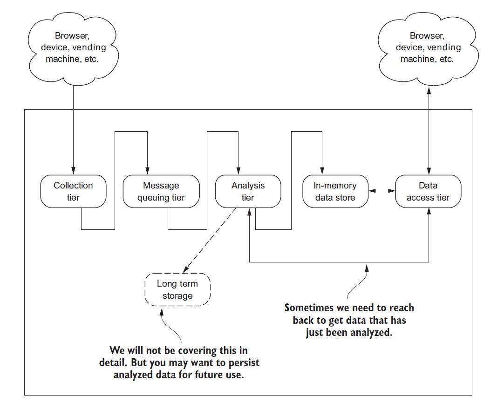

数据类型
* 业务数据：随机增删改查
* 日志数据：只增不改不删
* 汇总数据：顺序增少量改


* 数据来源：业务数据和日志数据
* 大数据系统：方便地接受来自不同数据源的数据，经过处理后，按需地将数据发送目标系统
  * 传: 
     * 构造插入命令和预处理数据：通用、可配置，少定制化开发
	   * 缓存或者存储：a）传输时延，尤其是跨数据中心的数据传输；b）目标系统的吞吐问题；c）网络或者目标系统不可用，例如网络传输丢包；d）降低系统耦合性、提高系统安全性和提高数据复用性。
     * Kafka和FTP是比较常用的存储/缓存数据工具
  * 存
     * 数据规模：
     * 数据类型：结构化数据和非结构化数据
	   * 访问模式：避免无效访问数据的规模
  * 算
     * 批量处理：大多数为定时任务，少部分为即席计算
	   * 实时处理：流式计算
* 应用系统：
  * 写入存储：大多数是业务数据和汇总数据，少数情况下会访问原始日志数据（经过裁剪的日志数据）
     * 比较常用的就是MySQL（集群）和Redis（集群）
     * 少数情况是HBase和ES这类NoSQL
  * 触发应用：触发报警或者调用接口等	
  * 即席计算：面向公司内部用户，例如数据分析员、开发工程师和机器学习应用等：a）访问频率并不高；建立专用系统，使用/投入比低；b）访问数据规模大，对于其他数据访问应用会有一定影响；c）访问模式差异大

支撑功能
* 定时调度
* 访问控制：身份认证和资源限制
* 监控集成：集成到现有的监控系统
* 持续发布：集成都git的pipeline
* 自动配置：例如调整处理参数，能够自动生效


高度重视实时处理
* 提高时效性，能够提高数据价值
* 批量处理可能造成目标系统的突发负载
* 实时处理+触发应用：有很多业务应用空间

不要忽视非结构化数据 


* 业务目标
   * 有哪些不同的角色
   * 不同角色的核心诉求和痛点
   * 公司和部门发展规划和目标
* 演进步骤
   * 业务效果和基础设施之间的平衡
   * 确保每个季度都要有业务成果
* 技术选型：概念多、系统多、发展快。没有最好的技术，只有最合适的业务。
  * 算：flink，spark
  * 存：MySQL集群、HBase，Hive、...,Data Lake,Data Lakehouse（湖仓一体）


分散在各个平台和数据库的系统 chaos

统一的数仓中，集中仓库  order

Data Warehouse 所有的主题 , Data Mart特定的主题

two approaches for building data warehouses
* Kimball methodology(Dimensional Modeling):Bottom up aproach
   * Facts and dimensions, star schema
   * less tables, but have duplicate data
   * Easier for user to understand
   * Slowly changing dimensions, surrogate keys.
* Inmon Methodology (Relation Modeling)： Top-down approach
   * Entity-RelationShip model
   * Many tables using joins
   * History tables, natural keys
   * Goog for indirect end-user access of data


Multidimensional data model (MDDM)
* Data Cube Model
* Start Schema Model: Star join Schema
* Snow Flake Schema Model
* Fact Constellations

 The two primary component of dimensional model 
 * Dimensions:- Texture Attributes to analyses data. 
 * Facts:- Numeric volume to analyze business. 

Fact Table ◦ Fact table consists of the measurements and facts of the business process. ◦ A fact table typically has two types of columns: those that contains facts(numerical values) and those that are foreign key to dimension tables.

Dimension Table ◦ The dimension table provides the detailed information about the attributes in the fact table. ◦ Fact tables connect to one or more dimension tables, but fact tables do not have direct relationships to one another.

The MDDM involve two types of tables
* Dimension Table:  
   * Consists of tupple of attributes of dimension. 
   * It is Simple Primary Key.  
* Fact Table
   * A Fact table has tuples, one per a recorded fact.  
   * It is Compound primary key. 


Fact Table
*  Measure
*  dimension :keys

Star Scheme 
* In the star schema design, a single object (the fact table) sits in the middle and is connected to other surrounding objects (dimension tables) like a star. 
* A star schema has one dimension table for each dimension.


Snowflake Scheme 
* Snowflake schemas contain several dimension tables for each dimension. *◦ 
* The main advantage of the snowflake schema is that it reduces the space required to hold the data and the number of places where it need to be updated if the data changes. 
* The main disadvantage of the snowflake schema is that it increase the number of tables that need to join in order to perform the given query.

Levels of data modeling:
* Conceptual Data Model • A conceptual data model identifies the highestlevel relationships between the different entities.
* Logical Data Model • A logical data model describes the data in as much detail as possible, without regard to how they will be physical implemented in the database. • Identify entity and relationships. • All attributes of each entity. • Identify primary and foreign key.
* Physical Data Model • Physical data model represents how the model will be built in the database.


Entity Relationship models
* entities
* Attributes:
* relationships:


relationships among those entities and relationships among those atributes.


recursive relationship

Keys: Natural vs. Surrogate 
* Natural keys are based on business rules and logic that determine how an individual instance can be uniquely identified. 
* Surrogate keys are often used instead, which are system-generated unique identifiers. e.g. Customer ID, Product ID, etc. — While surrogate keys are more efficient, important business rules are lost when they are used. 
It’s a balancing act


OLTP
* 避免数据冗余
* 确保数据一致性


https://www.slideshare.net/ivoandreev/data-warehouse-design-and-best-practices


Apache HAWQ


lakehouse

Parquet


大数据（Big Data）包括两个部分
* 大数据存储，例如HBase，Cassandra等
* 大数据处理，例如Yarn和Flink等。
不同于MySQL这类关系型数据，大数据存储主要面向于日志型数据，这类数据的操作特点是多读、少写和不改，也就是数据一旦被存储，就不会被更改或者更新，从而无需复杂的事务机制。因此，大数据存储系统往往支持横向扩展，而放弃分布式事务。

类似地，大数据处理系统为了实现横向扩展能力，而放弃了复杂的处理计算，通常仅仅支持具有良好并行（Embarrassingly Parallel）能力的计算，例如SUM、MAX和MAP这类能够轻易分而治之的计算。对于一些复杂的处理，需要根据特定的应用需求和处理模式进行定制开发，通常并不具有良好地可扩展性。

与传统的基于数理统计的数据分析相比，大数据处理具有如下两个特点：
1）处理全量或者海量数据。在传统统计分析中，基于合理设计的采样，仅仅需要处理一小部分数据，就能够获得所需要的结论，而大数据分析往往要求处理海量的数据，甚至全量数据。
2）重视小概率的事件。在传统统计分析中，重视大概率事件，忽略了那些小概率事件或者因素。虽然单类事件或者因素的概率很小，但是这些小概率事件或者因素却很多，即存在长尾分布（Long-Tailed Distribution），而大数据处理非常适合这类场景，从大概率事件到小概率事件都能够处理。
因此，传统的统计分析和大数据处理往往针对于不同的需求和场景，不是相互替代，而是相互补充的关系。例如，对于收视率调查，传统的统计分析就能够非常完美的解决，而不需要大数据处理，但是如果需要向用户个性化的推荐不同的视频内容，那么往往需要大数据处理的支持。


No data, No Truth

No Analytic, No understanding

No Programming, No Cognition

数据分析在实际系统应用的几个阶段
* 支持分析
* 辅助决策
* 协助操作
* 自动处理

数据分析的三个方面
* 数学基础
* 技术实现
* 业务解释


人类知识<-->机器规则
* 将人类已有的知识应用到机器处理规则
* 从机器学得的规则提炼和总结为人类知识

系统的输入与输出
* 输入：可能的各种相关数据
* 输出：统计报表、决策建议和控制动作

统计学方法与数据分析

## Streaming Process

A. G. Psaltis. Streaming Data: Understanding the real-time pipeline. Manning Publications Co. 2017




|Classification  | Example |Latency measured in |Tolerance for delay|
| :------------ | :------------ | :------------ | :------------| 
|Hard |Pacemaker, anti-lock brakes |Microseconds–milliseconds |None—total system failure, potential loss of life|
|Soft |	Airline reservation system,online stock quotes, VoIP (Skype) |	Milliseconds–seconds |Low—no system failure, no life at risk|  
|Near |Skype video, home automation |Seconds–minutes| High—no system failure,no life at risk |


 The interaction patterns fall into one of the following categories:
* Request/response pattern
    * Basic request/response pattern.Three common strategies can overcome this limitation: one on the client side, one
on the service side, and one a combination of the two.
    * Client making asynchronous request to the service: half-async pattern
    * Service-side half-async pattern
    * Service async request/response pattern：full-async
* Publish/subscribe pattern
* One-way pattern: “fire and forget” message pattern
* Request/acknowledge pattern
* Stream pattern

The two primary approaches to implementing fault tolerance, checkpointing and logging, are designed to protect against data loss and enable speedy recovery of the crashed node.

Numerous checkpoint-based protocols are available to choose from in the literature, but when you boil it down, the following two
characteristics can be found in all of them:
* Global snapshot—The protocols require that a snapshot of the global state of the whole system be regularly saved to storage somewhere, not merely the state of the collection tier.
* Potential for data loss—The protocols only ensure that the system is recoverable up to the most recent recorded global state; any messages that were processed and generated afterward are lost.

Part of the complexity of checkpointing that’s eliminated is the global snapshot, and therefore the management and generation
of the global state. In the end, the goals of the logging technique manifest themselves in the basic idea that underpins all of the logging techniques: if a message can be replayed, then the system can reach a global consistent state without the need for a global snapshot.


Implementing a logging protocol frees us from worrying about maintaining global state, enabling us to focus on how to add
fault tolerance to the collection tier. To do this we’re going to discuss two classic techniques, receiver-based message logging (RBML) and sender-based message logging (SBML), and an emerging technique called hybrid message logging (HML).


## Python

A programming paradigm is a style, or “way” of programming. Major programming
paradigms are,
* Imperative
* Logical
* Functional
* Object-Oriented


```
import os
if 'PYSPARK_SUBMIT_ARGS' in os.environ:
    del os.environ['PYSPARK_SUBMIT_ARGS']

from pyspark import SparkContext, SparkConf
import random

sc_conf = SparkConf()
sc_conf.setAppName("Pi")
sc_conf.setMaster('local')
sc_conf.set('spark.executor.memory', '1g')
sc_conf.set('spark.executor.cores', '8')
sc_conf.set('spark.cores.max', '10')
sc_conf.set('spark.logConf', True)

sc =  SparkContext(conf=sc_conf)

num_samples = 100000000
def inside(p):     
  x, y = random.random(), random.random()
  return x*x + y*y < 1
count = sc.parallelize(range(0, num_samples)).filter(inside).count()
pi = 4 * count / num_samples
print(pi)
sc.stop()
```


```
from cassandra.cluster import Cluster
from cassandra.policies import DCAwareRoundRobinPolicy
from cassandra.cluster import EXEC_PROFILE_DEFAULT
from cassandra.cluster import ExecutionProfile

profile = ExecutionProfile(request_timeout=3000)
cluster = Cluster(contact_points=['192.168.*.*','192.168.*.*'],\
                  execution_profiles={EXEC_PROFILE_DEFAULT: profile})
session = cluster.connect()
session.set_keyspace('revenue_report')
rows = session.execute("SELECT date, SUM(revenue)\
                        FROM * \
                        WHERE date>'2019-02-27'\
                        GROUP BY date ALLOW FILTERING ")
for row in rows :
    print(row[0], " ",row[1])
cluster.shutdown()
```

```

    easy_install mysql-python (mix os)
    pip install mysql-python (mix os/ python 2)
    pip install mysqlclient (mix os/ python 3)
    apt-get install python-mysqldb (Linux Ubuntu, ...)
    cd /usr/ports/databases/py-MySQLdb && make install clean (FreeBSD)
    yum install MySQL-python (Linux Fedora, CentOS ...)

```

[Apache Superset](https://superset.apache.org/docs/installation/installing-superset-using-docker-compose)
