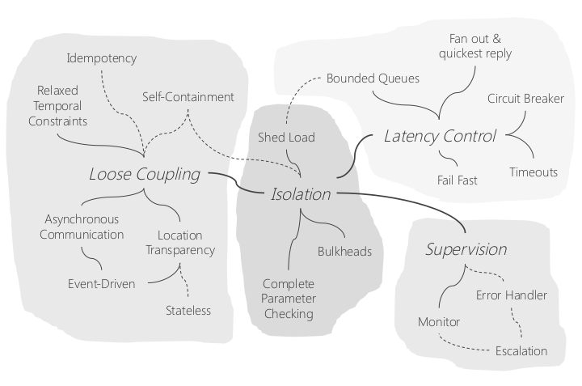

# Idea
[scalability-availability-stability-patterns](https://www.slideshare.net/jboner/scalability-availability-stability-patterns)

https://akfpartners.com/growth-blog


[从事分布式系统、计算、hadoop 等方面工作需要哪些基础](https://www.zhihu.com/question/19868791/answer/88873783l)

[分布式系统(Distributed System)资料](https://zhuanlan.zhihu.com/p/91431718)

* Horizontal scaling(水平扩展):scale out 向外伸缩，通过添加服务器，实现可扩展性
* Vertical scaling(垂直扩展):Scale up 向上伸缩，通过升级硬件，实现可扩展。


为什么需要分布式系统

遇到的问题
* 更大的数据量
* 更大的计算量
* 更多的请求数

分布式解决的问题
* 提高吞吐和容量
* 提高可靠性
* 降低系统成本：分布式系统不能解决所有问题，很多还需要超算来解决

可扩展性描述了一个系统在确保服务质量（例如响应时间或者可靠性等）的前提下，通过添加服务器资源能够处理更多任务的能力，包括处理更多服务请求、更大的数据规模以及更高的计算精度等。

分布式系统的定义：一组独立的并通过网络连接的计算机，能够相互协作完成特定的任务，就像一台计算机一样向外提供服务。

Multiprocessors（多处理器系统）
* Shared memory共享内存
    * uniform memory access (UMA) architecture
    * Non-uniform memory access (NUMA) architecture
* Shared clock共享时钟
* Shared operating system共享操作系统
* All-or-nothing failure或者全部失效或者没有失效


supercomputer：Parallel systems（超级计算机/大型计算机）：针对于大型的、计算密集(浮点运算)的和对于通信时延的任务
* Distribued memoery 分布式内存
* No shared global clock 没有全局共享时钟
* Shared operating system 共享的操作系统
* Partial failures 部分失效，在硬件和操作系统层面处理失效，上层应用和任务无感知。
* dedicated network 专门的网络

Multicomputers (networks of computers)：distributed systems（分布式系统）：针对于交互性的任务或者数据处理任务
* No shared memory 没有共享的内存
* No shared clock 没有共享的时钟
* Partial failures 部分失效，使用冗余地部署商用组件或者商业系统，依赖于应用层检测、隔离和迁移故障。
* common network 通用的局域网

分布式系统与并行系统（超级计算机）的区别：面对的任务类型不同
* 请求量：请求密集型
* 数据量：数据密集型
* 计算量：计算密集型

分布式系统主要面向请求密集型的应用或者需要较少通信的数据密集型/计算密集型

分布式系统依赖于网络可以划分为
* 强耦合系统（strongly coupled systems）：通过局域网络连接，更大的带宽以及通信时延更加可预测
* 松耦合系统（weakly coupled systems）：通过广域网络连接。

通过商品化硬件构建分布式系统，能够以比超算更加低廉的价格，提供远高于单个多处理系统的性能。
* 超级计算器（超算）：采用专用的硬件和软件，价格贵，性能高
* 多处理器系统：

分布式字面上的意思是通过多个服务器或者阶段协同提供服务

分布式的不同视角或者侧面:目的、对象、方法和问题


实现分布式的可能目标或者潜在好处包括：
* 提高系统的吞吐量 （improve throughtput) ，实现更强大的处理能力
* 快速响应业务增长，满足业务高速增长的需求
* 增加服务的可靠性，提高可用性或者容错性（High availability & Fault tolerance）
* 降低请求响应时间，减小客户等待时延(reduce latency)。
* 降低系统硬件要求，使用普通的商品化服务器
不仅仅能够提供较大的吞吐量，而且能够随着需求快速地增加或者减小系统吞吐能力。

分布式系统对于处理时延带来两个相互冲突的影响
* 增加处理时延。任务的分布式执行，需要额外增加协调处理过程。特别是，功能和服务的分布式部署使得相互之间调用依赖于网络传输，从而大大增加了响应时间。
* 减小处理时延。
    * 将大任务分解为更小的子任务，并在多个节点上并行处理，能够显著地降低整个任务的处理时间;
    * 通过平衡负载，减小等待时间，尤其是对于负载比较大情况，可以实现更快的响应能力。
因此，在实际的分布式系统需要综合考虑上述两个方面的影响。一方面需要尽可能地减小相互之间的协同和节点之间调用，另一方面需要充分挖掘任务蕴含的并发性和充分使用分布式系统的并行处理能力，可以弥补分布式处理带来的时间损失。


上述三个目标是相互冲突和矛盾
* 为了提高可靠性，需要更多的冗余节点，从而降低系统的吞吐。
* 虽然降低响应时间，能够提高吞吐量，但是提高吞吐量的很多措施却会大幅度增加服务的响应时间。

最为常见的目标是：在确保一定响应时延的情况下，提高系统的吞吐和可靠性。

评价分布式方案或者系统的几个方面
* 可扩展性
* 性能指标
* 复杂程度


性能指标
* 系统容量，即系统最大的吞吐量
* 响应时间，平均响应时间，总的请求中，响应时间低于一个特定阈值的请求所占比例
* 可靠性，

三者的区别与联系
* Fault Tolerance 容错性
   * Detection：发现故障
   * Isolation & Failover：故障隔离和服务切换
   * Recovery: 故障恢复
* Availability 可用性
* Reliability 可靠性


任何东西都可能失效。因此，为了实现高可靠性，需要冗余地部署设备和组件。理论上，包括网络在内的整个系统不应该存在单点故障，但是其建设和维护成本较高，在实际中要根据成本和效益进行分析，
* 失效能够造成多大的损失？最多容忍多长时间的停机时间？
* 为了实现高可用性，可以额外增加多少投入？

根据成本和效益，合理设计方案。在无法排除单点故障时，可以从如下几个方面考虑
* 确保重点的组件或者子系统没有单点故障。
   * 从业务或者使用上，核心的或者重要的子系统。
   * 从硬件和软件上，比较容易出现故障的子系统
* 在出现故障时，确保数据不丢失或者少丢失。需要数据完整的数据备份方案
* 在出现故障时，能够及时地确定故障并尽快地恢复。

可扩展性包括两个方面
* 管理：随着人员的增加，能够完成更多的工作和实现更多的产出
* 系统：随着资源的增加，能够处理更多的任务
  * 设计阶段
  * 开发阶段
  * 运维阶段
   

对于系统而言，可扩展性（可伸缩性）描述了一个系统随着添加资源，能够在满足服务水平的情况下处理更多工作的能力，包括更多的请求、更大的数据和更高的精度
* 更多的服务请求
* 更大的数据规模
* 更高的计算精度

线性扩展：在满足特定性能指标的前提下，所处理的服务请求/数据规模/计算精度随着添加的资源数量呈线性增长。在实际的分布式系统或者并行系统中，很难实现线性扩展。这是因为需要相互协同，从而添加了额外的消耗。

复杂程度如何衡量？


分布式的对象
* 数据(data)，存储的分布化
* 功能(function)，计算和处理的分布化
* 请求(request)，负载均衡

分布式的方法：
* 分割/划分（partition/split)，通过提高并发度来提高吞吐，通过并行处理来降低服务时间。
* 复制/克隆（replicate/clone)，分担负载来提高吞吐，提高可靠性


数据扩展所面临的两个问题
* 复制或者克隆：一致性问题，CAP
* 拆分或者sharding：事务保障

基于业务和场景进行简化
* 不改和少删，最终保持一致即可：比如weibo这类社交媒体，
* 一写多读，许可不一致，例如12306这类订票系统，查询和订购分别使用读库和写库，允许多个读库与写库之间短时间的不一致，仅仅会短时间增加写库的压力，不会引起其他的问题
* 有事务要求，但是事务所涉及的多个步骤是可逆的，例如转账。


A collection of independent computers connected through a communication network that work together to accomplish some goal 一组相互独立的并且通过网络连接的计算机能够相互协同工作，从而实现特定的目标。
* No shared operating system
* No shared memory
* No shared clock

Collection of independent computers that appears as a single system to the user(s) 从用户的视角一组相互独立的计算机就像单一的系统一样提供服务
* Independent = autonomous, self-contained 独立的：自治的、子包含的
* Single system = user not aware of distribution 单一系统=用户无法感知到分布性。


More cores per chip：requires multithreaded programming
* There are limits to the die size and # of transistors
* CPU主频存在上限

为什么需要分布式系统：我们的计算需求已经超过了CPU的进步。Our computing needs exceed CPU advances

Redundancy = replicated components

Service can run even if some systems die
* Series system: The system fails if ANY of its components fail
* Parallel system: The system fails only if ALL of its components fail


[Eight Fallacies of Distributed Computing ](https://samirbehara.com/2019/05/16/eight-fallacies-of-distributed-computing/)
分布式引入的问题

The 8 fallacies of distributed computing
1. The network is reliable.
2. Latency is zero.
3. Bandwidth is infinite.
4. The network is secure.
5. Topology doesn't change.
6. There is one administrator.
7. Transport cost is zero.
8. The network is homogeneous.

Fault tolerance: we want the system as a whole to continue working, event when some parts are faulty.
容错性：我们希望系统作为一个整体能够持续工作，即使其某些某些部分出现故障。

Network messages may take a long time to arrive
* Synchronous network model
   * There is some upper bound, T, between when a node sends a message and another node receives it
   * Knowing T enables a node to distinguish between a node that has failed and a node that is taking a long time to respond
* Partially synchronous network model
   * There’s an upper bound for message communication but the programmer doesn’t know it – it has to be discovered
   * Protocols will operate correctly only if all messages are received within some time, T. We cannot make assumptions on the delay time distribution
* Asynchronous network model
   * Messages can take arbitrarily long to reach a peer node
   * This is what we get from the Internet!


Messages may take an unpredictable amount of time
– We may think a message is lost but it’s really delayed
– May lead to retransmissions à duplicate messages
– May lead us to assume a service is dead when it isn’t
– May mess with our perception of time
– May cause messages to arrive in a different order

You know you have a distributed system when the crash of a computer you’ve never heard of stops you from getting any work done. — Leslie Lamport

No common knowledge:the only way of knowning something is to communicate it

Models of Distributed System
* two generals problem:网络模型
* the Byzantine generals problem: Need 3f+1 generals in total to tolerat f malicious generals (i.e. < 1/3 may by malicious)。节点行为模型。

a system model consisting of 
* Network behaviou (e.g. message loss)
* Node behavious (e.g. crashes)
* Time behavious (e.g. latency)

network behaviour
* point-to-point communication
  * Reliale (perfect) link
  * Fair-loss links
  * Arbitrary links (active adversary)
* Network partition  

node behavious
* Crash-stop (fail-stop)
* Crash-recovery (fail-recovery)
* Byzantine (fail-arbitrary)

Failure is a fact of life in distributed systems!
* In local systems, failure is usually total (all-or-nothing)
* In distributed systems, we get partial failure


Handling failure
* Handle detection, recovery, and restart
* Availability = fraction of time system is usable
  * Achieve with redundancy
  * But then consistency is an issue!
* Reliability: data must not get lost
  * Includes security


System Failure Types
* Fail-stop
  * Failed component stops functioning
  * Halting = stop without notice
  * Detect failed components via timeouts
        * But you can’t count on timeouts in asynchronous networks：And what if the network isn’t reliable?
        * Sometimes we guess
* Fail-restart
  * Component stops but then restarts
  * Danger: stale state

系统故障类型
* 停止响应：
* 错误响应：系统重启或者软硬件故障等导致返回错误的响应
* 超时响应：虽然能够返回响应，但是系统的响应时间超长。

Network Failure Types
* Omission
  * Failure to send or receive messages：Due to queue overflow in router, corrupted data, receive buffer overflow
* Timing
  * Messages take longer than expected：We may assume a system is dead when it isn't
  * Unsynchronized clocks can alter process coordination
* Partition
  * Network fragments into two or more sub-networks that cannot communicate with each other

网络故障类型
* 丢包增加：
* 传输超时：
* 无法传输：由链路中断和网络分裂造成，网络分裂被链路中断更加严重。


对于可断而言，仅仅根据响应情况，常常难以确定是服务系统问题，还是传输网络问题。

Network & System Failure Types
* Fail-silent
  * A failed component (process or hardware) does not produce any output
* Byzantine failures
  * Instead of stopping, a component produces faulty data
  * Due to bad hardware, software, network problems, or malicious interference

We deal with failures by adding redundancy： Replicated components
But this means we need to keep the state of those components replicated.

Nobody has the true global state of a system

[Fallacies of Distributed Computing Explained](http://rgoarchitects.com/Files/fallacies.pdf)


请求分解为多个请求：请求数据，检查数据是否准备完成，下载数据

请求复制：热备


|  |数据 | 功能 | 请求 |
| :------------ | :------------ | :------------ | :------------ |
|分割/划分 |数据划分<br>* 分担写负载 | pipeline | 大任务请求：划分为多个阶段性请求和多个并行请求（页面浏览）|
|复制/克隆 | 数据复制<br>* 分担读负载 <br>* 提高可靠性<br>*   Cache | 负载均衡 |热备| 


数据-分割/划分，提高系统的并发度

data
- partitions
- replication

读多写少，极端情况下一次写入、多次读取

数据复制所带来的问题
* 一致性问题，
* 事务处理
* 时延

数据分割
* 分割相同的数据（根据地理位置、id等分割客户数据）：两种常见的分割数据的方式是Hash和Range
* 分割不同的数据（分割客户、商品、订单和商户数据）


task
- load balancing
- pipeline

[Architecting for Massive Scalability](https://www.slideshare.net/ericdboyd/architecting-for-massive-scalability-st-louis-day-of-net-2011-aug-6-2011?qid=2acd1958-d23a-40d9-b5d6-afb6ff6c99e2&v=&b=&from_search=18)

What is Scalability? A service is said to be scalable if when we increase the resources in a system, it results in increased performance in a manner proportional to resources added. --Werner Vogels, CTO, Amazon.com 

Measures of Performance 
* Response Time 
* Throughput 

Scalability is the property of a system to handle a growing amount of work by adding resources to the system.

可扩展性（可伸缩性）描述了一个系统随着向其添加资源而能够处理更多工作的能力。

Computing capability of a system can be scaled up. Up to a certain point, we observe a performance gain as the system is scaled up. Yet, after a critical point, we observe that we do not get the intended speed up as we provide the system with more and more resources. 

一个系统的计算能力能够向上扩展。当系统向上扩展时，我们会观察到性能提升，但是在经过一个关键点之后，我们发现虽然我们为系统提供越来越多的资源，却无法获得所预计的性能加速。

Measures of Scalability?

What can be Scaled? 
* Servers 
* CPU 
* Memory 
* Hard Disk 
* Network Ports 
* Bandwidth 
* Cooling 
* Power 
* Racks 
* Floor Space

Benefits of Scalability
* Dynamic Capacity 
* Planning Cost is Linear 


In a general sense, scaling is a geometric notion where we make a system bigger by stretching it in several directions. However, every system has its limitations to growth. As the system is scaled up, overheads start to hinder the gains. Beyond a critical point, the capability of the system starts to decrease as the system is further scaled up.

一般而言，缩放是一种几何概念，我们通过在多个方向上拉伸来使系统变大。然而，每个系统都有其增长的限制。随着系统规模的扩大，开销不断增加，而收益却逐渐减少。在超过某个临界点后，随着系统进一步扩展，系统的能力开始下降。


ACID, CAP(Consistency, Availability, Partition Tolerance), BASE(Basically Available, Soft State, Eventually Consistent ) 

 I Need Scalability
 * Loose Coupling
 * Stateless 
 * Messaging & SOA 
 * Async & Background Processes 
 * Queuing 
 * Monitoring and Diagnostics 

Front-End (FE) + Back-End (BE) Architecture 
1. (FE) requests (BE) to perform work 
2. (BE) completes work 
3. (BE) reports results back to (FE) 


复制/克隆的一种特殊形式是跨越多个数据中心的复制/克隆(Multi-Active IDCs/Regions)
* 就近提供服务，减小网络传输时延
* 避免断电、断网和灾难等原因造成数据中心不可用，从而提供更高的可靠性
* 分流流量，避免网络拥塞

静态文件：CDN （Content Delivery Network）

数据的多数据中心异地存储

根据地理位置，部署多个站点：每次域名解析请求都会根据对应的负载均衡算法计算出一个不同的IP地址并返回，这样A记录中配置多个服务器就可以构成一个集群，并可以实现负载均衡


从系统的生命周期看，分布化设计整个周期的各个阶段和环节
Strategies --> design -> implement -> deployment -> operation(monitor, log)


在用户向Web服务器请求服务时，Web服务器
用户与服务器之间的异步操作
* 增加交互，例如返回确认界面，
* 后台操作
   * 基于WebSocket的站内消息
   * 基于定时Ajax的消息


Remote Procedure Call（RPC）
* Location transparency：System hides where a resource is located.


   
异步调用的好处
* 降低调用耦合性,更容易扩展
* 实现故障隔离，避免故障扩散
* 充分利用资源，提高系统吞吐

异步调用的实现更加复杂
* 针对每个调用，需要维护一个相互隔离的上下文信息
   * 在获得结果后，利用这个上下文信息能够继续执行
   * 需要唯一标识符用于标识调用而对应的上下文信息
* 需要额外的机制和操作，用于获取服务请求的处理状态或者结果。
   * 请求之前的处理
   * 请求期间的处理：这个处理过程仅仅针对于请求者进行轮训的情况。
   * 请求结果的处理
* 异步调用会引入更多的处理时延，从而额外地增加响应时间
  

服务器与服务器之间的异步操作
* 定时轮训（Future），不同管理域，即属于不同的管理者，请求者轮训任务状态或者处理结果
  * 直接返回结果：任务未完成，返回running状态，否则返回success和任务结果
  * 两次获取结果：任务非完成，返回running状态，否则返回success和任务结果地址。请求者根据返回的结果地址，在发起请求获得对应的结果。
* 消息队列（MQ），同一管理域，调用双方的耦合性最低
  * 通过消息队列发起请求
  * 从消息队列中接收结果
* 服务回调（Callback） ，不同管理域和同一管理域都可以
  * 请求方仅仅发起请求
  * 由被调用方将结果提交给请求方。

根据实际需求和场景涉及异步请求，例如出具大报告
1. 请求方发起一个请求，获得对一个的任务id
2. 根据任务id，请求方周期地轮训任务结果
3. 如果报告完成，请求方会获得对应报告的文件名
4. 请求方从相应的FTP服务器（每个用户一个用户名和密码）下载这个报告


阻塞/非阻塞与同步/异步分别刻画了调用过程和结果处理的不同方面。阻塞和非阻塞的区别是在调用结果返回之前，调用者（Caller）是否处于阻塞等待状态。非阻塞最常用的一种模式是Future模式，即调用过程立即返回Future，而调用者（调用一方的专门线程）以轮询方式查看Future的isDone()，判断调用过程是否已经完成，如果已经完成，则通过get获得结果，并完成后续的结果处理过程。非阻塞调用能够增加处理的并发度，从而提高系统的吞吐量，但是可能需要维护一个与调用相关的上下文信息，用于处理返回的结果。此外，在非阻塞方式中还要注意并发处理的调用个数，避免出现调用过多，而抛出OutOfMemoryError错误。同步和异步的主要区别是由调用者（Caller）还是被调用者（Callee）处理调用结果，异步方式中是由被调用者处理这个结果。异步方式是一种特殊的非阻塞调用，常用的模式是Callback模式，调用者需要将处理所需要的上下文信息封装在Callback中，并作为调用过程的参数传递给被调用者。如果调用过程是RPC，那么处理过程就会更加复杂。

Fault Tolerance
* 所有网络调用都要设置time out
  * connect timeout
  * read timeout
  * write timeout

系统优雅的退出：避免数据丢失或者数据异常
* 所有模块要实现Stopable接口(主动终止)
* 线程要接收和处理Interrupt信号(被动终止)

# Papers
[1] Patrick O'Neil, Edward Cheng, Dieter Gawlick, Elizabetch O'Neil. The log-structured merge-tree (LSM-tree). Acta Informatica, 1996, 33(4): 351-385.

[Brewer’s Conjecture and the Feasibility ofConsistent, Available, Partition-Tolerant WebServices](http://citeseerx.ist.psu.edu/viewdoc/download?doi=10.1.1.67.6951&rep=rep1&type=pdf)

It is impossible for a web service to provide the following three guarantees:
* Consistency
* Availability
* Partition-tolerance

ACID

Interactions with web services are expected to behave in a transactional manner: operations commit or fail in their entirety (atomic), committed transactions are visible to all future transactions (consistent), uncommitted transactions are isolated from each other (isolated), and once a transaction is committed it is permanent (durable).


Atomic , or linearizable , consistency is the condition expected by most web services today.


Alan Fekete, David Gupta, Victor Luchangco, Nancy Lynch, and Alex Shvartsman. Eventually-serializable data services. Theoretical Computer Science, 220(1):113–156, June 1999.

[Keeping CALM: When Distributed Consistency is Easy](https://arxiv.org/pdf/1901.01930.pdf)

# Books


Isomorphism


The AKF Scale Cube is a three dimentional approach to building applications that can scal infinitely.
* X Axis scaling: Cloning/Replicating. X axis scaling consists of running N instances of a cloned application or replicated database. Proxied by a load balancer, each instance handlers 1/Nth the load.
* Y Axis Scaling: Split Disimilar Thing. Scaling on the Y Axis consists of functional decomposition. Monoliths are separated along functional or resource oriented boundaries to create macro and microservices. This allows you to scale earch service independently and apply more resources only the services that need them.
* Z Axis Scaling: Split Similar Things. Scaling on the Z Axis consists of each server running the same code but for only a subset (or shard - 1/Nth) of the data. The most common Z axis split is by geography for B2C implementations, which can also enable faster response times. B2B implementations commonly split along a company or group of companies boundary.


AKF Scale Cube
* X-Axis: Horizontal Duplication and Cloning of services and data
* Y-Axis: Functional Decomposition and Segmentation - Microservices (or micro-services)
* Z-Axis: Service and Data Partitioning along Customer Boundaries - Shards/Pods


[Scalability Rules - Reduce Objects to Improve Website Performance (Rule 5)](https://akfpartners.com/growth-blog/scalability-rules-reduce-objects-to-improve-website-performance)

# 分布式存储

2000 集中式元数据管理：集中式元数据服务器，分布式存储节点。性能高、存储空间利用率高。元数据节点是系统瓶颈、高可用问题

2010s 去中心化，用计算的方式来定位，而不是利用查表的方式。一致性Hash.无单点性能瓶颈、文件数理几乎不受限制；磁盘空间利用率不高、管理困难、目录操作性能低

{},
   author =    {},
   publisher = {},
   isbn =      {3658245484, 978-3658245481},
   year =      {},

Andreas Meier, Michael Kaufmann,SQL & NoSQL Databases: Models, Languages, Consistency Options and Architectures for Big Data Management,Springer,2019


# Course


# 逻辑时间（Logical Time)

[Clock Synchronization：Getting the right time](https://www.cs.rutgers.edu/%7Epxk/417/notes/clocks.html)

[Precision Time Protocol: Clock synchronization that computes latency and offset](https://www.cs.rutgers.edu/%7Epxk/417/notes/ptp.html)

[Logical clocks： Causality and concurrency](https://www.cs.rutgers.edu/%7Epxk/417/notes/logical-clocks.html)

Goal: Enable clocks on multiple machines to synchronize to the same time.使得多台机器上的时钟能够同步到相同的时间。

Keeping track of time is difficult. No two clocks tick in perfect synchrony with each other. Quartz oscillators, which drive the timekeeping mechanisms of clock circuits, are not consistent over time and no two tick at exactly the same rate. The difference between two clocks at any given instant is the clock offset. The rate at which the clocks are drifting is the clock drift. The variation of network delay is called jitter. Jitter is useful for assessing the consistency of our interaction with servers.
保持正确的计时是困难的。没有两个时钟之间是完美同步的。驱动时钟电路计时机制的时英振荡器会随着时间出现不一致，两个滴答不再是精确的、相同的速率。在任意给定时刻两个时钟之间的差是时钟偏移。时钟正在偏移的速度就是时钟漂移(clock drift)。网络时延的变化被称为抖动（jitter）。抖动对于评估我们与服务器交互中的一致性非常有用。

We can correct for drift simply by changing the value of a system’s clock to reflect that of UTC time. However, we do not want to provide the illusion of time moving backward to any process that is observing the clock. A linear compensation function adjusts the rate at which time is measured on a computer (e.g., number of ticks that make up a second).
我们可以通过改变系统时钟的值来简单地纠正时间漂移，从而显示UTC时间。但是，我们不想使得任何正在观察时钟的进程产生时间正在倒流的错觉。为此，采用一个线性补偿函数(linear compensation function)调整在计算机上测量时间的速率（例如构成一秒的滴答数）

Cristian’s algorithm 

Berkeley algorithm

Network Time Protocol, NTP

Simple Network Time Protocol, SNTP

The formula for NTP and SNTP is time_offset = (T2 - T1 + T3 - T4)/2 where T1 is the time the message left the client, T2 is the time it arrived at the server, T3 is the time the response left the server, and T4 is the time that it arrived at the client. If we let TS = (T2 + T3)/2 then we arrive at Cristian’s formula.


* Offset（偏移）: The difference between the client’s clock and the server’s. This is how much the client needs to offset its clock to set it to the server’s time.
* Delay（时延）: This is an estimate of the time spent sending or receiving the message. It is one half of the round-trip time minus the estimate of time spent on the server.
* Jitter（抖动）: Jitter measures the variation in delay among multiple messages to the server. It gives us an idea of how consistent the latency is between the client and server.
* Dispersion（散布）: Dispersion is the estimated maximum error for the computed offset. It takes into account the root delay (total delay, not just to the server but the delay from the server to the ultimate time source), estimated server clock drift, and jitter. 


Precision Time Protocol (PTP, an IEEE standard)


The Precision Time Protocol, PTP, is designed to synchronize clocks on a local area network (LAN) to sub-microsecond precision. 
设计精确时间协议PTP是为了在局域网（LAN）上实现亚微秒精度的时钟同步。

An advantage of synchronizing via the LAN is that latency becomes far more predictable.
通过局域网进行同步的一个优点是延迟变得更加可预测。


Goal of logical clocks: Allow processes on different systems to identify causal relationships and their ordering among events, particularly among messages between different systems. 逻辑时钟的目的：允许不同系统上的进程识别在不同系统上的事件之间的（特别是消息之间的）因果关系及其顺序。

逻辑时间需要考虑两个方面
* 如果a→b, 那么clock(a) \<clock(b)
* 如果clock(a) \<clock(b)， 那么必有a→b

两个关系
* These events are concurrent这些事件是并发的
* Otherwise, they are causal。否则，它们是因果关系

Lamport clocks allow processes to assign sequence numbers (“timestamps”) to messages and other events so that all cooperating processes can agree on the order of related events. There is no assumption of a central time source and no concept of when events took place. Events are causally related if one event may potentially influence the outcome of another event. 
Lamport时钟允许进程赋予消息和其他事件一个序列号（时间戳），使得所有在协作中的进程能够对相关事件的顺序达成一致。没有假设集中的时间源，也没有事件发生时间的概念。如果一个事件可能潜在地影响另一个事件的发生，那么称事件是因果相关的。

The central concept with logical clocks is the **happened-before** relation: a→b represents that event a occurred before event b. This order is imposed upon consecutive events at a process and also upon a message being sent before it is received at another process. Beyond that, we can use the transitive property of the relationship to determine causality: if a→b and b→c then a→c.
逻辑时钟的核心概念是happen-before关系：a→b代表了事件a出现在事件b之前。这种顺序施加于在一个进程中相继发生的事件以及在消息被另一个进程接收之前的消息发送。除此之外，我们可以利用关系的传递性来确定因果关系：如果a→b和b→c，那么a→c。

If there is no causal relationship between two events (e.g., they occur on different processes that do not exchange messages or have not yet exchanged messages, even indirectly), then the events are **concurrent**.
如果两个事件之间没有因果关系（例如，它们发生在不交换消息的，或者尚未交换消息的不同进程上，甚至是间接地），那么这些事件就是并发的。


A message comprises two events: (1) at the sender, we have the event of sending the message and (2) at the receiver, we have the event of receiving the message. The clock is a process-wide counter (e.g., a global variable) and is always incremented before each event. When a message arrives, if the receiver’s clock is less than or equal to the message’s timestamp, the clock is set to the message timestamp + 1. This ensures that the timestamp marking the event of a received message will always be greater than the timestamp of that sent message.
一个消息有两个事件组成
1. 在发送端，存在发送消息的事件
2. 在接收端，存在接收消息的事件
时钟是一个进程范围的计数器（例如一个全局变量），并在每个事件发生前总是递增。当一个消息到达时，如果接收者的时钟小于或等于消息的时间戳，那么这个时钟被设置为消息时间戳+1。这确保了由接收消息事件标记的时间戳将会一直大于发送消息的时间戳。


**Lamport Clocks**

This simple incrementing counter does not give us results that are consistent with causal events. If event a happened before event b then we expect clock(a) \< clock(b).
这种简单的递增计数器不能为我们提供因果事件的一致性。如果事件a在事件b之前发生，我们期望clock(a) \<clock(b)。

To make this work, Lamport timestamp generation has an extra step. If an event is the sending of a message then the timestamp of that event is sent along with the message. If an event is the receipt of a message then the the algorithm instructs you to compare the current value of the process' timestamp counter (which was just incremented before this event) with the timestamp in the received message. If the timestamp of the received message is greater than or equal to that of the event, the event and the process' timestamp counter are both updated with the value of the timestamp in the received message plus one. This ensures that the timestamp of the received event and all further timestamps on that process will be greater than that of the timestamp of the event of sending the message as well as all previous messages on that process.
为了实现这一点，生成Lamport时间戳有一个额外步骤。如果一个事件是发送一个消息，那么这个事件的时间戳也与这个消息一同发送。如果一个消息是接收一个消息，那么算法会比较进程时间戳计数器的当前值（在这个事件之前刚刚递增）和所接收消息的时间戳。如果所接收消息的时间戳大于或者等于当前事件的时间戳，则当前事件和进程时间戳计数器都被更新为接收消息时间戳加一的值。这确保了接收事件的时间戳以及在那个进程上所有后续的时间戳将会大于发送事件的以及这个进程发送消息之前的时间戳。


With Lamport timestamps, we are assured that two causally-related events will have timestamps that reflect the order of events. For example, event h happened before event m in the Lamport causal sense. The chain of causal events is h→c, c→d, and d→m. Since the happened-before relationship is transitive, we know that h→m (h happened before m). Lamport timestamps reflect this. The timestamp for h (1) is less than the timestamp for m (7). However, just by looking at timestamps we cannot conclude that there is a causal happened-before relation. For instance, because the timestamp for k (1) is less than the timestamp for i (3) does not mean that k happened before i. Those events happen to be concurrent but we cannot discern that by looking at Lamport timestamps. We need need to employ a different technique to be able to make that determination. That technique is the use of vector timestamps.
通过Lamport时间戳，我们可以确定对于两个因果相关的事件，其时间戳会反映事件的顺序。例如，在Lamport因果意义上，事件h在事件m之前发生。因为存在因果关系事件链 h→c、c→d和 d→m。又因为happened-before关系是可传递的，所以我们可以得到 h→m（事件h在事件m之前发生）。Lamport时间戳反映了这个。h的时间戳1小于事件m的时间戳7。但是，仅仅通过查看时间戳，我们无法得出这是一个因果happerned-before关系的结论。例如k的时间戳1小于事件i的时间戳3，但是不意味着k先于i发生。这些事件碰巧是并发的，但我们无法通过查看Lamport时间戳来辨别。我们需要采用一种不同的技术来确定。这种技术就是使用向量时间戳。

Lamport timestamps allow us to maintain time ordering among related events： Partial ordering
* 第一个问题在不同进程上的多个事件可能标记相同的时间戳
* 第二个问题是Lamport时间戳（仅仅通过通过查看时间戳）不能决定两个事件之间的因果关系。


**Vector Clocks**

Unique timestamps (total ordering)


A vector clock is no longer a single value but rather a vector of numbers, with each element corresponding to a process.一个向量时钟不再是一个单一值，而是一个数字向量，向量中的每一个元素对应一个进程。

Each process knows its position in the vector. For example, in the example below, the vector elements correspond to the processes (P0, P1, P2).每个进程直到其在这个向量中的为止。例如，在下文的例子中向量元素对应于进程(P0, P1, P2)。

The rules for updating vector clocks are as follows:更新向量时钟的规则如下
1. Before affixing a vector timestamp to an event, a process increments the element of its local vector that corresponds to its position in the vector. For example, process 0 increments element 0 of its vector, process 1 increments element 1 of its vector, and so on.在给一个事件添加时间戳向量之前，一个进程会增加在其本地向量中对应在向量中位置的元素。
2. When a process receives a message, it also first increments its element of the vector (i.e., it applies the previous rule). It then sets the vector of the received event to a set of values that contains the higher of two values when doing and element-by-element comparison of the original event’s vector and the vector received in the message.  当一个进程接收一个消息，其也要首先更新向量中的元素（例如，像上一个规则所应用的那样）。然后，在原来的事件向量和在消息中接收到的向量之间一个一个元素的对照，两个元素中取较大的值设置接收事件的向量。


To determine if two events, V and W, are concurrent, do an element-by-element comparison of the corresponding timestamps. If each element of timestamp V is less than or equal to the corresponding element of timestamp W then V causally precedes W and the events are not concurrent. If each element of timestamp V is greater than or equal to the corresponding element of timestamp W then W causally precedes V and the events are not concurrent. If, on the other hand, neither of those conditions apply and some elements in V are greater than while others are less than the corresponding element in W then the events are concurrent. 
为了确定两个事件V和W是否并发，只要逐个元素地比较对应的时间戳。如果V中时间戳的每个元素小于或者等于W中时间戳的对应元素，那么V就因果地先于W，两个事件不是并发的。如果V中时间戳的每个元素大于或者等于W中时间戳的对应元素，则W逻辑地先于V，两个事件不是并发的。另一个方面，如果上面两个条件都不适用，也就是，V中的一些元素大于而另外一些则小于W中的对应元素，则两个事件是并发的。

# Patterns

[稳定性模式大全（Stability Patterns）](https://mp.weixin.qq.com/s?__biz=MzIxMzEzMjM5NQ==&mid=2651036295&idx=2&sn=84c81f52fd1d915e7a8a70985d3e9d16&chksm=8c4c4f83bb3bc695cad976bbafc7e977995b548e5545c319ec1487fb32bd25dbf554702e7eff&mpshare=1&scene=1&srcid=0504wRpYm31npqZ7x6azDg5r&sharer_sharetime=1588554674432&sharer_shareid=fc937fe50a97e6c10553c542abe0a39b&exportkey=Aa9aSiFEz46Dkrw1Lg%2Be0T8%3D&pass_ticket=a43aJERQMX9BbF%2FHWomrWkZFBaA3Ze0Kb4Lh0aokJrwblRbybCbiYCDvafpfxaWM#rd)


[Scalability, Availability & Stability Patterns](https://tehlug.org/presentations/92_07_23_scalability_Patterns.pdf)

https://www.slideshare.net/jboner/scalability-availability-stability-patterns/164-Stability_Patterns

https://www.slideshare.net/jboner/scalability-availability-stability-patterns

[awesome-scalability](https://github.com/binhnguyennus/awesome-scalability)


[How To Scale Your Software Product](https://www.devteam.space/blog/how-to-scale-your-software-product/)


[Scalability Design Principles](https://elastisys.com/scalability-design-principles/)

The different dimensions of software scalability
* Scalability of performance: You need high performance to support more users, and adding more capacity can help to improve the performance of the software. However, this is subject to limits since performance doesn’t scale linearly.
* Scalability of availability: You need to weigh between consistency, availability, and partition tolerance when designing a scalable system. A system with strong consistency lets users read the most recent updates immediately, however, this impacts the other two. You might need to settle for eventual consistency, i.e., users will eventually see all the updates, although with a minor time lag.
* Scalability of maintenance: Software and their IT infrastructure need regular maintenance, which is a key consideration while designing scalable systems.
* Scalability of expenditure: Building everything by yourselves offers many customization options, however, it increases both development and maintenance costs. Using available market-leading components may give fewer customization options, however, they cost less. It’s easier to find people to support such components, which reduces your maintenance costs.

How do you scale your software product
* Avoid a “Single Point of Failure” (SPOF)
* Scale horizontally instead of scaling vertically
* Use the right architecture pattern
  * Layered (n-tier) architecture
  * Event-driven architecture
  * Microservices architecture
  * Microkernel architecture
  * Space-based architecture:
* Identify the metrics to track scalability
  * Memory utilization;
  * CPU usage;
  * Network I/O;
  * Disk I/O.
* Use cloud computing smartly
* Push workload to clients and use APIs
* Use caching to improve scalability
* Use the right databases to achieve scalability
* Make the right choice of technology


[Availability and Single Points of Failure](https://docs.oracle.com/cd/E19424-01/820-4806/fjdch/index.html)

SPOFs can be divided into three categories:
* Hardware failures, for example, server crashes, network failures, power failures, or disk drive crashes
* Software failures, for example, Directory Server or Directory Proxy Server crashes
* Database corruption


**Timeouts Pattern**

Always use timeouts (if possible)

**Circuit Breaker Pattern（断路器模式）**


# Performance

[8 Key Application Performance Metrics & How to Measure Them](https://stackify.com/application-performance-metrics/)


# Reliability & Avaibility


三个的区别与联系
* Availability：High availability (HA) is the ability of a system or system component to be continuously operational for a desirably long length of time. 高可用时指一个系统或者系统组件具有能力，能够在所期望长的时间范围持续运营。
* Reliability
* Resiliency
* Stability
* Fault Tolerance 


Availability refers to the fraction of time that the system as a whole is usable. Since individual systems may fail, we achieve high availability via redundancy: deploying duplicate, triplicate (and more) systems.可用性是指系统作为一个整体可用时间的比例。因为单个系统可能会失效，所以我们通过冗余来实现高可用性：部署双重、三重（和更多重）的系统。 


Typically, an availability percentage is calculated as follows:

Availability = (minutes in a month -  minutes of downtime) * 100/minutes in a month

* 复制/克隆：并联系统，
* 分解/划分：串联系统，


Mean time between failures (MTBF)，平均无故障工作时间或者平均故障间隔时间，在工作环境条件下两个故障之间时间的平均值。MTBF越长表示可靠性越高正确工作能力越强 。

MTBF用于可修复系统（repairable systems）,而MTTF用于表示不可修复系统（non-repairable systems）中的期望故障时间。

mean time to failure (MTTF），平均无故障时间，故障前平均时间

Mean Time To Repair (MTTR) 平均修复时间，就是从出现故障到恢复中间的这段时间。MTTR越短表示易恢复性越好 

故障表现无法按照预期正常地响应服务请求，包括多
* 无法响应服务请求
* 返回错误的应答
* 服务时间或者响应时间超长

及时和正确地处理故障，较小故障所引发的不利影响或者损失。

[MTTR, MTBF, or MTTF? – A Simple Guide To Failure Metrics](https://limblecmms.com/blog/mttr-mtbf-mttf-guide-to-failure-metrics/)


As we’ll show in the failure metrics calculations below, the following inputs must be collected as part of your maintenance history:
* Labor hours spent on maintenance
* Number of breakdowns
* Operational time (can be calculated from total expected operating hours per week – total equipment downtime)


Mean Time To Repair (MTTR) refers to the amount of time required to repair a system and restore it to full functionality.

The MTTR clock starts ticking when the repairs start and it goes on until operations are restored. This includes repair time, testing period, and return to the normal operating condition.

MTTR = (total maintenance time)/(total number of repairs)

MTTR: Mean Time To Repair vs Mean Time To Recovery

Mean Time To Recovery is a measure of the time between the point at which the failure is first discovered until the point at which the equipment returns to operation. So, in addition to repair time, testing period, and return to normal operating condition, it captures failure notification time and diagnosis.

MTBF = (total operational time)/(total number of failures)

Mean Time To Failure (MTTF) is a very basic measure of reliability used for non-repairable systems. It represents the length of time that an item is expected to last in operation until it fails.

MTBF is used only when referring to repairable items, MTTF is used to refer to non-repairable items.

MTTF = (total hours of operation)/(total number of units)


* Early LifeIf we follow the slope from the leftmost start to where it begins to flatten out this can be considered the first period. The first period is characterized by a decreasing failure rate. It is what occurs during the “early life” of a population of units. The weaker units fail leaving a population that is more rigorous.  
* Useful LifeThe next period is the flat bottom portion of the graph. It is called the “useful life” period. Failures occur more in a random sequence during this time. It is difficult to predict which failure mode will occur, but the rate of failures is predictable. Notice the constant slope.  
* WearoutThe third period begins at the point where the slope begins to increase and extends to the rightmost end of the graph. This is what happens when units become old and begin to fail at an increasing rate. It is called the “wearout” period.


FIT – Failures in Time, number of units failing per billion operating hours. 


Availability of the module is the percentage of time when system is operational. 

A=MTBF/(MTBF+MTTR)

[System Reliability and Availability](https://eventhelix.com/RealtimeMantra/FaultHandling/system_reliability_availability.htm)

System Availability is calculated by modeling the system as an interconnection of parts in series and parallel. The following rules are used to decide if components should be placed in series or parallel:
* If failure of a part leads to the combination becoming inoperable, the two parts are considered to be operating in series
* If failure of a part leads to the other part taking over the operations of the failed part, the two parts are considered to be operating in parallel.

Availability in Series A = Ax * Ay

Availability in Parallel A = 1-(1-Ax)2

[Reliability vs Availability: What’s the Difference?](https://www.bmc.com/blogs/reliability-vs-availability/)

Availability refers to the percentage of time that the infrastructure, system or a solution remains operational under normal circumstances in order to serve its intended purpose.


Reliability refers to the probability that the system will meet certain performance standards in yielding correct output for a desired time duration. Reliability can be used to understand how well the service will be available in context of different real-world conditions.

MTBF = (total elapsed time – sum of downtime)/number of failures

[Weibull Reliability Analysis](http://faculty.washington.edu/fscholz/Reports/weibullanalysis.pdf)


[https://akfpartners.com/growth-blog/akf-availability-cube](https://akfpartners.com/growth-blog/akf-availability-cube)

[Site Reliability Engineering (SRE)](https://github.com/upgundecha/howtheysre)

* [Keepalived](https://www.keepalived.org/) 
* [Nginx](https://nginx.org/en/) v.t. [HAProxy](https://www.haproxy.org/)
* [Linux Virtual Server (IPVS)](http://www.linux-vs.org/)

[high availability (HA)](https://searchdatacenter.techtarget.com/definition/high-availability)

如何实现高可用性（high avaiability)
* 消除单点故障或者任何当其功能失效时会影响整个系统的那些节点。
* 确保所有系统和数据都要进行备份，并能够通过简单地方式恢复。
* 使用负载均衡在服务器和其他硬件之间分配应用和网络流量。负载均衡器一个流行的例子时HAProxy
* 持续地监控后台服务器的运行状况
* 为了应对断电或者自然灾害，在不同地理位置分配资源。
* 实现可靠的切换或者故障迁移。对于存储，独立磁盘冗余阵列（RAID）或存储区域网络（SAN）是常见的方法。
* 建立系统，一旦出现故障就能够尽可能快地检测到。
* 为高可用性设计系统部件，并在实现之前测试其功能。


Hot Standby

Hot standby is a redundant method in which one system runs simultaneously with an identical primary system. Upon failure of the primary system, the hot standby system immediately takes over, replacing the primary system. However, data is still mirrored in real time. Thus, both systems have identical data.

Hot standby is also known as hot spare, especially at the component level, such as a hard drive in a disk array.

Hot standby also is described as a failover technique to ensure system reliability and security, which is achieved by having a standby device or system ready to take over in the event of device or system failure. Hot standby also describes the ability of a software or hardware component to connect to a server and run read-only queries while in standby or recovery mode. Additionally, it describes the ability of a server to continually answer queries while maintaining open connections for users during recovery to normal operations.


* Hot Standby (active-passive) mode
* Cluster (active-active) mode
Active-Active vs. Active-Passive High-Availability Clustering

* cold site
* warm site
* hot site

4 practical methods to increase service resilience
* Implement rolling upgrades.实现滚动更新。不要同时更新/部署全部服务器，而是每次更新/部署一台服务器，并检测其运行状况，确保之前的更新/上线没有问题的情况下，再继续更新/部署下一台服务器。此种方式也被称为金丝雀部署（canary deployment），能够帮助识别问题，以避免问题扩大造成重大损失。需要确保你能够聚合和记录任何指示性能问题的数据，并在正式发布前解决这些问题。
* Retry functionality and make services asynchronous.重新审视功能，实现服务异步化。
* Test in production with synthetic transactions. 在生产系统上使用合成事务。Those types of small test scripts that run in production and provide user experience information are called synthetic transactions. Some frameworks provide them out of the box, but others might require a test tool. I personally prefer Document Object Model-to-database tests -- little snippets that check one particular piece of functionality all the time, logging the results and timing. Teams can even visualize these results on a dashboard.
* Engineer for redundancy, then ...


**Patterns of Resilience-A Small Pattern Language**

Availability ≔ MTTF /(MTTF + MTTR)

* MTTF: Mean Time To Failure
* MTTR: Mean Time To Recovery


Traditional stability approach: Maximize MTTF


Failures in todays complex, distributed and interconnected systems are not the exception.


Do not try to avoid failures. Embrace them.

Resilience approach: Minimize MTTR

the ability of a system to handle unexpected situations
* without the user noticing it (best case)
* with a graceful degradation of service (worst case)

Isolation
* System must not fail as a whole
* Split system in parts and isolate parts against each other
* Avoid cascading failures
* Requires set of measures to implement

**Bulkheads Pattern（隔舱模式）**

Bulkhead 模式是一种容错能力的应用程序设计。 在 bulkhead 体系结构中，应用程序的元素隔离到池中，这样，如果一个应用程序发生故障，其他元素将继续工作。 该名称在分段的分区 (隔舱的) ，并按发货的球面进行命名。 如果船体受到破坏，只有受损的分段才会进水，从而可以防止船只下沉。

资源耗尽问题同样会影响具有多个使用者的服务。 源自一个客户端的大量请求可能耗尽服务中的可用资源。 其他使用者不再能够使用该服务，从而导致连锁故障效应。

根据使用者负载和可用性要求，将服务实例分区成不同的组。 此设计有助于隔离故障，即使在发生故障期间，也能为某些使用者保留服务功能。

使用者也可以将资源分区，确保用于调用一个服务的资源不会影响用于调用另一个服务的资源。 例如，对于调用多个服务的使用者，可为其分配每个服务的连接池。 如果某个服务开始发生故障，只有分配给该服务的连接池才会受到影响，因此，使用者可继续使用其他服务。

[隔舱模式](https://docs.microsoft.com/zh-cn/azure/architecture/patterns/bulkhead)

**Complete Parameter Checking**


Patterns for Fault Tolerant Software

Errors in one part of the system propagate to other parts of the system. If the errors are incorrect computational results, then errors can compound asthey move through the system. If the errors are incorrect actions, they can trigger further erroneous actions.
系统某一个部分的错误会传播到系统的其他部分。如果错误是不正确的计算结果，那么随着这些错误在系统中移动，错误会持续恶化。如果错误是错误的操作，那么它们能够触发更多的错误操作。

How can the time from fault activation to error detection be minimized? The fastest option is to check for error at every operation that the system conducts. 
如何缩短从故障被触发到错误被检查到的时间？最快的选择是在系统执行的每个操作中检查错误。

Perform frequent checks on data and operations to detect errors quickly and prevent errors from propagating to the rest of the system 
频繁地对数据和操作执行检查，能够快速地检测错误并防止错误扩散到系统的其他部分。

Loose Coupling
* Complements isolation
* Reduce coupling between failure units
* Avoid cascading failures
* Different approaches and patterns available


**Asynchronous Communication**
* Decouples sender from receiver
* Sender does not need to wait for receiver’s response
* Useful to prevent cascading failures due to failing/latent resources
* Breaks up the call stack paradigm

**Location Transparency**
* Decouples sender from receiver
* Sender does not need to know receiver’s concrete location
* Useful to implement redundancy and failover transparently
* Usually implemented using dispatchers or mappers

**Event-Driven**
* Popular asynchronous communication style
* Without broker location dependency is reversed
* With broker location transparency is easily achieved
* Very different from request-response paradigm

**Stateless**
* Supports location transparency (amongst other patterns)
* Service relocation is hard with state
* Service failover is hard with state
* Very fundamental resilience and scalability pattern


**Relaxed Temporal Constraints**
* Strict consistency requires tight coupling of the involved nodes
* Any single failure immediately compromises availability
* Use a more relaxed consistency model to reduce coupling
* The real world is not ACID, it is BASE (at best)!

**Idempotency**
* Non-idempotency is complicated to handle in distributed systems
* (Usually) increases coupling between participating parties
* Use idempotent actions to reduce coupling between nodes
* Very fundamental resilience and scalability pattern

**Self-Containment**
* Services are self-contained deployment units
* No dependencies to other runtime infrastructure components
* Reduces coupling at deployment time
* Improves isolation and flexibility


Latency control
* Complements isolation
* Detection and handling of non-timely responses
* Avoid cascading temporal failures
* Different approaches and patterns available


**Timeouts**
* Preserve responsiveness independent of downstream latency
* Measure response time of downstream calls
* Stop waiting after a pre-determined timeout
* Take alternate action if timeout was reached

**Circuit Breaker**
* Probably most often cited resilience pattern
* Extension of the timeout pattern
* Takes downstream unit offline if calls fail multiple times
* Specific variant of the fail fast pattern


Hystrix

**Fail Fast**
* “If you know you’re going to fail, you better fail fast”
* Avoid foreseeable failures
* Usually implemented by adding checks in front of costly actions
* Enhances probability of not failing


Fan out & quickest reply
* Send request to multiple workers
* Use quickest reply and discard all other responses
* Reduces probability of latent responses
* Tradeoff is “waste” of resources


**Bounded Queues**
* Limit request queue sizes in front of highly utilized resources
* Avoids latency due to overloaded resources
* Introduces pushback on the callers
* Another variant of the fail fast pattern

为可用内存设置上限，即为队列和缓存等设置最大可用的内存数量，避免出现过度使用内存，引起内存不够分配而触发错误。

**Shed Load**
* Upstream isolation pattern
* Avoid becoming overloaded due to too many requests
* Install a gatekeeper in front of the resource
* Shed requests based on resource load


http://libgen.gs/ads.php?md5=9BF0FE6A1B5893A6C45B5434F0C1A979

Supervision
* Provides failure handling beyond the means of a single failure unit
* Detect unit failures
* Provide means for error escalation
* Different approaches and patterns available


**Monitor**
* Observe unit behavior and interactions from the outside
* Automatically respond to detected failures
* Part of the system – complex failure handling strategies possible
* Outside the system – more robust against system level failures

**Error Handler**
* Units often don’t have enough time or information to handle errors
* Separate business logic and error handling
* Business logic just focuses on getting the task done (quickly)
* Error handler has sufficient time and information to handle errors

**Escalation**
* Units often don’t have enough time or information to handle errors
* Escalation peer with more time and information needed
* Often multi-level hierarchies
* Pure design issue


Failures are the normal case. Failures are not predictable.
* Isolation
   * Bulkheads Pattern（隔舱模式）
   * Complete Parameter Checking (完成参数检查)
* Loose Coupling   
   * Asynchronous Communication
   * Location Transparency
   * Event-Driven
   * Stateless   
   * Relaxed Temporal Constraints
   * Idempotency
   * Self-Containment 
* Latency control
   * Timeouts 
   * Circuit Breaker
   * Fail Fast
   * Fan out & quickest reply
   * Bounded Queues
   * Shed Load
* Supervision
   * Monitor
   * Error Handler
   * Escalation
   
   



”Resilience reloaded-More resilience patterns“

(Almost) every system is a distributed system -- Chas Emerick

Failures in todays complex, distributed and interconnected systems are not the exception.
* They are the normal case
* They are not predictable
* They are not avoidable


[大话高可用](https://mp.weixin.qq.com/s?__biz=MzUzNjAxODg4MQ==&mid=2247483678&idx=1&sn=2091e0f6b52cd859284fb14baec7565c&scene=21#wechat_redirect)

去依赖 弱依赖 超时和重试、蓄洪、限流、熔断、降级

对方故障：快速失败和安全失败

对方恢复：快速回复和安全回复

快速恢复有些策略。最简单的比如心跳检测、事件监听等。

安全恢复一般主要是在恢复前对系统或数据先做一些检查、数据还原等。
  
 单节点-->集群-->多机房-->多地区-->异地多活
 
 多服务策略
 * 负载均衡
 * 主从切换
 * 优先策略
 
 [Redis 缓存和 MySQL 数据如何实现一致性？](http://www.iocoder.cn/Fight/How-do-Redis-cache-and-MySQL-data-achieve-consistency/)
  
  负载均衡来提高系统吞吐和可靠性
  
  
  负载均衡算法
  * Round Robin 轮换
  * Least Connections — 最少连接（Least Connections）这个算法意味着负载均衡器会选择当前连接最少的服务器。
  * 

# 一致性（Consensus/Consistency)


[The Raft Consensus Algorithm](https://raft.github.io/)

在容错的分布式系统中一致性是一个基本问题。一致性涉及多个服务器在数值上达成一致。一旦他们在一个数值上作出决定，这个决定就是最终的。当多数服务器可用的时候，通常的一致性算法就能够生效。


[Distributed Systems, Failures, and Consensus](https://www2.cs.duke.edu/courses/fall07/cps212/consensus.pdf)

分布式算法的两个属性
* 安全性（safty）
* 活跃性（liveness）

安全性是指坏的事情不会发生，而活跃性是指某些号的事情最终一定会发生。


# 分布式事务(Distributed Transactions)

[七种分布式事务的解决方案，一次讲给你听](https://mp.weixin.qq.com/s?__biz=Mzk0MjA4ODcxNQ==&mid=2247497900&idx=1&sn=bc852ce0d95cba8e38b88bd2c770fb61&chksm=c2cacfc8f5bd46dec369e3ae19fd38a1f1c84c865166128888b898d1fb7d13749c5bcce32561&mpshare=1&scene=1&srcid=0301XK8c2GVwrBp3v3e7VhOs&sharer_sharetime=1614588764353&sharer_shareid=fc937fe50a97e6c10553c542abe0a39b&exportkey=ARxc9hSIw3%2BQ80qPYtwZBAQ%3D&pass_ticket=hTYUAL4XFSBHRHnHATvHraAh%2Fz6yBvuhenUPU0Uj6K%2FyI8AFZ8qSJuFXYU4y5fFj&wx_header=0#rd)
[Two-phase commit protocol](https://en.wikipedia.org/wiki/Two-phase_commit_protocol)
[二阶段提交](https://zh.wikipedia.org/wiki/%E4%BA%8C%E9%98%B6%E6%AE%B5%E6%8F%90%E4%BA%A4)


事务的ACID属性
* 原子性（Atomicity）：一个事务中的所有操作是一个不可分割的整体，要么全部完成，要么全部不完成，不会存在仅仅完成部分操作的情况。
* 一致性（Consistency）：在事务开始之前和事务结束以后，数据库将会保持一致的状态，即数据的完整性不会受到被破坏。
* 隔离性（Isolation）：数据库允许多个事务并发执行，但是相互隔离，互不干扰，就像仅仅有一个事务执行一样。
* 持久性（Durability）：一旦事务结束，对数据的修改就是永久的，即便系统故障也不会丢失。

分布式事务的解决方案
* 两阶段提交（two-phase commit protocol, 2PC）
* 三阶段提交（two-phase commit protocol, 3PC）
* 补偿事务（Try,Confirm,Cancel, TCC）

two-phase commit protocol (2PC) 

2PC是针对分布式环境而设计的一种算法，用于协调所有节点（或进程）在参与分布式原子事务时保持一致。在分布式系统中，每个节点虽然可以知晓自己的操作是成功或是失败，但无法确定其他节点的操作是成功还是失败。当一个事务跨越多个节点时，为了保持事务的ACID特性，需要引入一个作为协调者的组件来统一掌控所有节点（称作参与者）的操作结果并最终指示这些节点提交或者中止（回滚）这个事务。 即使遇到系统故障（涉及进程、网络节点、通信等的故障）的情况下，该协议也能达到其目标。 

在2PC协议中将所有的节点（或进程）被划分为两类，其中一个被设计为协调者（Coordinator），而其他的被设计为参与者（Participants，Cohorts或Workers）。

The protocol assumes that there is stable storage at each node with a write-ahead log, that no node crashes forever, that the data in the write-ahead log is never lost or corrupted in a crash, and that any two nodes can communicate with each other. The last assumption is not too restrictive, as network communication can typically be rerouted. The first two assumptions are much stronger; if a node is totally destroyed then data can be lost. 
该协议假设每个节点都具有稳定的存储和一个预写日志，并且节点不会永远处于崩溃状态，因此预写日志的数据不会丢失，也不会在崩溃中损坏。任意两个节点之间都能够相互通讯。最后一个假设不太严格，因为网络通讯通常能够重新路由。前两个假设非常强，如果一个节点被完全摧毁，那么数据可能会丢失。

2PC协议有两个阶段组成
1. 请求阶段（commit-request phase，或称表决阶段，voting phase）。在此阶段，一个协调者尝试让所有参与者针对于是提交事务、还是终止这个事务进行投票，或者“Yes”： 提交（如果事务参与这本地部分正确执行），或者“No”：终止（如果检测到本的部分出现问题），
   1. The coordinator sends a query to commit message to all participants and waits until it has received a reply from all participants. 协调者向所有参与者发送询问是否提交操作，并一直等待，直到接收到来自所有参与者的响应。
   2. The participants execute the transaction up to the point where they will be asked to commit. They each write an entry to their undo log and an entry to their redo log. 参与者执行所有截止到询问发起时间的事务操作，并将Undo信息和Redo信息写入日志。
   3. Each participant replies with an agreement message (participant votes Yes to commit), if the participant's actions succeeded, or an abort message (participant votes No, not to commit), if the participant experiences a failure that will make it impossible to commit. 如果参与者成功完成了操作，则响应一个同意消息（参与者投Yes表示提交）。如果节点遭遇到一个使得无法提交的失败，则应答一个”中止”消息。    
   
2. 提交阶段（commit phase）：基于参与者的投票，协调者决定是提交事务（仅当所有参与者投“Yes”）、还是终止这个事务（其他情况），并将结果通告给所有的参与者。按照通告的要求，参与者随后针对其本地事务资源（也被称为可恢复资源，例如数据库数据）执行所需的操作（提交或者终止）。
   * Success： If the coordinator received an agreement message from all participants during the commit-request phase:在请求阶段，如果协调者从所有的参与者接收到同意消息
        1. The coordinator sends a commit message to all the participants. 协调者发送一个提交消息给所有的参与者。
        2. Each participant completes the operation, and releases all the locks and resources held during the transaction.每个参与者完成操作，并释放在此事务期间持有的所有锁和资源。
        3. Each participant sends an acknowledgement to the coordinator. 每个参与者发送一个确认消息给协调者。
        4. The coordinator completes the transaction when all acknowledgments have been received. 当收到所有的确认消息时，协调者完成这个事务。
   * Failure： If any participant votes No during the commit-request phase (or the coordinator's timeout expires)。在请求阶段，如果其中一个参与者投票为No（或者协调者时间过期）。
        1. The coordinator sends a rollback message to all the participants. 协调者发送一个回滚消息给所有的参与者。
        2. Each participant undoes the transaction using the undo log, and releases the resources and locks held during the transaction.每个参与者使用undo日志取消事务，并释放在此事务期间持有的所有锁和资源。
        3. Each participant sends an acknowledgement to the coordinator. 每个参与者发送一个确认消息给协调者。
        4. The coordinator undoes the transaction when all acknowledgements have been received. 当收到所有的确认消息时，协调着取消这个事务。


2PC是安全的。不会有坏数据被写入数据库，但是其活跃性不好。

2PC的第一个问题：同步阻塞问题。
The greatest disadvantage of the two-phase commit protocol is that it is a blocking protocol. If the coordinator fails permanently, some participants will never resolve their transactions: After a participant has sent an agreement message to the coordinator, it will block until a commit or rollback is received
两阶段提交最大的缺点是其是一个阻塞式协议。如果协调者永久地失效，则一些参与者将不会释放它们的事务： 在一个参与者发送一个同意消息给协调者后，这个参与者将会一直阻塞，直到接收到提交或者回滚消息为止。


2PC的第二个问题：单点故障。
A two-phase commit protocol cannot dependably recover from a failure of both the coordinator and a cohort member during the Commit phase. If only the coordinator had failed, and no cohort members had received a commit message, it could safely be inferred that no commit had happened. If, however, both the coordinator and a cohort member failed, it is possible that the failed cohort member was the first to be notified, and had actually done the commit. Even if a new coordinator is selected, it cannot confidently proceed with the operation until it has received an agreement from all cohort members, and hence must block until all cohort members respond.
在提交阶段两阶段提交协议不能可靠地从协调者和参与者的故障中恢复。如果仅仅协调者失败，并且没有参与者收到提交消息，则能够安全地断定没有发生提交。但是，如果协调者和一个参与者都失败了，那么失败的那个参与者可能是第一个被通知的，并且已经完成了提交。即使选择了新的协调者，在收到来自所有参与者的同意之前，新协调者也无法自信地继续操作，因此必须阻止，直到所有参与者做出响应。 

The three-phase commit protocol eliminates this problem by introducing the Prepared to commit state. If the coordinator fails before sending preCommit messages, the cohort will unanimously agree that the operation was aborted. The coordinator will not send out a doCommit message until all cohort members have ACKed that they are Prepared to commit. This eliminates the possibility that any cohort member actually completed the transaction before all cohort members were aware of the decision to do so (an ambiguity that necessitated indefinite blocking in the two-phase commit protocol). 
三阶段提交协议通过引入准备提交（Prepared to commit）状态消除了这个问题。如果协调者在发送preCommit消息之前失败，参与者将一致同意操作被中止。协调者将不会发送doCommit消息，直到所有参与者已经确认他们准备提交。这就消除了如下的可能性，即在所有其他参与者知道决定如何操作之前，任意一个参与者已经完成事务（这种模糊性使得在两阶段提交协议中需要无限阻塞）。 

2PC在这种fail-stop情况下会失败是因为voter在得知Propose Phase结果后就直接commit了, 而并没有在commit之前告知其他voter自己已收到Propose Phase的结果. 从而导致在coordinator和一个voter双双掉线的情况下, 其余voter不但无法复原Propose Phase的结果, 也无法知道掉线的voter是否打算甚至已经commit. 

3PC可以有效的处理fail-stop的模式, 但不能处理网络划分(network partition)的情况---节点互相不能通信. 假设在PreCommit阶段所有节点被一分为二, 收到preCommit消息的voter在一边, 而没有收到这个消息的在另外一边. 在这种情况下, 两边就可能会选出新的coordinator而做出不同的决定.


除了网络划分以外, 3PC也不能处理fail-recover的错误情况. 简单说来当coordinator收到preCommit的确认前crash, 于是其他某一个voter接替了原coordinator的任务而开始组织所有voter commit. 而与此同时原coordinator重启后又回到了网络中, 开始继续之前的回合---发送abort给各位voter因为它并没有收到preCommit. 此时有可能会出现原coordinator和继任的coordinator给不同节点发送相矛盾的commit和abort指令, 从而出现个节点的状态分歧.


3PC就是把2PC的Commit阶段拆成了PreCommit和DoCommit两个阶段. 通过进入增加的这一个PreCommit阶段, 参与者可以得到上一阶段的投票结果, 但不会提交; 而通过进入DoCommit阶段, 参与者才最终提交事务.
1. CanCommit：此阶段类似于2PC的请求阶段。
        1.协调者向所有参与者发出包含事务内容的CanCommit请求，询问是否可以提交事务，然后等待所有参与者的答复。
        2.在收到CanCommit请求后，参与者如果认为自己可以执行事务操作，则应答YES并进入预备状态，否则应答NO。
2. PreCommit
   * 当所有参与者均应答YES时
        1.协调者向所有参与者发出PreCommit请求，进入准备阶段。
        2.参与者收到PreCommit请求后，执行事务操作，将Undo和Redo信息记入事务日志中（但不提交事务）。
        3.各参与者向协调者应答Ack消息或No消息，并等待最终指令。 
   * 当任何一个参与者反馈NO，或者等待超时后协调者尚无法收到所有参与者的应答时
        1.协调者向所有参与者发出abort请求。
        2.无论收到协调者发出的abort请求，或者在等待协调者请求过程中出现超时，参与者均会中断事务
3. DoCommit
   * 当所有参与者均反馈Ack响应时
        1.如果协调者处于工作状态，则向所有参与者发出DoCommit请求。
        2.参与者收到DoCommit请求后，会正式执行事务提交，并释放整个事务期间占用的资源。
        3.各参与者向协调者应答Ack完成的消息。
        4.协调者收到所有参与者的Ack消息后，即完成事务提交。
   * 任何一个参与者反馈NO，或者等待超时后协调者尚无法收到所有参与者的反馈时
        1.如果协调者处于工作状态，向所有参与者发出abort请求。
        2.参与者使用阶段1中的Undo信息执行回滚操作，并释放整个事务期间占用的资源。
        3.各参与者向协调者应答Ack完成的消息。
        4.协调者收到所有参与者的Ack消息后，即完成事务中断

XA规范，XA是由X/Open组织提出的分布式事务的规范，主要是给数据库提供一个标准，各家数据库可以根据这个标准完成自己的分布式事务协议
X/Open主要提供了以下参考文档：
DTP 参考模型： [Distributed Transaction Processing: Reference Model](pubs.opengroup.org/onlinepubs/9294999599/toc.pdf)
DTP XA规范： [Distributed Transaction Processing: The XA Specification](pubs.opengroup.org/onlinepubs/009680699/toc.pdf)

Google Chubby的作者Mike Burrows说过， there is only one consensus protocol, and that’s Paxos” – all other approaches are just broken versions of Paxos. 意即世上只有一种一致性算法，那就是Paxos，所有其他一致性算法都是Paxos算法的不完整版。

JTA（Java Transaction API）也定义了对XA事务的支持，实际上，JTA是基于XA架构上建模的，在JTA 中，事务管理器抽象为javax.transaction.TransactionManager接口，并通过底层事务服务（即JTS）实现

Best efforts 1 Phase commit 

笼统地讲，与事务在执行中发生错误后立即回滚的方式不同，事务补偿是一种事后检查并补救的措施，它只期望在一个容许时间周期内得到最终一致的结果就可以了。事务补偿的实现与系统业务紧密相关，并没有一种标准的处理方式。一些常见的实现方式有：对数据进行对帐检查;基于日志进行比对;定期同标准数据来源进行同步，等等

[Distributed transactions in Spring, with and without XA](https://www.infoworld.com/article/2077963/distributed-transactions-in-spring--with-and-without-xa.html)


关于TCC（Try-Confirm-Cancel）的概念，最早是由Pat Helland于2007年发表的一篇名为《Life beyond Distributed Transactions:an Apostate’s Opinion》的论文提出。在该论文中，TCC还是以Tentative-Confirmation-Cancellation命名。正式以Try-Confirm-Cancel作为名称的是Atomikos公司，其注册了TCC商标。

TCC（Try-Confirm-Cancel）又称补偿事务。其核心思想是："针对每个操作都要注册一个与其对应的确认和补偿（撤销操作）"。它分为三个操作：
* Try阶段：主要是对业务系统做检测及资源预留。
* Confirm阶段：确认执行业务操作。
* Cancel阶段：取消执行业务操作。
TCC事务的处理流程与2PC两阶段提交类似，不过2PC通常都是在跨库的DB层面，而TCC本质上就是一个应用层面的2PC，需要通过业务逻辑来实现。这

只有在满足操作结果与顺序无关，才能应用TCC，即对于任意两个操作op1和op2，依照顺序执行op1和op2与依序执行op2和op1的结果相同，才能应用TCC。


[MySQL XA Transactions](https://dev.mysql.com/doc/refman/8.0/en/xa.html)


分布式事务
* XA  
* TCC  
* SAGA 
* 事务消息


[Google I/O 2009 - Transactions Across Datacenters.](https://www.youtube.com/watch?v=srOgpXECblk)
[Google I/O 2009 跨数据中心事务](https://www.bilibili.com/video/av57190094/)

# 杂项

＃＃　分布式ID

[分布式ID之为什么需要分布式ID以及分布式ID的业务需求](https://www.itqiankun.com/article/1565060480)

[Size does Matter: pattrens for high scalability](https://www.slideshare.net/ufried/scalability-patterns)

Basic of Scalability
* Strive for Simplicity: The system should be made as simple as possible (but no simpler)
* Scale out, not up
* Be stateless.
* Share nothing
* Communicated Asynchronously

Dimensions of Scalability
* Splitting (By function or resource)
* Replication
* Sharding

Replication: High read to write ratio
* Load balancer & shared nothing units
* load balancer & stateless nodes & scalable storage
* master slave replication
* masterless replication

Splitting
* Split up by noun (data) or verb (function)
* Best implemented with shared nothing units and/or anynchronous communication

Sharding
* Consistent Hashing
* Scatter & gather (MapReduce)

Design for high scalability
* Relax temporal constraints: ACID, BASE, CAP
  * Quorum
  * Harvest & Yield
  * Hinted handoffs
* Cache as cache can
  * Short response times and/or high throughput are important
  * High read to write ratio
* Keep dynamic data closer to the computer and static data closer to the end-user

The core principles of scalability: simplicity, scale out, share nothing, asynchronous communication.  
  
  
[No crash allowed - Fault tolerance patterns](https://www.slideshare.net/ufried/no-crash-allowed-fault-tolerance-patterns)  

Fault->Error-> Failure

Error detection and handling is a core effort in fault tolerant system design.

Availability: percentage of time performing the designed function (uptime). availability = MTTF /(MTTF+MTTR)

Coverage: Probability to revoer automatically within a given time period given that an error has occured. Prob(Successful error detection) * Prob(Successful recovery)

Reliability: Probablity to perform without devitions from aggeed-upon behaviour for a specific period of time.

Dependability: Trustworthiness to be relied upon to perform the desired function.

Strive for Simpmlicity.The system should be made as simple as possible (but no simpler).

Design for Failure. Whatever can go wrong will go wrong.

Design incrementally.

Fault tolerant architecture: error detection -> error recovery(improves error handling) || error mitigation (reduces error risk) -> fault treatment (core error handling flow)

* Redudancy: Balance costs and level of availability carefully.
* 
  
much request, complex function, big data 大量请求， 复杂功能，海量请求

http://www.redbooks.ibm.com/redpapers/pdfs/redp5109.pdf

[AKF Availability Cube](https://akfpartners.com/growth-blog/akf-availability-cube)

[The Scale Cube](https://akfpartners.com/growth-blog/scale-cube)

[Architectural Principles - Fault Isolation & Swimlanes](https://akfpartners.com/growth-blog/fault-isolation-swim-lane)

[The Domino or Multiplicative Effect of Failure](https://akfpartners.com/growth-blog/the-domino-or-multiplicative-effect-of-failure)

[The AKF Scale Cube: X Axis in the Persistence Tier](https://akfpartners.com/growth-blog/the-akf-scale-cube-x-axis-in-the-persistence-tier)

[Measuring Availability](https://akfpartners.com/growth-blog/measuring-availability)

[The Scale Cube: Achieve Security Through Scalability](https://akfpartners.com/growth-blog/the-scale-cube-achieve-security-through-scalability)

AKF Availability Cube
* X axis: Duplicate Everything. i.e. "N" x firewalls, switches, database instances, power supplies, services etc.- each a clone, increasing availability
* Y Axis: Eliminate the multiplicative effect of Failure in "Deep" or "Broad" chains.
* Z Axis:Fault Isolate Customer Segment. Reduce the impact of outages to smaller customer segments.

The X Axis of the Availability Cube: Any product/service/solution we develop should have multiple instances (deployments) of the service/product. 


[千万级流量的优化策略实战](https://blog.csdn.net/person_limit/article/details/80561196)

[Patterns of Distributed Systems](https://martinfowler.com/articles/patterns-of-distributed-systems/)

[架构设计60-设计原则01-故障隔离(故障的传播方式与隔离办法)](https://www.jianshu.com/p/a88041462150)

[The Art of Scalability - Managing growth ](https://www.slideshare.net/quipo/the-art-of-scalability-managing-growth)

[Scalability wikipedia](https://en.wikipedia.org/wiki/Scalability)

Scalability is the property of a system to handle a growing amount of work by adding resources to the system.

[Consistency model wikipedia](https://en.wikipedia.org/wiki/Consistency_model)

Coherence deals with maintaining a global order in which writes to a single location or single variable are seen by all processors. Consistency deals with the ordering of operations to multiple locations with respect to all processors.

Assume that the following case occurs:
1. The row X is replicated on nodes M and N
2. The client A writes row X to node M
3. After a period of time t, client B reads row X from node N

The consistency model has to determine whether client B sees the write from client A or not. 

There are two methods to define and categorize consistency models; 
* Issue: Issue method describes the restrictions that define how a process can issue operations.
* View: View method which defines the order of operations visible to processes.

two main reasons for replicating; reliability and performance. Reliability can be achieved in a replicated file system by switching to another replica in the case of the current replica failure. The replication also protects data from being corrupted by providing multiple copies of data on different replicas. It also improves the performance by dividing the work. While replication can improve performance and reliability, it can cause consistency problems between multiple copies of data. The multiple copies are consistent if a read operation returns the same value from all copies and a write operation as a single atomic operation (transaction) updates all copies before any other operation takes place. 

可靠性
* 节点损坏。一个副本所在服务器不能响应，则切换到另一个副本所在服务器
* 数据损坏。

读性能
* 平衡负载，减小等待时间
* 并行读取，

[Eventually Consistent](https://www.allthingsdistributed.com/2007/12/eventually_consistent.html)

[Availability & Consistency](https://www.infoq.com/news/2008/01/consistency-vs-availability/)

Inconsistency can be tolerated for two reasons: for improving read and write performance under highly concurrent conditions and for handling partition cases where a majority model would render part of the system unavailable even though the nodes are up and running.


two ways of looking at consistency： One is from the developer / client point of view; how they observe data updates. The second way is from the server side; how updates flow through the system and what guarantees systems can give with respect to updates.


The degree of consistency may vary:  
* Strong consistency. After the update completes any subsequent access (by A, B or C) will return the updated value.  
* Weak consistency. The system does not guarantee that subsequent accesses will return the updated value. A number of conditions need to be met before the value will be returned. Often this condition is the passing of time, [i.e.] the inconsistency window.  
* Eventual consistency. The storage system guarantees that if no new updates are made to the object eventually (after the inconsistency window closes) all accesses will return the last updated value.  


https://www.infoq.com/architecture/presentations/
[Consistency vs. availability: eventual consistency by Werner Vogels](https://www.infoq.com/news/2008/01/consistency-vs-availability/)

[Architectures That Scale Deep - Regaining Control in Deep Systems](https://www.slideshare.net/InfoQ/architectures-that-scale-deep-regaining-control-in-deep-systems)

* Scaling Wide: 功能的克隆+负载平衡，提高可靠性和吞吐量
* Scaling Deep: 功能的分割，系统之间的调用，tier Pattern，增加了系统之间的依赖性，依赖的不可见性，故障扩散


Capacity limits are scalability limits.

Scalability Isn’t Throughput-vs-Latency

Concurrency-vs-Latency is OK。 It’s a simple quadratic per Little’s Law, and is quite useful
* Scalability is formally definable, and black-box observable
* Scalability is nonlinear; this region is the failure boundary
* Scalability is a function with parameters you can estimate


[distributed systems like it or not](https://www.slideshare.net/postwait/distributed-systems-like-it-or-not)

[Monitoring 101](https://www.slideshare.net/postwait/monitoring-101-79494722)

Monitoring is the action of observing and checking static and dynamic properties of a system.
 
Service Level Objects: usually based on percentiles: 95th percentile less 10ms

1. **Do not measue rates.** You can derive the rate of change over time at query time.
2. **Monitor outside the tech stack.** Your tech stack wout not exist without happy customers and a sales pipeline. Monitor that which is important to the health of your organization.
3. **Do not silo data.** The behaior of the parts must be put in context. Correlating disparate systems and even business outcomes is critical.
4. **Value observation of real work** over the measurement of synthesized work.
5. **Synthesize work to ensure function** for business critical, low-value events.
6. **Percentiles are not histograms." For rebust SLO management, you need to store histograms for post-processing. 
7. **History is critical.** not weeks or months, but years of detailed history. Capacity planning, retrospectives, comparative analysis, and modelling all relay on accurate, high-fidelity history.
8. **Alters require documentation.** No ruleset should trigger an alert without: human-readable explanation, business impact description, remediation procedure, escalation documentation.
9. **Be outside the blast radius.** The purpose of monitoring is to detect changes in behavior and assist in answering operational questions.
10. **Something is better than nothing.** Don't let perfect be the enemy of good. You have to start somewhere.


[The Art of Scalability - Managing growth](https://www.slideshare.net/quipo/the-art-of-scalability-managing-growth/2-Scalability_Scalability_is_a_desirable)  good


Scalability is a desirable property of system, a network, a business or a process, which indicates its ability to handle growing amounts of work. 可伸缩性(可扩展性)是系统、网络、业务或者流程期望的一种属性，该属性表明其具有能力，能够处理不断增长的工作量。

scalable not equal fast: 增加资源，能够处理更多的请求或更多的数据

Project Management: Measurement-> Communication->Resolution
* Goals
* Projects
* Tasks
* Individuals

People Management
* Hiring
* Firing
* Growth

Headroom: 余量= Capacity - Current Load

Managing Incidents and Problems
1. Detect
2. Report
3. Investigate
4. Escalate
5. Resolve


Performance (Load) Testing

Stress Testing

Architectural Principle
* N+1 design
* for rollback
* to be disabled
* to be monitoring
* for multiple live sites
* use mature technology
* asynchronous design
* stateless system
* buy when non core: focus on core competencies


Create Fault Isolative Structures: Limit impact of failures, Easier debugging

Scale Directions
* X : cloning of entities or data- unbiased distribution of work
* Y : Seperation of work by activity or data
* Z : separation of work by persion for whom the work is done. 

Splitting Applications for scale
* Mirroring
* split by service
* split by need/location/value


Splitting database for scale
* Data cloing (replication/Clustering)
* Split by service/resource/data affinity
* split by modulus/ hash-based lookups

Caching for performance & Scale
* Object caches : Redis
* Application caches: Squid, Varnish
* CDNs

[Database Scalability](http://horicky.blogspot.com/2008/03/database-scalability.html)

* Indexing
* Data De-normalization: Table join is an expensive operation and should be reduced as much as possible. One technique is to de-normalize the data such that certain information is repeated in different tables.
* DB Replication
* Table Partitioning
* Table Sharding
* Transaction Processing:Avoid mixing OLAP (query intensive) and OLTP (update intensive) operations within the same DB. In the OLTP system, avoid using long running database transaction and choose the isolation level appropriately.


[Web Site Scalability](http://horicky.blogspot.com/2008/03/web-site-scalability.html)

* Web tier : Serving static contents (static pages, photos, videos)
* App tier : Serving dynamic contents and execute the application logic (dynamic pages, order processing, transaction processing)
* Data tier: Storing persistent states (Databases, Filesystems)

Content Delivery
* Dynamic Content
* Static Content


Request Dispatching and Load Balancing
* DNS Resolution based on user proximity
* Load balancer

Client communication
* Designing the granularity of service call
   * Reduce the number of round trips by using a coarse grain API model so your client is making one call rather than many small calls
   * Don't send back more data than your client need
   * Consider using an incremental processing model. Just send back sufficient result for the first page. Use a cursor model to compute more result for subsequent pages in case the client needs it. But it is good to calculate an estimation of the total matched result to return to the client.
* Designing message format
* Consider data compression
* Asynchronous communication

Session state handing
* Memory-based session state with load balancer affinity
* Memory replication session state across App servers
* Persist session state to a DB
* On-demand session state migration
* Embed session state inside cookies

[Scalable System Design](http://horicky.blogspot.com/2008/02/scalable-system-design.html)

General Principles
* "Scalability" is not equivalent to "Raw Performance"
* Understand environmental workload conditions that the system is design for
   * Dimension of growth and growth rate: e.g. Number of users, Transaction volume, Data volume
   * Measurement and their target: e.g. Response time, Throughput
* Understand who is your priority customers
   * Rank the importance of traffic so you know what to sacrifice in case you cannot handle all of them
* Scale out and Not scale up
* Keep your code modular and simple
* Don't guess the bottleneck, Measure it
* Plan for growth
   * Do regular capacity planning. Collect usage statistics, predict the growth rate

Common Techiques
* Server Farm (real time access)
* Data Partitioning
* Map / Reduce (Batch Parallel Processing)
* Content Delivery Network (Static Cache)
* Cache Engine (Dynamic Cache)
* Resources Pool
* Calculate an approximate result
* Filtering at the source
* Asynchronous Processing
  * In callback mode, the caller need to provide a response handler when making the call. The call itself will return immediately before the actually work is done at the server side. When the work is done later, response will be coming back as a separate thread which will execute the previous registered response handler. Some kind of co-ordination may be required between the calling thread and the callback thread.
  * In polling mode, the call itself will return a "future" handle immediately. The caller can go off doing other things and later poll the "future" handle to see if the response if ready. In this model, there is no extra thread being created so no extra thread co-ordination is needed.
* Implementation design considerations


[Scalable System Design Patterns](http://horicky.blogspot.com/2010/10/scalable-system-design-patterns.html)

* Load Balancer
  * Random
  * Round robin
  * Least busy
  * Sticky session/cookies
  * By request parameters
* Scatter and Gather
* Result Cache
* Shared Space: The model also known as "Blackboard"
* Pipe and Filter: This model is also known as "Data Flow Programming"; all workers connected by pipes where data is flow across.
* Map Reduce
* Bulk Synchronous Parellel: This model is based on lock-step execution across all workers, coordinated by a master. Each worker repeat the following steps until the exit condition is reached, when there is no more active workers.
   1. Each worker read data from input queue
   2. Each worker perform local processing based on the read data
   3. Each worker push local result along its direct connection

* Execution Orchestrator: This model is based on an intelligent scheduler / orchestrator to schedule ready-to-run tasks (based on a dependency graph) across a clusters of dumb workers


[The Fundamental Mechanism of Scaling](http://brooker.co.za/blog/2021/01/22/cloud-scale.html)

A common misconception among people picking up distributed systems is that replication and consensus protocols—Paxos, Raft, and friends—are the tools used to build the largest and most scalable systems.
当人们学习分布式系统时一个常见的错误概念是复制和一致性协议（Paxos、Raft和frients？）是用来构建更大和高伸缩系统的工具。

At the most basic level, though, they don't make systems scale.
但是，在最基本的层面上，这些协议并不会使得系统具有可伸缩性。

Instead, the fundamental approach used to scale distributed systems is avoiding co-ordination. Finding ways to make progress on work that doesn't require messages to pass between machines, between clusters of machines, between datacenters and so on. The fundamental tool of cloud scaling is coordination avoidance
反而，用于扩展分布式系统的最基本方法是避免协作。寻找方法，既能够完成工作，又无需在机器之间、在机器集群之间、在数据中心之间传递消息。云扩展的基本工具是避免协作。

With this in mind, we can build a kind of spectrum of the amount of coordination required in different system designs:
* Coordinated. These are the kind that use paxos, raft, chain replication or some other protocol to make a group of nodes work closely together. The amount of work done by the system generally scales with the offered work (W) and the number of nodes (N), something like O(N * W) (or, potentially, worse under some kinds of failures).
*Data-dependent Coordination. These systems break their workload up into uncoordinated pieces (like shards), but offer ways to coordinate across shards where needed. Probably the most common type of system in this category is sharded databases, which break data up into independent pieces, but then use some kind of coordination protocol (such as two-phase commit) to offer cross-shard transactions or queries. Work done can vary between O(W) and O(N * W) depending on access patterns, customer behavior and so on.
* Leveraged Coordination. These systems take a coordinated system and build a layer on top of it that can do many requests per unit of coordination. Generally, coordination is only needed to handle failures, scale up, redistribute data, or perform other similar management tasks. In the happy case, work done in these kinds of systems is O(W). In the bad case, where something about the work or environment forces coordination, they can change to O(N * W) (see Some risks of coordinating only sometimes for more). Despite this risk, this is a rightfully popular pattern for building scalable systems.
* Uncoordinated These are the kinds of systems where work items can be handled independently, without any need for coordination. You might think of them as embarrassingly parallel, sharded, partitioned, geo-partitioned, or one of many other ways of breaking up work. Uncoordinated systems scale the best. Work is always O(W).


[Amazon Builders' Library中文](https://aws.amazon.com/cn/builders-library/?cards-body.sort-by=item.additionalFields.customSort&cards-body.sort-order=asc)

[Amazon Builders' Library En](https://aws.amazon.com/builders-library/?nc1=h_ls&cards-body.sort-by=item.additionalFields.customSort&cards-body.sort-order=asc)


[ Distributed systems: for fun and profit](http://book.mixu.net/distsys/index.html)

[A Distributed Systems Reading List](https://dancres.github.io/Pages/)

[Distributed Systems A free online class](https://www.distributedsystemscourse.com/)

[CSE138 Distributed Systems](https://www.youtube.com/user/lindseykuper)

[MIT 6.824 Distributed Systems (Spring 2020)](https://www.youtube.com/watch?v=cQP8WApzIQQ&list=PLrw6a1wE39_tb2fErI4-WkMbsvGQk9_UB)


[Readings in distributed systems](http://christophermeiklejohn.com/distributed/systems/2013/07/12/readings-in-distributed-systems.html)

课程视频官方地址：

https://www.youtube.com/channel/UC_7WrbZTCODu1o_kfUMq88g

爱可可老师也将视频“搬运”到了B站上：

https://www.bilibili.com/video/av89327823/

截止到现在（2月18日），只更新了前三节课。

不过，整个课程的paper和lab已经放出了，如果你觉得视频更新太慢，你也可以先“酸爽”着。

课程地址：

https://pdos.csail.mit.edu/6.824/schedule.ht

[Programming Models for Distributed Computing](https://heather.miller.am/teaching/cs7680/)

[Distributed Systems: Paul Krzyzanowski](https://www.cs.rutgers.edu/%7Epxk/417/notes/index.html)

[Distributed and Operating Systems: Lecture notes, handouts and schedule](http://lass.cs.umass.edu/~shenoy/courses/677/lectures.html)

http://lass.cs.umass.edu/~shenoy/courses/spring19/readings.html

[Distributed DBMS - Concepts](https://www.tutorialspoint.com/distributed_dbms/distributed_dbms_concepts.htm)

Matthieu Perrin, Distributed Systems. Concurrency and Consistency,ISTE Press,2017

Andreas Meier, Michael Kaufmann, SQL & NoSQL Databases: Models, Languages, Consistency Options and Architectures for Big Data Management, Springer Vieweg, 2019

M. Tamer Özsu, Patrick Valduriez, Principles Of Distributed Database Systems, Springer 2020

Alex Petrov, Database Internals: A deep-dive into how distributed data systems work, O’Reilly Media,2019

[Marc's Blog](http://brooker.co.za/blog/)


[Distributed Systems: Paul Krzyzanowski](https://www.cs.rutgers.edu/%7Epxk/417/notes/index.html)


[Spring 2020 Reading List](https://www.cs.rutgers.edu/~pxk/417/readinglist.html)

[CS6450 Distributed Systems](http://www.cs.utah.edu/~stutsman/cs6450/calendar/)

[A Distributed Systems Reading List](https://dancres.github.io/Pages/)

[distributed_systems_readings](https://github.com/feilengcui008/distributed_system_readings)

[Distributed Systems (Spring 2021)](http://homes.sice.indiana.edu/prateeks/dist-sys-course.html)

[awesome-distributed-systems](https://github.com/theanalyst/awesome-distributed-systems)

[Advanced Topics in Distributed System](https://www.cs.purdue.edu/homes/clifton/cs603/)

# Open Source

## Zookeeper

### command

srvr

### configuration

```
tickTime=2000
dataDir=/var/lib/zookeeper
clientPort=2181
#the initLimit is the amount of time to allow followers to connect with a leader.
initLimit=20
#The syncLimit value limits how out-of-sync followers can be with the leader.
syncLimit=5
		
#server.X=hostname:peerPort:leaderPort
server.1=zoo1.example.com:2888:3888
server.2=zoo2.example.com:2888:3888
server.3=zoo3.example.com:2888:3888
```


## Mesos


[Mesos: A Platform for Fine-Grained Resource Sharing in the Data Center](https://people.eecs.berkeley.edu/~alig/papers/mesos.pdf)


## Kafka


Kafka Producer配置需要在两个方面的折中考虑
* 吞吐（时延）和可靠性之间的折中
* 丢失消息和重复消息之间的折中
较大的消息吞吐和较小的发送时延需要以降低消息可靠性为代价，容易出现消息丢失或重复消息的问题，反之亦然，提高可靠性需要降低。类似地，
文中介绍的是如果接受到ack，那么确保消息不会丢失。另一种常见情况是在超时之后还没有受到ack，Producer如何处理？如果重传，可能出现消息重复，如果不重传，可能出现消息丢失

可靠性相关的配置参数
* Topic
  * replication-factor:replication-factor不能超过Borker的数量，数值越大，可靠性消息可靠性越高

* Producer
  * acks: 
  * min.insync.replicas

[Kafka 如果丢了消息，怎么处理？](https://mp.weixin.qq.com/s/TcN5kslQxRQOBlkSjg7_Sg)


[kafka-examples](https://github.com/gwenshap/kafka-examples)

### Broker Configuration

```
zookeeper.connect
broker.id
```

kafka-run-class.sh
```
LOG_DIR="/home/admkafka/logs"
```

```
nohup /usr/local/kafka_2.12-1.1.0/bin/kafka-server-start.sh /usr/local/kafka_2.12-1.1.0/config/server.properties &
nohup /usr/local/kafka_2.12-1.1.0/bin/zookeeper-server-start.sh /usr/local/kafka_2.12-1.1.0/config/zookeeper.properties &
```

Command
```
kafka-topics.sh --zookeeper 127.0.0.1:2181 --list
kafka-topics.sh --zookeeper 127.0.0.1:2181 --create --replication-factor 1 --partitions 1 --topic mysql
kafka-topics.sh --zookeeper 127.0.0.1:2181 --delete --topic mysql
kafka-topics.sh --zookeeper 127.0.0.1:2181 --alter --topic mysql --partitions 5

kafka-consumer-groups.sh --bootstrap-server 127.0.0.1:9092  --list
kafka-consumer-groups.sh --bootstrap-server 127.0.0.1:9092  --describe --group trader

kafka-console-consumer.sh --zookeeper 127.0.0.1:2181 --topic reports --from-beginning

kafka-console-producer.sh --broker-list 127.0.0.1:9092 --topic service-request --property print.key=true
```


迁移或者更改topic的partition
```
vim topics-to-move.json
{
  "topics": [
    {"topic": "facebook_reports"},
    {"topic": "trace"},
    {"topic": "history"},
    {"topic": "admweb"}
  ],
  "version":1
}

/usr/local/kafka/bin/kafka-reassign-partitions.sh --zookeeper 192.168.1.6:2181 --topics-to-move-json-file topics-to-move.json --generate --broker-list "10"

```

```
vim expand-cluster-reassignment.json
{"version":1,
  "partitions":[{"topic":"facebook_reports","partition":0,"replicas":[10]},
 		{"topic":"trace","partition":1,"replicas":[10]},
                {"topic":"history","partition":0,"replicas":[10]},
                {"topic":"admweb","partition":0,"replicas":[10]}]
}

/usr/local/kafka/bin/kafka-reassign-partitions.sh --zookeeper 192.168.1.6:2181 --reassignment-json-file expand-cluster-reassignment.json --execute

```

```
/usr/local/kafka/bin/kafka-reassign-partitions.sh --zookeeper 192.168.1.6:2181 --reassignment-json-file expand-cluster-reassignment.json --verify
```


#### Neha Narkhede, Gwen Shapira, and Todd Palino. Kafka: The Definitive Guide. O’Reilly Media, Inc. 2017

There are three primary methods of sending messages:
- Fire-and-forget
- Synchronous send
- Asynchronous send

[73]
Setting session.timeout.ms lower than the default will allow consumer groups to detect and recover from failure
sooner, but may also cause unwanted rebalances as a result of consumers taking longer to complete the poll loop or garbage collection. Setting session.timeout.ms higher will reduce the chance of accidental rebalance, but also means it will take
longer to detect a real failure.


[75]
receive.buffer.bytes and send.buffer.bytes: It can be a good idea to increase those when producers or consumers communicate with brokers in a different datacenter, because those network links typically have higher latency and lower bandwidth.


[77]
By setting auto.commit.offset=false, offsets will only be committed when the application explicitly chooses to do so. The simplest and most reliable of the commit APIs is commitSync().


[78]~[80]  
Combining Synchronous and Asynchronous Commits
- commitSync() will retry the commit until it either succeeds or encounters a nonretriable failure,
- commitAsync() will not retry

[86]  
Note that consumer.wakeup() is the only consumer method that is safe to call from a different thread.  
Before exiting the thread, you must call consumer.close().


## Spark

### Build

#if use scala 2.12
./dev/change-scala-version.sh 2.12

build/mvn -Pmesos -DskipTests clean package

[Running Spark on Mesos](https://spark.apache.org/docs/latest/running-on-mesos.html)

hadoop fs -copyFromLocal spark-2.4.0-bin-custom-spark.tgz  hdfs://master.hadoop:10000/spark/lib/

### Configuration

vim conf/spark-env.sh
```
# Options read by executors and drivers running inside the cluster
# - SPARK_LOCAL_IP, to set the IP address Spark binds to on this node
# - SPARK_PUBLIC_DNS, to set the public DNS name of the driver program
# - SPARK_CLASSPATH, default classpath entries to append
# - SPARK_LOCAL_DIRS, storage directories to use on this node for shuffle and RDD data
# - MESOS_NATIVE_JAVA_LIBRARY, to point to your libmesos.so if you use Mesos
MESOS_NATIVE_JAVA_LIBRARY=/usr/local/mesos/lib/libmesos.so
SPARK_EXECUTOR_URI=hdfs://master.hadoop:10000/spark/lib/spark-2.4.0-bin-custom-spark.tgz
SPARK_LOG_DIR=hdfs://master.hadoop:10000/spark/logs
SPARK_LOCAL_IP=192.168.1.5
SPARK_LOCAL_DIRS=/home/hadoop/spark
```

vim conf/spark-defaults.conf
```
spark.executor.uri  hdfs://master.hadoop:10000/spark/lib/spark-2.4.0-bin-custom-spark.tgz
spark.master        mesos://192.168.1.5:7077
spark.eventLog.dir  hdfs://master.hadoop:10000/spark/logs
```
vim /etc/profile
```
SPARK_HOME=/usr/local/spark
EXPORT SPARK_HOME
```

configure hostname for every nodes   

vim /etc/hostname
```
node7.beijing
```
vim /etc/sysconfig/network
```
HOSTNAME=node7.beijing
```
vim /etc/hosts
```
192.168.1.7 node7.beijing
192.168.1.6 node6.beijing
192.168.1.5 node5.beijing
192.168.1.3 node3.beijing
192.168.1.2 node2.beijing
```

```
hostname node5.beijing
```

### Run

```
/usr/local/spark/sbin/start-mesos-dispatcher.sh -m mesos://192.168.1.5:5050 -h 192.168.1.5 --webui-port 8087 --name SparkFramework

http://192.168.1.5:8087/
```

```
export PYSPARK_PYTHON=/usr/local/anaconda3/bin/python3
```


  
## Flink
There are two basic kinds of state in Flink: Keyed State and Operator State.

Keyed State is always relative to keys and can only be used in functions and operators on a KeyedStream.

With Operator State (or non-keyed state), each operator state is bound to one parallel operator instance. The Kafka Connector is a good motivating example for the use of Operator State in Flink. 

Keyed State and Operator State exist in two forms: managed and raw.

Managed State is represented in data structures controlled by the Flink runtime, such as internal hash tables, or RocksDB. Examples are “ValueState”, “ListState”, etc. Flink’s runtime encodes the states and writes them into the checkpoints.

Raw State is state that operators keep in their own data structures. When checkpointed, they only write a sequence of bytes into the checkpoint. Flink knows nothing about the state’s data structures and sees only the raw bytes.

A third type of supported operator state is the Broadcast State. Broadcast state was introduced to support use cases where some data coming from one stream is required to be broadcasted to all downstream tasks, where it is stored locally and is used to process all incoming elements on the other stream.


* Pattern

MapReduce pattern
* map part (distribution of work).


[CS5412: Topics in Cloud Computing(Spring 2021 focus: Using the Cloud to Create Smart IoT Systems)](http://www.cs.cornell.edu/courses/cs5412/2021sp/)

[Consistency in Distributed Systems ](https://mwhittaker.github.io/consistency_in_distributed_systems/index.html)

[Caches, Modes, and Unstable Systems](https://brooker.co.za/blog/2021/08/27/caches.html)

[The Fundamental Mechanism of Scaling](https://brooker.co.za/blog/2021/01/22/cloud-scale.html#foot3)


[分布式和存储的那些事](https://www.zhihu.com/column/distributed-storage)

[CSE 552: Distributed Systems](https://courses.cs.washington.edu/courses/cse552/19au/schedule/)

[Consensus: Bridging Theory and Practice](https://github.com/ongardie/dissertation)


[分布式块存储之调优方法论-1 综述](https://zhuanlan.zhihu.com/p/645673037)